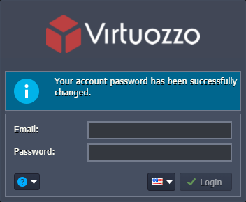

# Account Password Reset

The platform makes sure that account passwords are regularly updated through the automatic deprecation mechanism. By default, passwords expire after 180 days (with several heads-up notifications) and need to be renewed to restore access to the account.

If you still retain access to your account, follow the [change password](#change-password) flow. If you've forgotten your current password or it has already expired, the platform provides a reliable and secure flow to [reset your password](#reset-password).

## Password Requirements

User accounts security is the top priority for the platform, so the following password requirements are enforced by default:

- the minimum length of 10 characters
- at least one symbol for each of the following categories: numbers, lowercase and uppercase letters, special characters
- must not repeat any of the previous passwords

{}**Note:** The exact requirements for each platform are defined by the appropriate service hosting providers and can vary from the default ones.{}

Also, we recommend configuring **[Two-Factor Authentication](/two-factor-authentication/)** for an additional layer of protection to drastically increase the account's security.

## Change Password

In order to update your PaaS account password, log in to the appropriate platform dashboard, and follow the steps below.

1\. Click on the menu with your login in the upper-right corner and choose the **Change Password** option.

2\. In the opened frame, fill in the fields with your current and new passwords and click the Change Password button.

In a moment, you'll be notified about operation success and receive the appropriate email as well.

## Reset Password

If you've lost access to your account, you can follow the password reset procedure to restore it.

1\. Go to the appropriate PaaS installation login page and select the **Reset Password** option from the list at the bottom-left corner of the form.

2\. Within the opened frame, you need to provide the email address of your account.

Click **Reset** for the platform to send you a link for password restoration.

3\. Check your inbox for the ***Confirm Account Password Reset*** email.

Click the **Reset Password** button to proceed with the operation.

{}**Note:** For security reasons, the link remains valid for a short period only. If used after invalidation, the following message will be displayed.

{}

4\. In the opened form, you can set up a new password.

That's all! You'll be redirected back to the dashboard, where you can log in using the new credentials.

{}**Tip:** Also, you'll receive an email about the success of the password reset operation.

{}

## What's next?

* [Account Registration](/account/)
* [Account Types](/types-of-accounts/)
* [Account Statuses](/account-statuses/)
* [Two-Factor Authentication](/two-factor-authentication/)
* [Personal Access Tokens](/personal-access-tokens/)
* [Accounts Collaboration](/account-collaboration/)