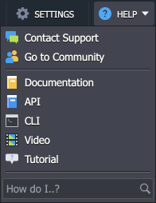

# Account Statuses

Platform accounts can have different statuses:

* **Active**

If your account is active, all your *environments are running*.

* **Deactivated**

In this case, you still have access to the platform dashboard, but you cannot create new environments and all existing ones are *stopped* and cannot be edited (only removed).

If you have a *trial* account it can be deactivated due to the trial period/credits expiration. <u>Convert your account</u> to the billing one and it will be activated automatically.

If you have a *billing* account it can be deactivated due to lack of money. <u>Replenish the account</u> and it will be reactivated automatically.

All your environments will be *automatically started* upon account reactivation, so no additional actions are required.

* **Suspended**

The account can be suspended, if you broke any part of agreement with Service Provider. After that all the environments will be stopped and you *won't be able to sign in*. To reactivate your account you need to <u>contact hoster's support</u>.

* **Destroyed**

In this case you still have the access to the platform dashboard, but all of your *environments are deleted* and you can't recover them.

It happens in two cases. First, if you personally ask to delete it. Secondly, if your account is deactivated and you don't do anything to activate it during some period of time stated by hoster.

If you wish to recover your account, log in to the dashboard and refill your balance to make it positive.

{}**Note:** To delete your account and unsubscribe from our mailings, please, contact your Hoster's Support. For that click *Help* button at the top panel of the dasboard and choose **Contact Support** item in the drop-down menu.

{}

## What's next?

* [Account Registration](/account/)
* [Account Types](/types-of-accounts/)
* [Account Password Reset](/account-password-reset/)
* [Two-Factor Authentication](/two-factor-authentication/)
* [Personal Access Tokens](/personal-access-tokens/)
* [Accounts Collaboration](/account-collaboration/)