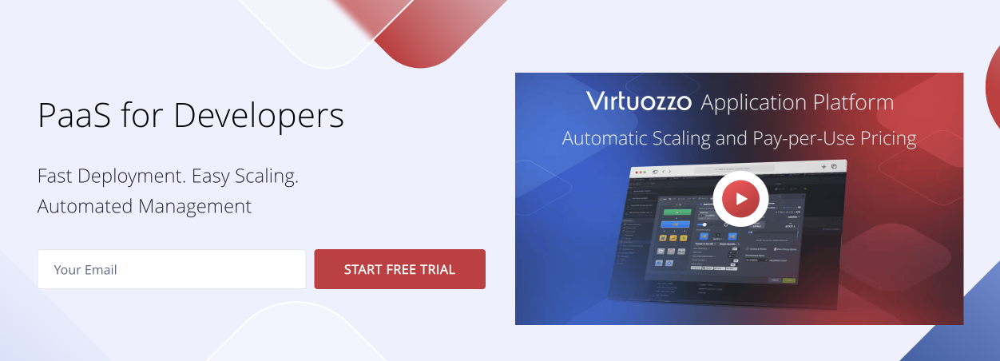
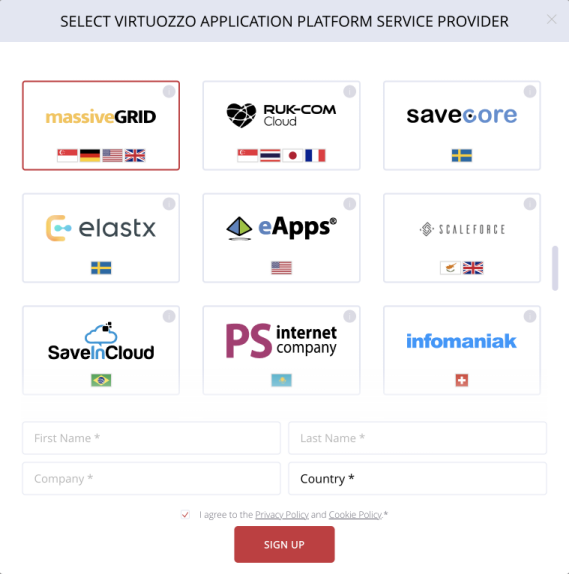
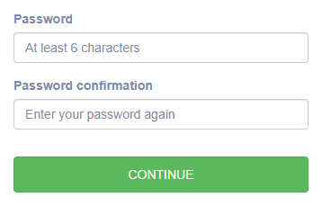
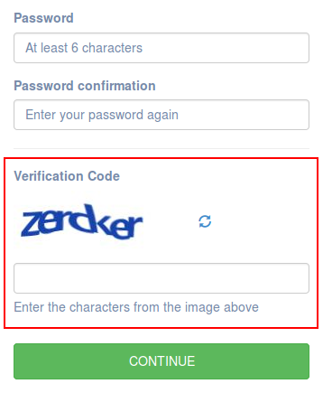
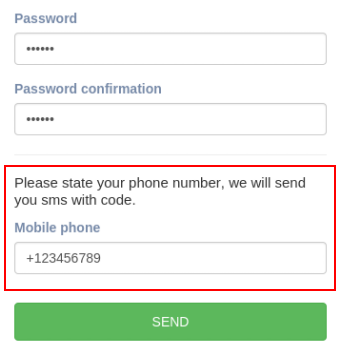
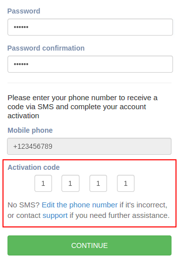
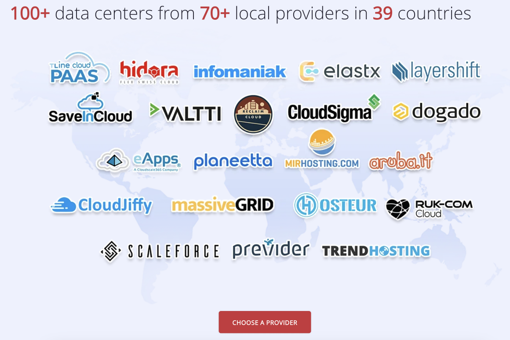
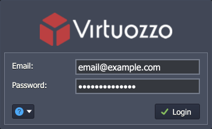
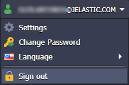

# Account Management

* [Sign Up: How to Create an Account](#sign-up)
* [Sign In to the Dashboard](#sign-in)
* [Sign out](#sign-out)

{}**Tip:** If you need to [reset or change password](/account-password-reset/) for your platform account check out the linked guide.{}

## Sign Up

The PaaS is offered across multiple platforms worldwide, so if you don't have a specific hosting provider in mind, the best way to choose the most suitable one is to compare options via [Cloud Union](https://www.virtuozzo.com/application-platform-partners/).

{}**Tip:** Check out our **[Getting Started](/getting-started/#sign-up-how-to-create-an-account)** guide for general information on how to create a new account.{}

Also, you can register directly from the main website.

1\. Go to the https://www.virtuozzo.com/paas-cloud-hosting/ and provide your email for registration.

2\. Select the preferred service provider and provide some basic account data in the appeared form.

Accept terms of use and privacy policy and click **Sign Up**.

3\. Check your email inbox. Depending on the hosting provider you’ve chosen, you can receive one of the following messages:

* if your *Welcome to PaaS* email contains automatically generated credentials, just use them for signing into the dashboard and enjoy
* otherwise, you’ll be provided with a special activation URL. Click it to complete your account registration with the help of the following form:

Specify the desired password for your account and confirm it within the appropriate fields.

According to your hosting provider’s settings, this activation form can also contain either [captcha](#captcha-verification) or [mobile number verification](#mobile-number-verification) widget:

### Captcha Verification

A captcha widget represents an image with a set of random characters and an input field for these characters to be typed in.

In case you can’t identify the displayed symbols, the image can be reloaded using the round-arrows icon to the right.

### Mobile Number Verification

The mobile number verification widget requires you to specify your phone number for a unique activation code receiving. Additionally, after you are successfully signed up, this number will be bound to your account.

{}**Note:** One phone number can be used for a single account registration only.{}

After you click the **Send** button, your activation code will be either sent to the specified mobile phone via SMS or dictated by a robot with the automatic phone call (depends on a hosting provider’s settings). Herewith, the form will be extended with one more 4-cell field for this code entering. 

Fill each cell with a separate digit of the received code.

{}**Note:** The number of attempts for the activation code entering is limited and depends on your hosting provider settings. If this limit is exceeded, you’ll need to use another phone number to complete the registration.{}

In case no SMS/call was received, you can either **Edit the phone number** (if it was specified incorrectly) or **Contact support** (if any other issue occurred and you need assistance).

Once all the required data is entered, press the **Continue** button. You’ll be automatically redirected to the platform dashboard, where you can sign in using the credentials you’ve specified and start working.

## Sign In

In order to sign in to a PaaS account, you need to open the dashboard of the appropriate provider:

* Following a direct link of the following structure: https\://app.{[hoster_domain](/paas-hosting-providers/)}/
* Click the required hosting provider from the list at [website](https://www.virtuozzo.com/application-platform-partners/)

In both cases, you’ll be redirected to the login page.

Here, specify your credentials within the corresponding fields and click on the **Login** button.

## Sign Out

To sign out from the dashboard, click on your login in the upper-right corner and choose the **Sign out** option.

We recommend logging out of your PaaS account after finishing your management and configuration session.

## What's next?

* [Account Types](/types-of-accounts/)
* [Account Statuses](/account-statuses/)
* [Account Password Reset](/account-password-reset/)
* [Two-Factor Authentication](/two-factor-authentication/)
* [Personal Access Tokens](/personal-access-tokens/)
* [Accounts Collaboration](/account-collaboration/)
* [Dashboard Guide](/dashboard-guide/)