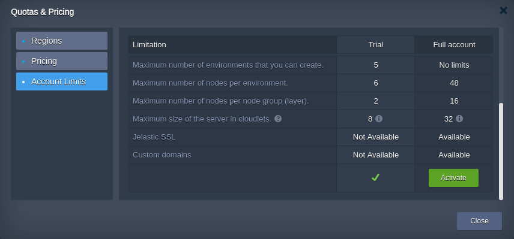

# Quotas System

While working with the platform, you can notice some features being completely or partially restricted (e.g. [public IP](/public-ip/) option or number of [cloudlets](/cloudlet/) per container) by your particular service hosting provider. In most cases, such limitations are provided for trial accounts only, so [upgrading](/upgrade-refill-account/) will automatically unlock access to all of the platform functionality.

If you still require some quotas enlargement after account conversion, please, contact your hosting service provider to get an assistance.

The actual account permissions can be viewed via the **Quotas & Pricing > Account Limits** window at the platform dashboard.

Quotas |
-------------|
Maximum number of environments that you can create |
Maximum number of nodes per environment |
Maximum number of nodes per node group (layer) |
Maximum size of the server in cloudlets (128 MiB RAM and 400 MHz CPU) |
Maximum available disk space per node |
Maximum available disk space per storage node |
External network bandwidth |
Option to set up high-availability cluster |
Public IPv4 addresses |
Maximum number of Public IPv4 addresses per environment |
Maximum number of Public IPv4 addresses per node |
Public IPv6 addresses |
Maximum number of Public IPv6 addresses per environment |
Maximum number of Public IPv6 addresses per node |
The period during which you can use your trial account |
The minimal amount of money in the account, which allows you to create environment |
Built-in SSL |
Custom domains |

## What's next?

* [Account Types](/types-of-accounts/)
* [Upgrade/Refill Account](/upgrade-refill-account/)
* [Pricing Model Overview](/pricing-model/)