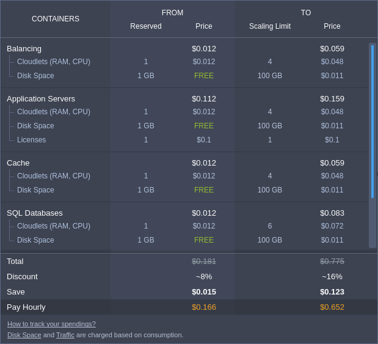
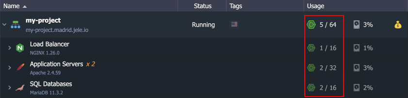
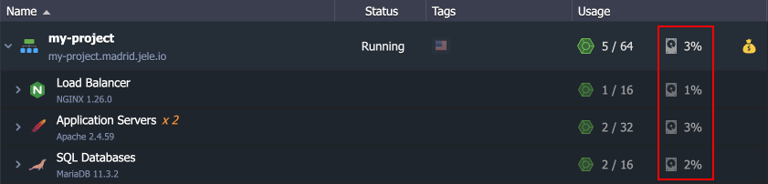
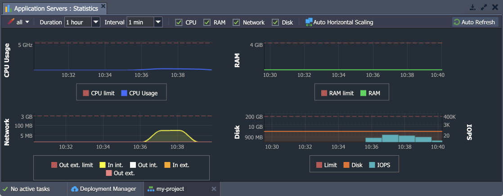
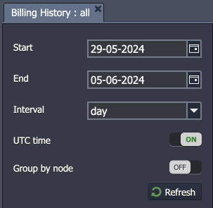
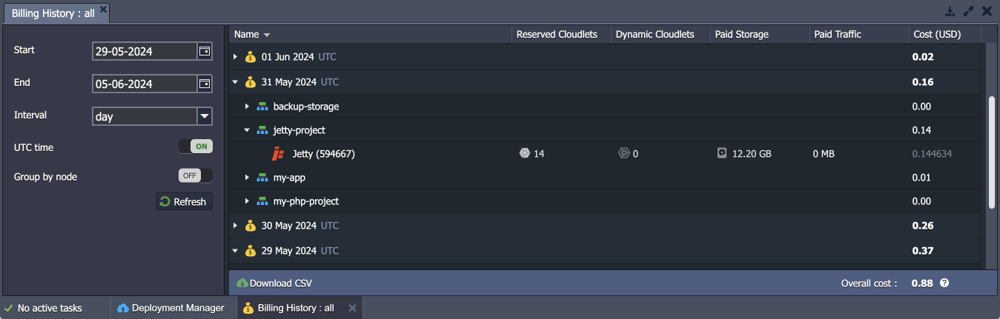
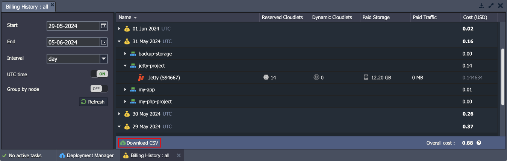

# Monitoring Consumed Resources

Keeping an eye on the resources your application consumes allows you to plan your budget and control the expenditure of funds. Below, we will describe how it is implemented in the platform:

- [Estimated Environment Cost](#estimated-environment-cost)
- [Current Resource Usage](#current-resource-usage)
- [Statistic of Consumption](#statistics-of-consumption)
- [Billing History](#billing-history)

## Estimated Environment Cost

While creating or changing the environment, you operate with a [dedicated wizard](/setting-up-environment/), which is divided into three main sections. The left part allows to set up the required topology. The second (central) one is to choose the number of nodes, allocate resources (**Reserved Cloudlets** and **Scaling Limit**), and enable additional options (**Disk Limit**, **Public IP**, etc.). Within the right panel, you can check the **Estimated Cost** of your environment in the “minimum-maximum" format, showing the price per hour, day, or month.

{}**Note:** You can learn more about [how the platform pricing works](/pricing-model/) in the linked document.{}

Hover over the **Price** widget in the wizard to get detailed information about the cost of the used resources and options within your environment.

Here, you can see three columns:

- **Containers** - list of all nodes in the environment
- **From** - a reserved number of allocated resources (i.e., environment minimal price)
- **To** - a resource limit (i.e., maximal price)

The displayed containers are grouped by layers to simplify perception and the total cost is shown at the bottom of the frame, providing additional information on the received **Discount** and **Saved** money.

## Current Resource Usage

In your dashboard, you can see a list of all your environments. The right-hand column displays current resource **Usage**. You can see the amount of disk storage and cloudlets currently being used by the whole environment or, if you expand the environment context using the arrow icon at the left, you can see the individual resource usage by each server within the environment.

1\. The first metric in the **Usage** column is the number of cloudlets currently being used (first cloudlet number) out of the cloudlet *Scaling Limit* (second cloudlet number) you have configured.

The cloudlet icon changes color from green to yellow and red when you are near or at the configured *Scaling Limit*.

2\. The second metric in the **Usage** column is the percentage of currently consumed **disk space** out of the assigned disk limit.

## Statistics of Consumption

You can also see the amount of consumed Disk, RAM (Memory), CPU, and Network Bandwidth according to each container by clicking on the [Statistics](/view-app-statistics/) button of the desired node.

Based on the statistics received, you can change the limits of the automatic [vertical](/automatic-vertical-scaling/) and [horizontal](/automatic-horizontal-scaling/) scaling for your environment. For example, you can choose the number of reserved cloudlets in accordance with the load on the graphs.

## Billing History

An important tool for budget analysis is billing history tracking, which you can find in the corresponding section of the platform dashboard. If needed, the report can be downloaded to your local machine.

1\. Use the **Billing History** {}{} button next to your specific environment or navigate to the account’s **Balance > Billing History** option in the upper menu to review the charges for consumed resources.

2\. In the left panel, you can adjust search parameters to customize your billing history report:

- specify **Start/End** dates to set the report’s range
- choose **Interval** (period) for grouping data in the report
- enable **UTC time** to switch from local time to UTC in the report
- toggle **Group by node** switcher to group instances within the same layer (billing history is shown separately for each node by default)

Click **Refresh** to apply changes.

3\. Within intervals, the displayed data is grouped by environments, expand it to see the list of nodes and their resource usage. All the nodes are sorted in alphabetical order and additional paid options (if any) are shown below, e.g. [Public IP](/public-ip/) or [SSL](/custom-ssl/).

You can see the following information regarding every environment node:

- *Reserved Cloudlets*
- *Dynamic Cloudlets*
- *Paid Storage*
- *Paid Traffic*
- *Cost*

{}**Note:** Some hosting providers can offer some free resources (cloudlets, disk space, IP addresses, SSL certificates), in which case, only resources used over that amount will be charged.{}

The total charges (overall cost) between the selected dates are calculated for you at the very bottom of the list.

4\. In order to analyze your costs with local tools, you can download your billing history as a ***.csv*** file with the appropriate **Download CSV** button at the bottom.

As you can see, the platform provides complete information about the cost of services and the use of resources, which helps you easily plan your budget.

## What's next?

- [Charged Resources](/chargeable-resources/)
- [Load Alerts](/load-alerts/)
- [Automatic Discounts](/automatic-discounts/)
- [Billing System Overview](/billing-system/)
