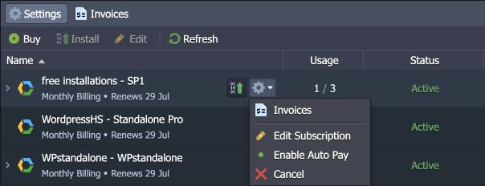

---

# Subscription-Based Products

*This feature availability depends on the particular hosting provider’s settings.*

The platform can offer some products based on the subscription model. The flow is standard to the modern subscription services implementations – a client is charged once and gets a designated product for a specified period. The solution gives you a fix-priced alternative to the default [usage-based model](/pricing-model/). Let’s see how it works.

## Purchasing Subscription

1\. All products that are available for the user are displayed in the dedicated ***Subscription Plans*** tab of the [Marketplace](/marketplace/).

Hover over the required package from the list and click **Install**.

2\. Within the opened window, you can see all the configured service plans for the product (multiple options can be available).

Choose the required plan and click **Buy**.

3\. In the pop-up, specify the following data:

- **Billing Period** – choose the preferred period and pricing option from the list
- **Quantity** – set a total number of instances included in the subscription
- **Auto Pay** – enable automatic subscription renewal after the initial period

{}**Note:** Although subscription environments are bought separately, they will still be stopped in case of [account deactivation](/account-statuses/).{}

At the bottom of the frame, you can see the total sum of the configured subscription.

4\. An invoice will be generated immediately after clicking the **Subscribe & Pay** button.

After that, your subscription will be added to the dedicated account section, where you can [manage all your subscriptions](#managing-subscriptions).

{}**Tip:** Within the initial Marketplace window, the **Buy** button will be replaced with the **Install** one, allowing you immediately install the obtained package (just like any standard solution).

Later, once all the available installations are deployed, the button will change to the **Upgrade** one.{}

## Managing Subscriptions

All the **Subscriptions** are added to the dedicated section in the account settings. Initially, all the new entries are in the *Incomplete* status, which will be updated as soon as the appropriate invoice is fulfilled (or expires). Here, you can view all the subscription details, buy new packages, install (uninstall) corresponding instances, and view invoices.

The subscription table provides the following information:

- **Name** – shows the product and tariff plan name (expand to see the list of installations)
- **Usage** – displays the installed to the total number of subscription instances
- **Status** – provides the subscription status
  - *Incomplete* – complete the invoice to start using the subscription
  - *Active* - the subscription is ready for work (the last invoice is in the “*paid*” status)
  - *Unpaid* - the last invoice still needs to be paid
  - *Canceled* - you’ve canceled the subscription
- **Payment** – shows the information on the due or next payment (you can hover over and click **Pay** to complete the due invoice)
- **Cost** – provides subscription price/period
- **Auto Pay** – displays whether the auto-payment feature is enabled for the subscription
- **Created** – shows the creation date (hover over to see additional info on when the subscription was activated and the billing period)

1\. Let’s go through the available functionality and specifics:

The buttons on the tools panel allow to:

- **Buy** [new subscriptions](#purchasing-subscription), which will redirect to the appropriate Marketplace section (as described in the previous section).
- **Install** packages for the existing subscriptions.
- **Edit** a subscription to change installation quantity and change the *Auto Pay* option.
- **Refresh** information in the list.

1.1. The installation window is similar to a standard package. Provide all the required parameters and click the **Install** button.

{}**Note:** Products installed through subscriptions may have some restrictions due to the fixed pricing nature (e.g., topology adjustment, environment cloning, and removal).

{}

The product will be automatically created in a minute.

1.2. The **Edit** subscription option allows updating the number of installations for the existing subscriptions. The price per installation is calculated according to the remaining billing period.

- Upon *upgrade* (increasing number of installations), the platform will automatically generate an additional “*update quantity*” invoice.
- In case of a *downgrade* (no less than the existing number of instances), the platform will generate a refund invoice, and the account’s balance will be recharged.

Additionally, you can turn the **Auto Pay** option on/off.

{}**Tip:** The **Edit** button will be replaced with the **Discard Changes** one till the appropriate invoice is fulfilled.{}

2\. Hover over the subscription to see the **Install** option (as described in the previous step) and a drop-down menu with additional options:

- ***Invoices*** – switches to the *Invoices* tab, filtered by the current subscription
- ***Edit Subscription*** – opens the *Edit Subscriptions* dialog (as described in the previous step)
- ***Enable/Disable Auto Pay*** – changes the *Auto Pay* option state for the current subscription
- ***Cancel*** (***Don’t Cancel***) – terminates the subscription (or cancels termination)

2.1. Upon canceling the subscription, you can still use it till the end of the paid period. During this time, you can choose ***Don’t Cancel*** from the same menu, but afterward, your subscription will be removed from the list.

3\. Hover over the installation within your subscription to access the following actions:

- ***Switch Subscription*** - allows moving installations between subscription plans *<u>within the same product</u>*
- ***Delete*** – removes selected installation from the account

3.1. The availability of the **Switch Subscription** functionality depends on the hosting provider configurations. If available, you can move your installation as follows:

- **Current Subscription** is selected automatically based on the installation for which the option was clicked.
- **New Subscription** drop-down allows selecting the existing subscription (or buying a new one) within the same product
- **Passphrase** is a confirmation code to perform the operation.

3.2. When deleting the installation, you will be asked for confirmation.

4\. The **Invoices** tab allows reviewing all the subscription-related payments. Filters by *subscription*, *status*, and *number (ID)* can help you locate the invoices needed.

If you have open invoices, you can **Pay** them directly from this panel.

Now, you know all the needed information on how to work with subscriptions and should be ready to start using the feature on your own.

## What's next?

- [Usage-Based Pricing](/pricing-model/)
- [Platform Marketplace](/marketplace/)
- [Two-Factor Authentication](/two-factor-authentication/)
- [Personal Access Tokens](/personal-access-tokens/)