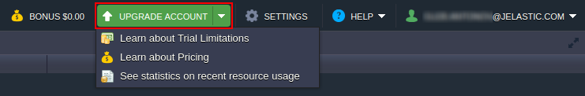
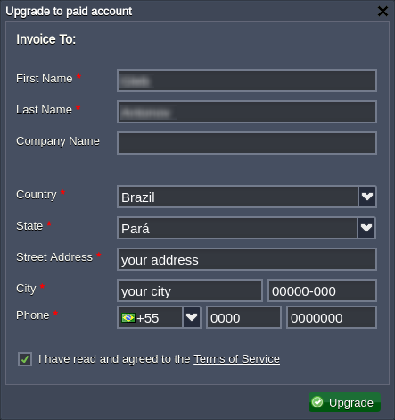
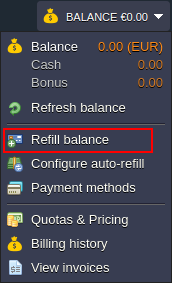
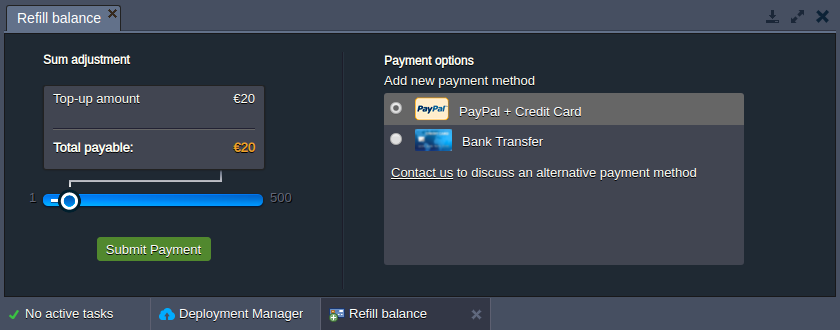
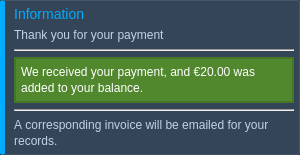
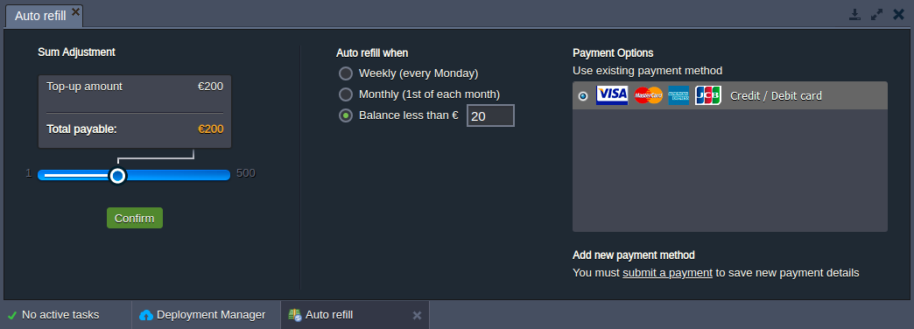

# Upgrade & Refill Account

After the initial trial period, if you are satisfied with our product and wish to continue to use the platform, your account should be upgraded to the [billing](/types-of-accounts/) one. The conversion will additionally remove any limitations and provide access to all of the available functionality.

{}**Tip:** If you don't have an account yet, choose the most suitable [service provider](https://www.virtuozzo.com/application-platform-partners/) for you (based on the *geolocation*, *performance*, *support quality*, etc.) and sign up for a free trial.

The platform will automatically send the confirmation email, so just follow the provided instructions (an additional captcha or SMS verification may be required).{}

1\. Log into the platform dashboard and click the **Upgrade Account** button at the top.

Also, you can expand this menu for additional information on the *trial limitations*, *pricing*, and *recent resource usage*.

2\. Within the opened window, you need to provide the requested personal data and to accept the *[Terms of Service](https://jelastic.com/terms/)* agreement in order to create your billing account.

Click **Upgrade** and complete an obligatory first balance refill to finalize the conversion.

3\. For the following payments, expand the **Balance** menu at the top of the dashboard and click the **Refill Balance** option.

4\. Within the opened panel you can set the required refill sum (using the appropriate slider) and choose the preferred payment method.

{}**Notes:**

* if the VAT number (tax amount) for the payment is equal to zero, it can be hidden within the dashboard UI, depending on your hosting service provider settings
* if you can not find your preferred payment method among the available ones, click the *contact us* link to discuss the possibility of using alternative options
{}

Click the **Submit Payment** button and fulfill the invoice via the chosen payment system.

5\. After successful money transfer, you'll see the appropriate pop-up within your dashboard.

6\. Also, you can automate the process with the help of the *auto-refill* option (**Balance > Configure auto-refill**). Here, specify payment sum/method and additionally select the refill condition:

* *Weekly (every Monday)*
* *Monthly (1st of each month)*
* *Balance less than the specified sum*

{}**Note:** The *auto-refill* feature is not supported by some billing systems (i.e. this option may not be available for your particular hosting provider) and payment methods (e.g. *PayPal* or *bank transfer*).{}

Click **Confirm** to enable auto-refill for the account.

Now, you know how to convert to billing and how to keep your account active with a regular balance refill.

## What's next?

* [Pricing Model Overview](/pricing-model/)
* [Billing Systems Overview](/billing-system/)
* [Hosters Pricing](/pricing-pages/)
* [Charged Resources](/chargeable-resources/)