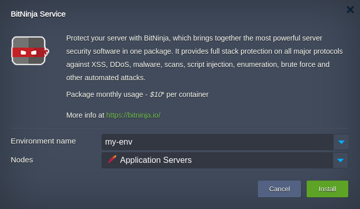

# BitNinja Server Security Add-On

**[BitNinja](https://bitninja.io/)** is an easy-to-use, security-as-a-service server defense tool. It protects your server from hackers, botnets, attackers, and malicious activities with minimal effort and maintenance required from your side.

All the servers protected by BitNinja collect and exchange information about attacks with each other, accumulating a knowledge base (known as **Defense Network**). Detected attacks and blocked IPs are immediately reported to all protected servers worldwide, creating an even harder shield against attacks.

In the platform, you can protect your servers with BitNinja security in a few clicks with the dedicated add-on.

## BitNinja Installation

The **[BitNinja](https://github.com/jelastic-jps/bitninja)** add-on is available for all certified nodes at the platform (except *[VPS](/vps/)*).

1\. Open the [Marketplace](/marketplace/) in the platform dashboard and search for the ***BitNinja Service*** package or find it in the **Add-Ons** section. Hover over and click **Install** to proceed.

{}**Tip:** Also, you can install the solution from the **Add-Ons** panel for a specific environment layer.

{}

2\. In the opened window, choose the target environment and layer through the appropriate fields. BitNinja add-on provides a varying set of features (modules) based on the selected layer:

- **Load Balancer** - *[IP Reputation](https://doc.bitninja.io/docs/ip%20filter/ip_reputation/)*, *[Web Application Firewall](https://doc.bitninja.io/docs/Modules/waf2)*, *[DOS Detection](https://doc.bitninja.io/docs/Modules/dosdetection)*, *[Port Honeypot](https://doc.bitninja.io/docs/Modules/port_honeypot)*
- **Application Server** - *[IP Reputation](https://doc.bitninja.io/docs/ip%20filter/ip_reputation/)*, *[Proxy Filter](https://doc.bitninja.io/docs/Modules/proxyfilter)*, *[FTP Captcha](https://doc.bitninja.io/docs/Modules/captchaftp)*, *[SMTP Captcha](https://doc.bitninja.io/docs/Modules/captchasmtp)*, *[Malware Detection](https://doc.bitninja.io/docs/Modules/malware-detection)*, *[Web Application Firewall](https://doc.bitninja.io/docs/Modules/waf2)*, *[Defense Robot](https://doc.bitninja.io/docs/Modules/defenserobot)*
- **Database** - *[IP Reputation](https://doc.bitninja.io/docs/ip%20filter/ip_reputation/)*
- **Shared Storage** - *[IP Reputation](https://doc.bitninja.io/docs/ip%20filter/ip_reputation/)*, *[Proxy Filter](https://doc.bitninja.io/docs/Modules/proxyfilter)*, *[FTP Captcha](https://doc.bitninja.io/docs/Modules/captchaftp)*, *[SMTP Captcha](https://doc.bitninja.io/docs/Modules/captchasmtp)*, *[Malware Detection](https://doc.bitninja.io/docs/Modules/malware-detection)*
- **Build Node** - *[IP Reputation](https://doc.bitninja.io/docs/ip%20filter/ip_reputation/)*, *[Malware Detection](https://doc.bitninja.io/docs/Modules/malware-detection)*

{}**Note:** All features (modules) are available and can be enabled on all layers. The list just represents modules activated by default based on the common use cases.{}

{}**Note:** As proprietary software, the add-on usage requires a license. You can learn all the [license pricing](#license-pricing) specifics in the dedicated section below.{}

Click **Install** for the package to automatically set up a BitNinja agent on your nodes and create an account at the BitNinja cloud service (must be confirmed and activated).

3\. After the installation, you will receive an email with the "***[BitNinja Account Activation] Quick setup + Results in 12 hours***" subject.

Here, you can find an activation link. Click it and set up a password for your account.

{}**Note:** Only one BitNinja account can be created per email address, so you cannot activate the add-on on multiple PaaS platforms that use the same email.{}

Now, your server is under protection!

### License Pricing

The platform seamlessly integrates the cost of the BitNinja license under the fair **pay-as-you-go** principles. Namely, the license is billed hourly (730 hours per month) and for <u>*active*</u> containers only. In addition, license lifecycle management is fully automated:

- licenses are issued for every container on the layer during the BitNinja add-on installation
- each newly-created container on the layer (horizontal scaling) is provided with a dedicated license
- licenses are decommissioned for stopped and removed containers

Each license is charged based on the [1 hosted user](https://bitninja.com/pricing/) plan, which currently is **10\$** per month (or approximately *0.014\$* per hour).

{}**Note:** The exact cost may vary slightly for the platforms with a currency other than USD; it depends on the conversion rate at the moment of the hourly billing event. You can track all the account charges via the **[Billing History](/monitoring-consumed-resources/#billing-history)** in the dashboard.{}

Check the following example scenario for a better understanding.

Let's say we have an environment with a load balancer, several application servers, and a database cluster of two nodes. During the BitNinja add-on installation, you can select a target layer. In our case, it is logical to add an add-on to the load balancer server (instead of multiple compute nodes). For additional security, we'll install BitNinja for the database layer as well.

*<u>Result:</u>* The license price is per server/node, so for the example above, we'll be charged for three licenses (one for load balancer and two for databases). Also, if we add or remove nodes on the layers with installed add-on (horizontal scaling), the platform will automatically adjust the total license count. It is done with the purpose that scaled instances have the same configuration.

## BitNinja Add-On Options

After installation, you can manage the ***BitNinja Service*** add-on via the dedicated panel. Use the appropriate buttons to open the **BitNinja Admin Panel**, **Restart Agent**, or **Uninstall** the add-on.

For example, log into the BitNinja service console to monitor the events.

## Vendor Support

If you face any issues or have questions regarding BitNinja, you can contact the support team directly via the dashboard. Use the quick **chat** option in the bottom right corner or open a support ticket by navigating to the **Get help** menu in the top right corner of the dashboard.

## What's next?

- [Monitoring with New Relic](/new-relic-installation/)
- [Managing Locale Settings](/locale-settings/)
- [Custom Error Page Settings](/custom-error-page/)
- [Managing Timezone Settings](/timezone-management/)