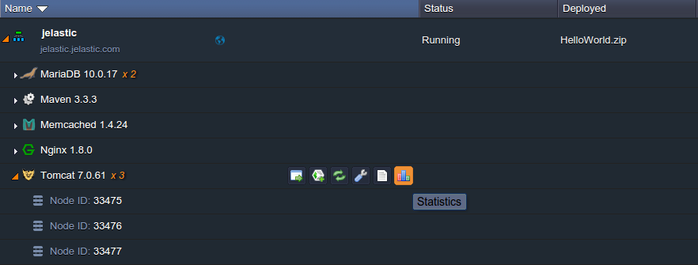
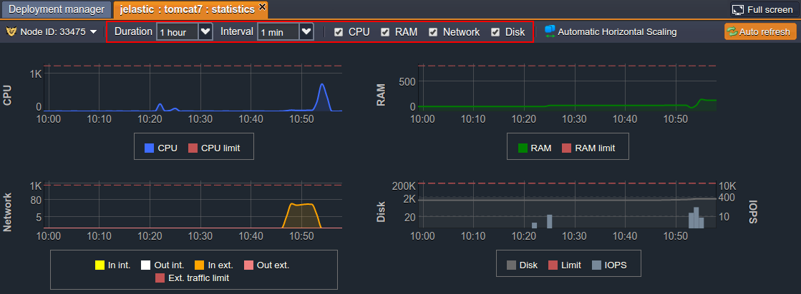
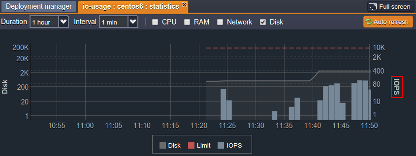
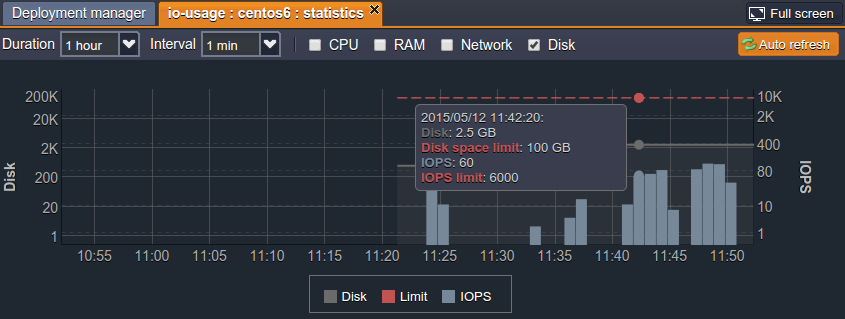
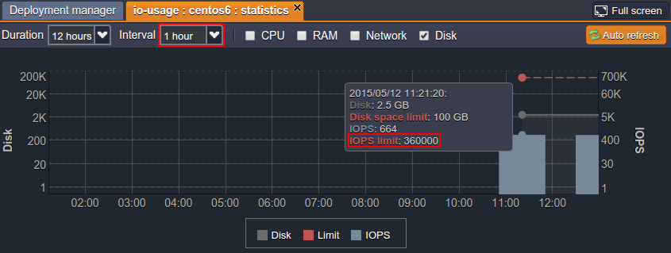

# Statistics Monitoring

Statistics monitoring is an easy but powerful tool that helps to manage environments smartly. The information, provided by the platform in-built statistics module, covers all the billable resources' consumption, so it can help to adjust the topology according to your needs and to cut the spends greatly.

## View Statistics

You can track the usage statistics for all the nodes in your environment: *application servers*, *balancers*, *web servers* and *databases*. For that, just click the corresponding button next to the desired instance (or set of the same-typed nodes):

In the opened tab you'll find the statistics on all the types of consumed resources and their limits:

* **RAM** - memory consumption (in *MiB*)
* **CPU** - processor load (in *MHz*)
* **Network** - internal and external traffic (in *MB*)
* **Disk** - stored data amount (in *MB*) and I/O operations amount (in *IOPS*)

The *RAM* and *CPU* limits depend on the number of [cloudlets](/cloudlet/). The *Disk* can be set within the allowed range, while *Network* and *IOPS* limits are defined by your hosting provider. Also, be aware that *Network* is limited not by the total usage but by the amount of external traffic per second (*Mbps*).

You can further analyze the presented statistics by varying the *Interval* and *Duration* settings and enabling/disabling the particular sections at the top tools panel:

{}**Note:** The platform collects statistics every minute and stores it for an hour to implement an accurate ***[Pay-per-Use](/pricing-model/)*** charging approach. Afterward, the data is automatically aggregated into the one-hour blocks, using one of the two methods based on the particular resource type:

* a sum of all values for *CPU*, *Network*, *Disk IOPS* and *Disk IO*
* the maximum value for *RAM* and *Disk*{}

Using the statistics data you can easily track the resources consumption of your application (hover over for the details on a particular time frame), thus analyze and predict your future spends and, as a result, be able to choose the best way to manage your environment. For even more convenience, you can configure the set of [load alerts](/load-alerts/) to be notified about the consumption level growth or wane to the specified percentage via email. This can greatly help you to save your money!

See the linked document to get additional information on [resources charging](/resource-consumption/).

And below we'll consider the specifics of I/O usage tracking in more details.

## I/O Usage Monitoring

The **Input/Output Operations per Second** amount monitoring is the very common and popular storage measurement method, which helps to analyze the container's efficiency based on its ability to handle a particular number of read and write operations simultaneously without the performance degradation. 

{}**Note:** Currently IOPS statistics for the Windows-based nodes is not provided.{}

1\. IOPS data is shown within the *Disk* statistics section by means of the second axis to the right of the graph (we've disabled all the rest of sections to concentrate on the information we are actually interesting in):

Obviously, the more operations are handled - the higher the system load is. Thus, to avoid the hardware efficiency degradation, the allowed IOPS amount is limited - the appropriate threshold (defined by your hosting provider) is marked with the red dotted line at the top of the graph.

Reaching this point implies that the performance of your container can be negatively affected, so it is needed to enlarge the number of servers used or to optimize the application itself.

2\. Upon hovering over the particular point at the Disk/IOPS graph, you'll see the popup tooltip with the following details:

* **date and time** of the gathered stats
* **Disk** - the amount of space container is actually using
* **Disk space limit** - the maximum amount of data that is allowed to be stored in a container
* **IOPS** - the number of I/O operations handled during the stated *Interval*
* **IOPS limit** - the maximum number of I/O operations, allowed to be performed by container during the stated *Interval*

{}**Note:** Both limits (i.e. for *Disk* space and *IOPS*) are displayed in a single line, named **Limit** in the chart's legend. The particular threshold values for each of these resource types can be seen at the appropriate axes to the left and right - for the *used disk space* and the *amount of IOPS* respectively.{}

3\. As it was mentioned above, the **IOPS limit** depends on the *Interval* chosen. So, for example, if you state *1 hour* Interval for your environment, the prior limit for *1 minute* (which is equal to *6000* - see the image in the previous step) will be increased in 60 times (as 1 hour = 60 minutes):

*6000 \* 60 = 360 000*

In such a way, you are provided with the actual disk load information and get the ability to monitor its state in real time.

## What's next?

* [Log Files](/view-log-files/)
* [Charged Resources](/resource-consumption/)
* [Load Alerts](/load-alerts/)