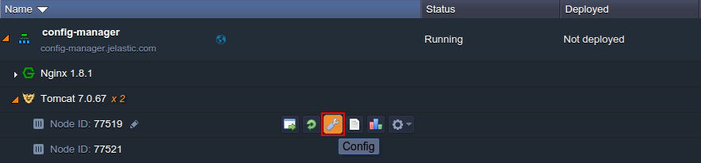
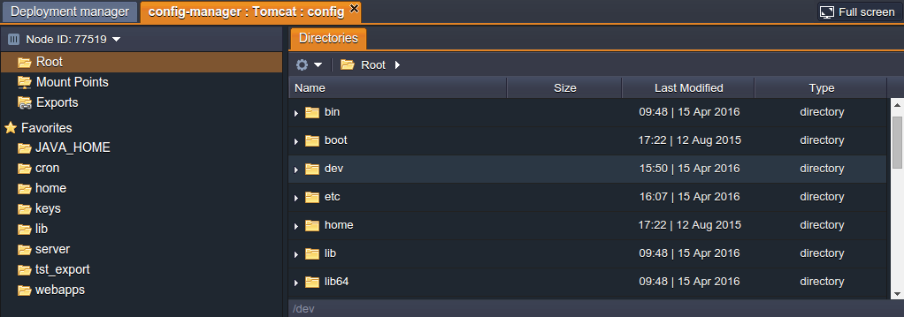
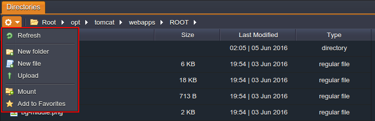
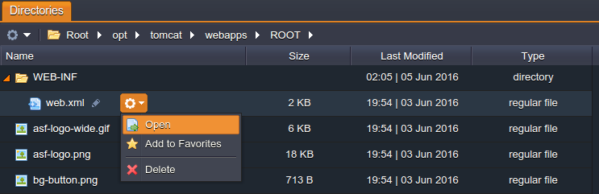
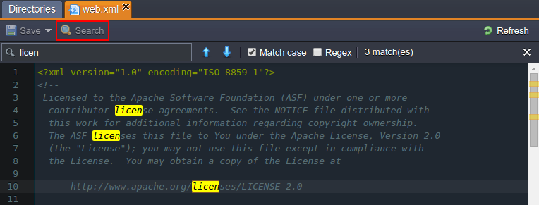
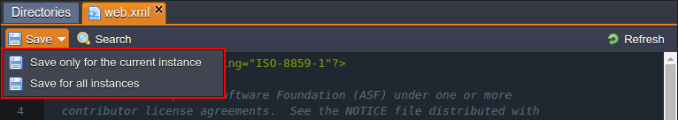
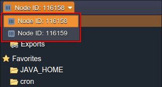

# Configuration File Manager

The platform configuration manager is a powerful tool, which allows to take control over all of the files within the particular container. This allows to easily and quickly apply some common configurations to your nodes through the comfortable GUI right in your browser, without the necessity to establish [SSH connection](/ssh-overview/), that may be required for some complex operations.

In order to open the configuration manager, hover over the required node and click the **Config** button (the one with a wrench icon).

In the middle part of the dashboard, the corresponding configuration tab will be opened.

Herein the following sections are available:

* ***Root*** (File Manager) - gives you an access to the container's local filesystem, where you can manage different settings within configuration files of your app
* ***Mount Points*** - list of folders, that are physically stored on the remote node but can be used at a current node (learn how you can [mount data](/mount-points/) at the platform)
* ***Exports*** - list of folders, which are shared with other nodes, i.e. these files are stored locally, but are also available at the remote instances (find out more at the dedicated [storage exports](/storage-exports/) documentation page)
* ***Favorites*** - files and folders you've marked as favorites so that you have a quick and simple access to them

Further down this guide, we'll consider the basics of configuration manager usage, that are applicable for any platform container. However, if you require to find out the configuration specifics for a particular node type, select one of the following docs:

* [Docker Container Configuration](/docker-configuration/)
* [Java Application Server Configuration](/java-application-server-config/)
* [PHP Application Server Configuration](/php-application-server-config/)
* [Ruby Application Server Configuration](/ruby-application-server-config/)
* [Database Configuration](/database-configuration-files/)
* [NGINX Balancer Configuration](/nginx-balancer-config/)
* [Memcached Configuration](/memcached-configuration/)
* [Maven Configuration](/maven-configuration/)

## Working with File Manager

The platform in-build file manager gives an easy and convenient access to your container files and allows to perform the majority of common operations right through the dashboard.

{}**Tip:** You can also connect to a container via [SSH](/ssh-access/) in order to get even more possibilities for its management.{}

1\. When switching to the ***Root*** section of the config manager, you'll see the file system tree in the right-hand part, with the path string and the **Actions for the current directory** expandable list in the tools pane above. These options provide the following functionality:

* easily switch between directories within the path by clicking on any of the intermediate folder. Also, you can specify the target location manually by typing it in the appropriate input field, which appears upon clicking on the empty space wherever at the path bar

* the action list contains a number of functions for the selected directory management, like content refresh, new item creation, addition of the selected item to favorites, its deletion or remote directory mounting

2\. Below the tools panel, you can see the files tree, intended for a simple navigation between them and displaying of additional information on the comprised files.

Within its columns, the following data is presented:

* **Name** - file name, which can be edited by clicking on pencil icon (appears upon hovering over); also, you can manage the selected file by using the Additionally list
* **Size** - disk space consumed by a file
* **Last Modified** - date of file creation or its last changing
* **Type** - category a file belongs to (where the available types are *regular file*, *directory*, *named pipe*, socket, character device and block device)

    {}**Note:** Only the *regular file* type can be edited via the Config manager.{}

3\. Each opened file (double click it or select the corresponding **Open** action for that) will be shown within the separate sub-tab, so you can switch between them without closing the previous one, which makes it more convenient to explore the file system.

Moreover, to simplify the operation of files management and editing, the appropriate **Search** option can be used, available by means of the same-named button at the top panel.

Just type the required piece of text to find and highlight all matches throughout your file. Use the additional options to narrow the search results even further:

* *Match Case* - allows to perform a case sensitive search
* *Regex* - enables [regular expressions](https://en.wikipedia.org/wiki/Regular_expression) for the search conditions specification

4\. After you've finished file edits, don't forget to **Save** changes you've made with a corresponding button at the top. Herewith, in case you are working with a layer of multiple nodes, you'll be additionally asked whether it's required to save the made changes *only for the current instance* or *for all instances*.

{}**Tip:** While saving the made changes in any config file, the confirmation pop-up will appear. If you feel confident and want to skip this message in future, tick the &ldquo;*Do not show this dialog again*&rdquo; option. As a result, all the further edits will be instantly saved without re-asking for confirmation. This setting will be applied for all types of config files in all of your environments.{}

5\. To make changes on some other node within the same layer, you can use the automatically fetched drop-down list at the top of the manager's left part.

{}**Note:** that the already opened files will be automatically reloaded for the corresponding nodes upon switching.{}

That's all of the main file manager functions, which, hopefully, will greatly help you during your work with our Platform.

## What's next?

* [Mount Points](/mount-points/)
* [Exporting Data for Sharing](/storage-exports/)
* [SSH Access](/ssh-access/)