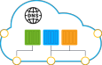
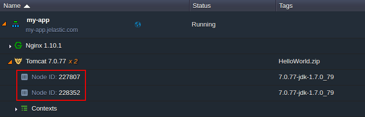
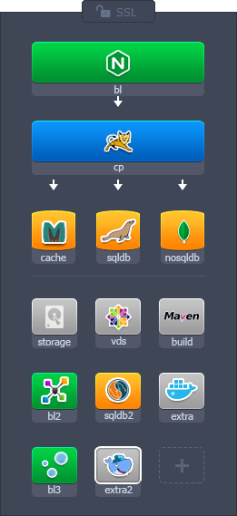
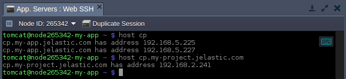
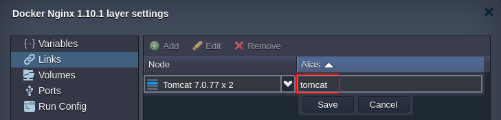

# DNS Hostnames for Direct Connection to Containers

{}{}

Being able to easily connect to Cloud services is a criteria of great importance for all of the developers. In the platform, each newly created node is assigned a number of automatically generated hostnames, pointed to the appropriate server internal/[external](/public-ip/) IP address.

Depending on a type of the created node, the set of hostnames for it could differ. Thus, below we'll consider the possible ways to refer to a particular node, hosted at the platform, either from inside (i.e. when managing it via [SSH Gate](/ssh-gate/)) or outside of the Cloud:

- [Hostnames for Specific Containers](#hostnames-for-specific-containers)
- [Supplementary Hostnames for Particular Node Types](#supplementary-hostnames-for-particular-node-types)
- [Hostnames for Specific Layers](#hostnames-for-specific-layers)
- [Short Hostnames for Containers within One Environment](#short-hostnames-for-containers-within-one-environment)
- [Hostnames for Linked Containers](#hostnames-for-linked-containers)

## Hostnames for Specific Containers

Each container at the platform can be accessed by its internal IP address with an URL of one of the following formats:

* ***node\${nodeId}-\${envName}.\${platformDomain}***
* ***node\${nodeId}.\${envName}.\${platformDomain}***

Herewith, the placeholders should be replaced with the next values:

* ***${nodeId}*** - an automatically generated unique digit identifier, assigned to every container within a Platform

* ***${envName}*** - environment name (not an [alias](/environment-aliases/)), specified during its creation
* ***${platformDomain}*** - domain name of a PaaS installation [hosting service provider](/paas-hosting-providers/)

Both variants can be used for refering to the nodes from inside or outside of the platform (i.e. allowing to establish both internal and external connections).

## Supplementary Hostnames for Particular Node Types

Some of the platform certified stacks are provisioned with additional hostname prefixes (i.e. where the appropriate stack name is used instead of the *node* string) to make their management more convenient.

{}**Note:** Such supplementary prefixes are valid only within domains with a hyphen as a separator.{}

<table><colgroup><col width="150"><col width="150"><col width="400"></colgroup><tbody>
<tr><th style="background-color: #0a88f7;">Node Type</th><th style="background-color: #0a88f7;">Stack</th><th style="background-color: #3baaff;">Additional Hostname</th></tr>

<tr><td colspan="2" style="background-color: #e6e6e6;"><b>Custom Docker Сontainers</b></td><td style="background-color: #f2f2f2;"><i>docker${nodeId}-${envName}.${platformDomain}</i></td></tr>

<tr><td rowspan="11" style="background-color: #e6e6e6;"><b>Database</b></td><td style="background-color: #e6e6e6;">Cassandra 1/2</td><td style="background-color: #f2f2f2;"><i>cassandra${nodeId}-${envName}.${platformDomain}</i></td></tr>

<tr><td style="background-color: #e6e6e6;">CouchDB</td><td style="background-color: #f2f2f2;"><i>couchdb${nodeId}-${envName}.${platformDomain}</i></td></tr>

<tr><td style="background-color: #e6e6e6;">MariaDB 5/10</td><td style="background-color: #f2f2f2;"><i>mariadb${nodeId}-${envName}.${platformDomain}</i></td></tr>

<tr><td style="background-color: #e6e6e6;">Memcached</td><td style="background-color: #f2f2f2;"><i>memcached${nodeId}-${envName}.${platformDomain}</i></td></tr>

<tr><td style="background-color: #e6e6e6;">MongoDB 2/3</td><td style="background-color: #f2f2f2;"><i>mongodb${nodeId}-${envName}.${platformDomain}</i></td></tr>

<tr><td style="background-color: #e6e6e6;">MSSQL</td><td style="background-color: #f2f2f2;"><i>mssql${nodeId}-${envName}.${platformDomain}</i></td></tr>

<tr><td style="background-color: #e6e6e6;">MySQL 5.6/5.7</td><td style="background-color: #f2f2f2;"><i>mysql${nodeId}-${envName}.${platformDomain}</i></td></tr>

<tr><td style="background-color: #e6e6e6;">Neo4j 1/2</td><td style="background-color: #f2f2f2;"><i>neo4j${nodeId}-${envName}.${platformDomain}</i></td></tr>

<tr><td style="background-color: #e6e6e6;">OrientDB</td><td style="background-color: #f2f2f2;"><i>orientdb${nodeId}-${envName}.${platformDomain}</i></td></tr>

<tr><td style="background-color: #e6e6e6;">PostgreSQL 8/9</td><td style="background-color: #f2f2f2;"><i>postgres${nodeId}-${envName}.${platformDomain}</i></td></tr>

<tr><td style="background-color: #e6e6e6;">Redis</td><td style="background-color: #f2f2f2;"><i>redis${nodeId}-${envName}.${platformDomain}</i></td></tr>

<tr><td colspan="2" style="background-color: #e6e6e6;"><b>VPS</b></td><td style="background-color: #f2f2f2;"><i>vps${nodeId}-${envName}.${platformDomain}</i></td></tr>
</tbody></table>

All alternative domain strings, shown in the table above, can be utilized similarly to the [hostnames for specific containers](#hostnames-for-specific-containers).

## Hostnames for Specific Layers

For the new environments, you can get all internal IP addresses of containers within one node layer using the following hostname:

* ***\${nodeGroup}.\${envName}.\${platformDomain}***

Here, ***\${nodeGroup}*** placeholder is a name of a particular layer the required container belongs to. By default, layers are named in accordance with the appropriate *[nodeGroup](https://docs.cloudscripting.com/creating-manifest/selecting-containers/#all-containers-by-group)* specific role.

{}**Note:** Node groups added via the *[extra layers](/release-notes-54/#extra-environment-layers-for-all-supported-engines)* in the topology wizard are named in the same way, but with the appropriate ***\${N}*** index. Herewith, the default layers in topology wizard (e.g. *bl*, *cp*, *sqldb*, etc.) are considered as the first index, so the enumeration in *extra* layers starts with the second one, e.g. *cp2*, *cp3*, *cp4*, ... (except of the *extra*, *extra2*, *extra3*, ...). For example:

{}

For example, this command can be used to get an application servers list for any environment within the platform:

{}**Tip:** In order to get a list of containers for the current environment, just a [short hostname](#short-hostnames-for-containers-within-one-environment) can be used.{}

Herewith, every time a new container is created (removed) in a system, the appropriate record is automatically added to (removed from) DNS for the layer hostname.

## Short Hostnames for Containers within One Environment

All the newly created Docker containers and dockerized platform-managed stacks are provisioned with the specific DNS rules, which allow usage of the additional simplified hostnames:

* ***node${nodeId}*** - alias to refer to a container in confines of a single environment
* ***${nodeGroup}*** - alias to refer to a layer in confines of a single environment

Utilizing such short hostnames in server configuration files, application source code and [SSH](/ssh-gate/) console (within often used commands like *ping*, *host*, *dig*, etc.) makes operating with Dockerized stacks via Platform internal network much more convenient. Additionally, such approach enables painless [environment migration](/environment-regions-migration/) to another [hardware region](/environment-regions/) through eliminating the necessity to adjust your application code due to the changed server location.

## Hostnames for Linked Containers

Upon [linking](/container-links/) two Docker-based environment layers, a set of dedicated DNS records are automatically added to the global platform database. This allows to refer to the nodes within a *target* layer from the *source* ones (but <u>not</u> vice versa) when working in confines of these two layers using the following hostname aliases:

* ***${linkAlias}*** - to refer to a random node within a target layer; an exact node to respond is chosen by means of the Round-Robin algorithm - this ensures even load distribution
* ***\${linkAlias}_\${N}*** - to access a particular container within a target layer

Here, the appropriate placeholders are to be substituted with:

* ***${linkAlias}*** - link name you've specified during its setting (e.g. *tomcat* in the image below)

* ***${N}*** - nominal index number (in a *1...N* range) of a particular container within the target linking layer (e.g. *tomcat_1*, *tomcat_2*), etc; herewith, master container is always considered the 1st instance, whilst the rest of layer nodes are assigned numbers according to their nodeID values, being sorted in ascending order (starting with the *_2* index, then *_3*, *_4*, etc.)

For example, if there are three containers on a layer - with the *123*, *124* (master) and *125* IDs. According to the above-described implementation, the aliases will be assigned as follows:

* ***alias_1*** - link to the *124* container as a master node
* ***alias_2*** - will point to the *123* instance since it has the lowest ID among the remaining containers
* ***alias_3*** - for referring to the *125* container as the one with the next lowest nodeID

{}**Tip:** By appending an environment domain to the alias ***\${linkAlias}.\${envName}.\${platformDomain}***, the corresponding linked layer name can be resolved and accessed externally, i.e. from anywhere over the Internet. And by ***\${linkAlias}_\${N}*** corresponding container of a linked layer can be resolved internally only, within the linked layers network.{}

Now, you know all the specifics and shortcuts that can be used to refer to your nodes, which will help to quickly and efficiently organize connections between your application instances.

## What's next?

* [Secure Sockets Layer](/secure-sockets-layer/)
* [Built-In SSL](/built-in-ssl/)
* [Custom SSL](/custom-ssl/)