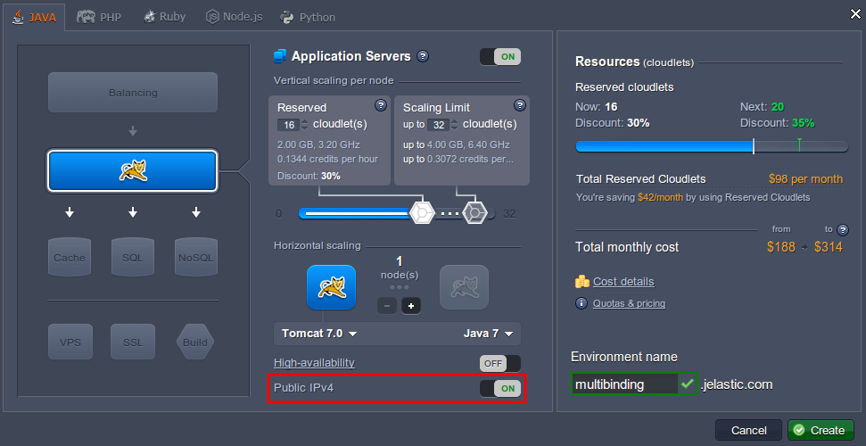
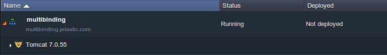
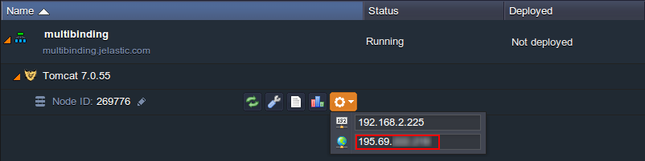
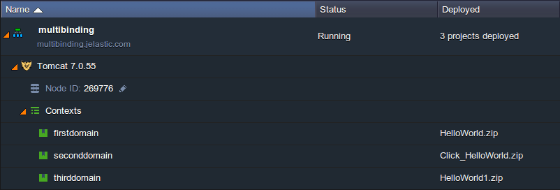
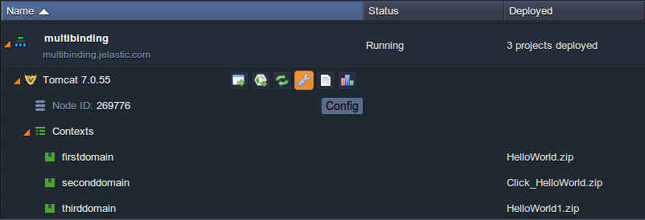
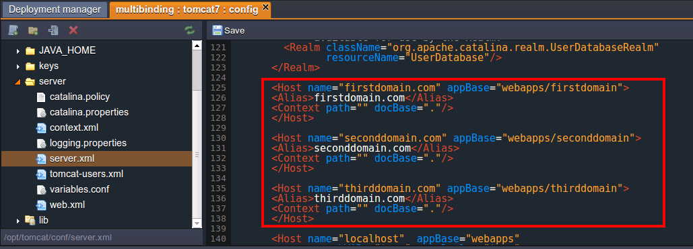
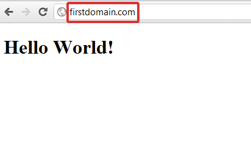
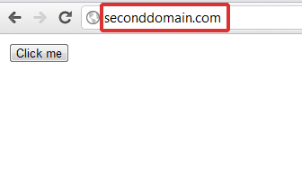
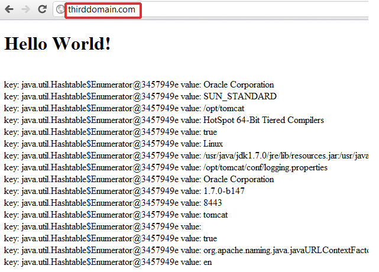

# Setting Up Multiple Domains with Public IP


## The Benefits of Having Multiple Domains

* ***Usability***

One of the main benefits of having multiple domain names is that it gives you *multiple points of entry*: this can be useful if, for example, you want different domains leading to differently themed sites for different marketing campaigns or user experiences.

* ***Cost Saving***

Another benefit that you can take advantage of is the ability to have *more than one domain running on a single environment*. For example, you can have two different applications with two different domains running on a single Tomcat instance.


## Setting Up Multiple Domains

*In order to use a domain name for your application, you need to register it or have administrative access to it.*

1\. Log into the PaaS account.

2\. While in the platform dashboard, click the **Create environment** button:

 

3\. In the **Environment Topology** dialog, pick your application server (for example, [Tomcat](/tomcat/)), switch on **Public IPv4** for your server and type your environment name, for example, *multibinding*.



In a minute your environment with **Tomcat** will be successfully created.



4\. Bind your **domain names** to the Tomcat's Public IP address, which you can find in the drop-down list for the server. The binding procedure depends on the hosting company, where you bought domains.



5\. Upload your war files/file to the **Deployment manager** and deploy them to different contexts.



6\. Click on **Config** button for Tomcat.

 

7\. Navigate to **server.xml** file (*server* directory) and set the configuration for host multiple domains (add *Host tags* for each domain you want to host).

For example:
```xml
<Host name="firstdomain.com" appBase="webapps/firstdomain">
<Alias>firstdomain.com</Alias>
<Context path="" docBase="."/>
</Host>

<Host name="seconddomain.com" appBase="webapps/seconddomain">
<Alias>seconddomain.com</Alias>
<Context path="" docBase="."/>
</Host>

<Host name="thirddomain.com" appBase="webapps/thirddomain">
<Alias>thirddomain.com</Alias>
<Context path="" docBase="."/>
</Host>
...
```



8\. **Save** the changes and **Restart** Tomcat.

9\. Now you can check the results. You application/s will be available through the specified domain names.







{}**Note:** If you want to redeploy an application to the Tomcat instance with already configured *server.xml*, you need to comment *< Host >* block before redeploying and uncomment it afterwards.{}


## What's next?

* [Public IP](/public-ip/)
* [Custom Domains](/custom-domains/)
* [Secure Sockets Layer](/secure-sockets-layer/)