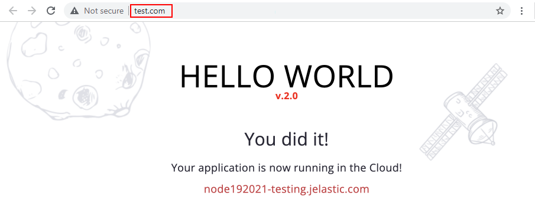

# Swap Domains

While working with any project, you will eventually face the need to upgrade or modify it. Of course, before applying any changes in production, you should thoroughly test them. With the platform, this can be done in a separate environment, and once the new version is ready, you can just **swap domains** between these development/testing and production projects for an immediate version switch.

So, by utilizing this functionality, you can skip the steps of rolling out updates to the environment in production (avoiding additional configurations and possible downtime) and simultaneously keep the previous version of your application for a quick rollback in case of necessity.

{}**Note:** The *Swap Domains* feature operates with the [bound domains](/custom-domains/#how-to-bind-domain-to-environment) only. If you need to swap URLs for environments with public IP as an entry point (attached to the application server or load balancer), use the [swap external IPs method](/cli-ip-swap/) or adjust appropriate records in your domain registrar.{}

So, let's see how this works.

## Create Test Environment

1\. Locate your environment in production with the application that you want to update. In our example, it is called *production*.

{}**Note:** This environment should have a [bound custom domain](/custom-domains/#how-to-bind-domain-to-environment) (e.g. *production.com*) that you will consequently swap with a different environment.

{}

2\. Click the **Open in Browser** button or access via custom domain to see your application.

3\. [Clone this environment](/clone-environment/) to automatically create its identical copy including, all deployed packages, databases, etc. Let's name it *testing*.

4\. Click the **Open in Browser** button for your cloned environment to make sure that everything works fine.

Now, you can add new features, customize settings, apply updates, etc. All without affecting the original environment.

## Update Application

1\. Make the needed changes (either directly via the dashboard or by deploying the new project version) to the cloned environment. The following documentation guides can help you with your project adjustments:

- [Deployment Guide](/deployment-guide/)
- [SSH Access](/ssh-access/)
- [Configuration File Manager](/configuration-file-manager/)

2\. Click the **Open in Browser** button for your updated project to test your changes.

{}**Note:** The **Swap Domain** functionality will work even if only one environment has a bound domain. However, for more thorough testing, you can [bind a custom domain](/custom-domains/#how-to-bind-domain-to-environment) to your cloned environment as well.

{}

## Swap Domains

After testing the updates, the next step is to swap domains of the *production* and *testing* environments.

{}**Tip:** If only one of the environments has a bound custom domain, the *Swap Domains* functionality will transfer it to the second environment.{}

1\. Open the **Settings** for one of your environments (e.g. *production* one). Here, the required **Custom Domains** section will be opened by default.

2\. In the Swap Domains subsection, choose the environment with which you want to swap domains (the *testing* one in our case) and click the **Swap** button.

{}**Tip:** You can check custom domains bound to the current environment in the *Domain Binding* subsection and for the target environment - in the *Swap Domains* one.{}

3\. Now, you can navigate to your production environment custom domain (*production.com* in our case) and see that your application has been updated.

{}If you experience any problems with a domain swap, you can appeal to our technical experts' assistance at [Stackoverflow](https://stackoverflow.com/questions/tagged/jelastic).{}

## What's next?

* [Custom Domains](/custom-domains/)
* [Multiple Domains for Tomcat](/multiple-domains-tomcat-server/)
* [Multiple Domains with Public IP](/multiple-domains/)
* [Application Lifecycle](/how-to-manage-application-lifecycle/)