# Endpoints: A Direct Connection to the Cloud

{}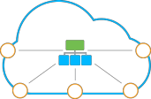{}

The **Endpoints** feature at the platform refers to the possibility of TCP/UDP ports mapping via the Shared Load Balancer, which is intended to simplify the instances' collaboration with third-party tools and resources. This is achieved through providing the ability to establish the direct connection (over either raw TCP or UDP protocol) to the corresponding node, without the mandatory [Public IP](/public-ipv4) address attached.

Such linking can be used to enable a great variety of different tasks, like remote database management, direct apps' [deployment from IDE](/deploy-dotnet-archive-url) (for *IIS*), running multiple project copies on a single instance, accessing a server's admin panel with no external address bound, etc.
{}**Tip:** Beside the increased convenience, with endpoints you can cut your spends for the External IP usage, which, otherwise, would be required for such operations. Obviously, endpoints can't completely replace them, but may become useful in some elementary jobs, and being combined with other platform features (like automatic [vertical](/automatic-vertical-scaling) and [horizontal](/automatic-horizontal-scaling) scaling, [discounts tiers](/automatic-discounts), etc.) such an approach can help you to significantly save your money.{}

Follow the instruction below to find out how to work with endpoints at the platform and discover a few interesting use-cases to try them by yourself.


## Endpoints Managing
The list of endpoints can be accessed via the environment **Settings** menu, that opens through selecting the same-named button for a particular environment.

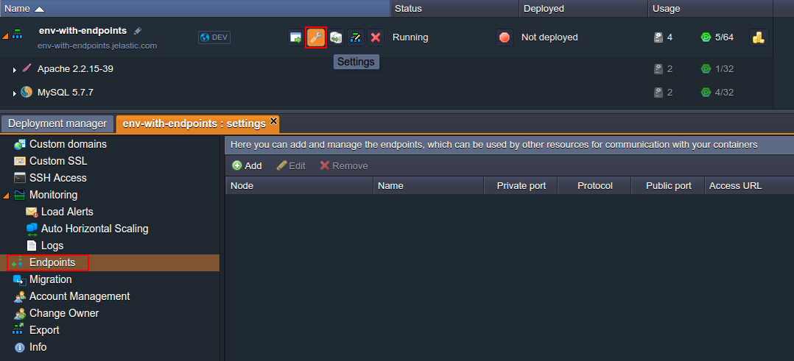


Within the opened tab, switch to the **Endpoints** menu item. Now you can start working with your mapping's list:

* [add new endpoint](#add)
* [edit/remove the existing endpoint](#edit)

### Adding Endpoints
To create a new endpoint, click the **Add** button from the top tools' pane and fill in the appeared ***Add Endpoint*** form with the relevant data:

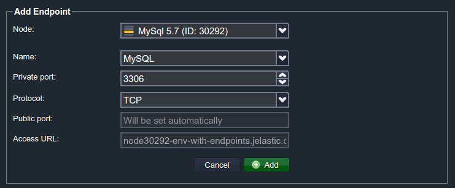

* **Node** - select the instance you'd like to set the endpoint for (here only the comprised in the chosen environment nodes are displayed)
* **Name** - either type the title for a new endpoint or choose one of the preconfigured options (the corresponding list is provided just [down](#preconfigured) the page)
* **Private port** - specify the preferred local node's port to be used for mapping (it's substituted automatically in case the predefined *Name* was selected)
* **Protocol** - select either TCP or UDP

<a id="preconfigured"></a>The rest of fields, i.e. **Public port** and **Access URL**, will be configured by the platform automatically.

Select **Add** when ready.

{}
For more convenience, we provide the embedded list of predefined endpoint configurations, based on the protocol or purpose implied:

<div align="center"><table style="width: 600px;"><colgroup width="300px"><col width="150px"><col width="150px"></colgroup><tbody><tr><th style="padding-top: 10px; padding-bottom: 10px; text-align: center;">Connection Name</th><th style="padding-top: 10px; padding-bottom: 10px; text-align: center;">Private Port</th></tr><tr><td>Remote Desktop</td><td>3389</td></tr><tr><td>PowerShell</td><td>5986</td></tr><tr><td>SMTP</td><td>25</td></tr><tr><td>FTP</td><td>21</td></tr><tr><td>DNS</td><td>53</td></tr><tr><td>HTTP</td><td>80</td></tr><tr><td>POP3</td><td>110</td></tr><tr><td>IMAP</td><td>143</td></tr><tr><td>LDAP</td><td>389</td></tr><tr><td>HTTPS</td><td>443</td></tr><tr><td>SMTPS</td><td>587</td></tr><tr><td>POP3S</td><td>995</td></tr><tr><td>IMAPS</td><td>993</td></tr><tr><th colspan="2" style="padding-top: 10px; padding-bottom: 10px; text-align: center;">Optional*</th></tr><tr><td>{database_name}</td><td>{database_port}</td></tr><tr><td>RDP</td><td>3389</td></tr><tr><td>DEPLOY</td><td>8172</td></tr></tbody></table></div>

*<b>Optional</b> values availability depends on the type of the chosen node:

* *database nodes* are provided with the default endpoint, named after themselves and with the appropriate port stated
* *Windows-based containers* have the additional *[RDP](/win-rdp-access) (3389)* connection
* *IIS application server* has the *DEPLOY (8172)* connection for the direct project [deployment from IDE](/deploy-dotnet-archive-url#direct)
{}

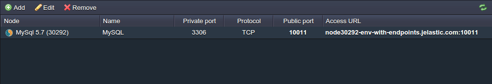


Here you'll find the **Public port** and **Access URL** actual values already displayed. You can use these parameters to perform the required operations - just click on a particular string to get the opportunity to easily copy it.
{}**Note:** <a id="edit"></a>that for linking functionality to work properly with the [VPS](/vps) and [Docker&reg;](/dockers-management) containers, the corresponding private ports (stated during the endpoint addition) at these nodes should be opened by the owner manually.{}
### Edit/Remove Endpoint
Any existing endpoint can be easily edited or removed in case of further unnecessity. For that, just select the desired connection within the endpoints list and click the **Edit** (either use double-click on the required line) or **Remove** button, located at the tools' pane above.

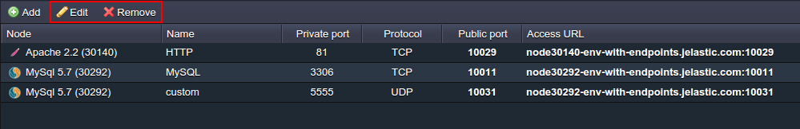

Depending on the option chosen, you'll see the following:

* ***Edit*** - in the appeared ***Edit Endpoint*** form (which is completely similar to the ***Add*** one) you can modify all the abovementioned settings except the **Node** choosing (as this makes no sense - you could just add a new similar endpoint to the required instance).
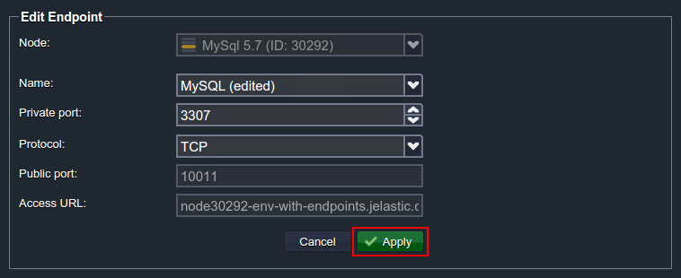
Once the required changes are made, just **Apply** them with the same-named button at the bottom of the frame.

* ***Remove*** - the special pop-up frame will appear, where you need to confirm your decision:
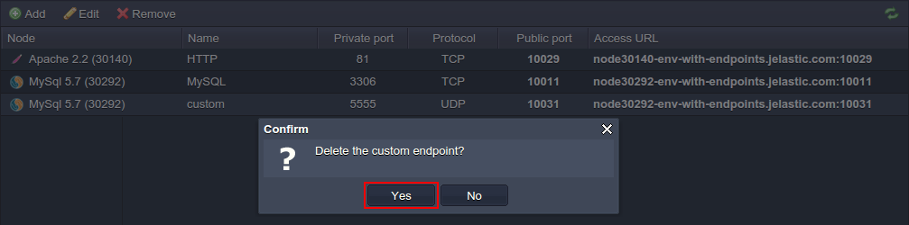
Just after that, the corresponding endpoint will be removed from the list.


## Endpoints Use-Cases
Once the required mappings are configured, you can apply them for running different tasks. To make it easier to start, below we'll describe a few most common endpoints' use-cases that you can benefit from.

As an example, we will use an environment with the **Apache** application server and **MySQL** database (you can create the similar one following [this](/setting-up-environment) guide):

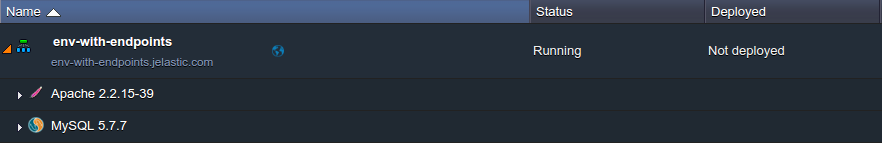

Now, let's learn how to use endpoints for:

* <a href="#access-db" id="access-db">establishing remote access to your database</a>
* [running multiple project copies on a single app server](#multi-dev-stages)


### Database Management
With endpoints, gaining remote access to your DB instance becomes pretty easy, as using this feature eliminates the necessity to acquire any additional options like a Public IP.<a id="access-db-terminal"></a>
To show this, we'll consider two simple ways of performing this operation: through [embedded OS terminal](#access-db-terminal) and [third-party DB client](#access-db-client).

#### Connection via Terminal
The most common approach is to use the embedded terminal of your local machine, as this does not require any additional installations or configurations and provides sufficient functionality for a simple connection establishment - just a single command is required:
```bash
mysql -h {host} -P {port} -u {user} -p
```
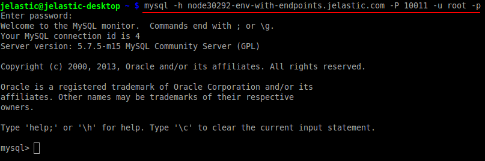
where:

* ***{host}*** - endpoint Access URL without the port suffix specified (*node30292-env-with-endpoints.jelastic.com* in our case)
* ***{port}*** - public port number assigned (*10011* in this example)
* ***{user}*** - database user name (the platform has sent it to you via email during the environment creation - by default it stands for *root* for all the new MySQL servers)

After the connection validation, you'll be requested for the appropriate DB user's password (it can also be found in the abovementioned email) in order to<a id="access-db-client"></a> access your database.

That's all! Now you can start working with your database through executing the required SQL queries.

#### Connection via Local Client
In the case you require advanced functionality or if you are used to managing the data stored within your database with more convenience, a type of database desktop client may come in handy here. It will provide you with a user-friendly graphic interface and the variety of included features to accelerate your work.

For an example of such a client, that will help to establish the remote connection to our database through the created endpoint, we'll use one of the most popular DB management tools - [MySQL Workbench](http://www.mysql.com/products/workbench/).

1\. Run the abovementioned application and click the **New Connection** button.
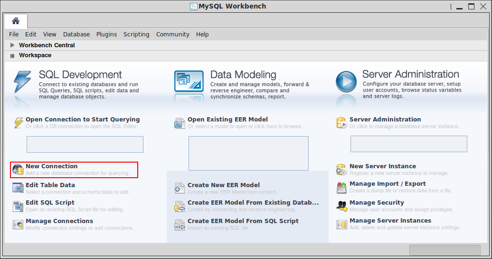

2\. In the appeared ***Setup New Connection*** frame, fill in the following fields at the top:

* **Connection Name** - set an appellation for your connection (e.g. *jelastic-db*)
* **Connection Method** - choose the Standard (*TCP/IP*) method
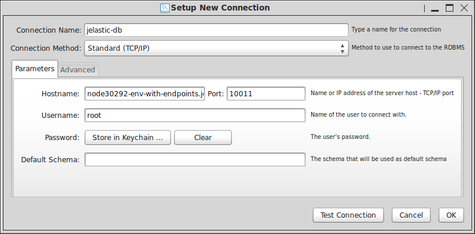
Then, specify the required DB data inside the ***Parameters*** tab beneath:

* **Hostname** - endpoint URL without the port number specified at the end (*node30292-endpoints.jelastic.com* in our case)
* **Port** - the endpoint's public port (we got port *10011* assigned during its addition)
* **Username** - name of the admin DB user (the platform has sent it to you via email during the environment creation - by default it stands for *root* for all the new MySQL servers)
* **Password** - either click **Store in Keychain** to enter and save your pass (which can be found within the same email) or skip this field to specify it during each connection attempt
* **Default Schema** - the database schema to be used by default (can be also left blank)
Click **OK** to complete.

3\. Double-click on the newly appeared connection record to initiate its establishment and specify your password in the appeared frame (if you haven't saved it before).
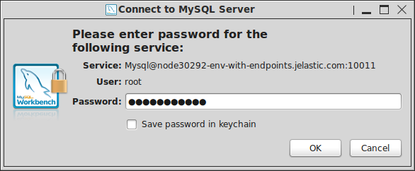
You can also tick *Save password in keychain* if you don't want to enter it manually each time you need to access your database. Click the **OK** button to proceed.

4\. In a minute, you'll be connected to your DB.
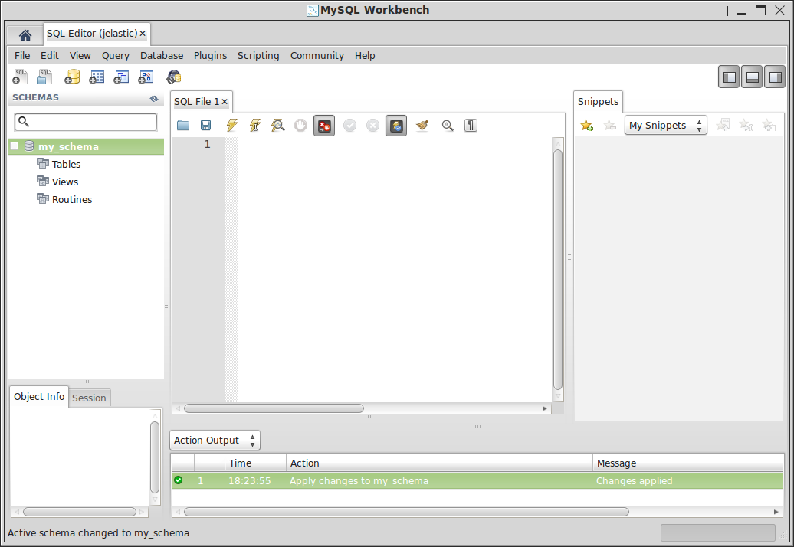

Great! Now you can start organizing your data using all the provided benefits of the full-featured management client.

<a id="multi-dev-stages"></a>Just in the same way you can connect to any other database server within the platform or, for example, [backup and restore](/dump-import-export-to-mysql) your data within dump files.

### Multiple Development Stages at a Single App Server
Beside the elementary operations of DB management, endpoints also give the ability to implement a variety of useful and interesting solutions for other servers. Below we'll examine one of such beneficial possibilities this feature ensures - how to use a single application server as your production and development environment simultaneously (with the Apache instance from our environment as an example).

1\. So, map the endpoint to your **Apache** server with the preferred unused private port opened.
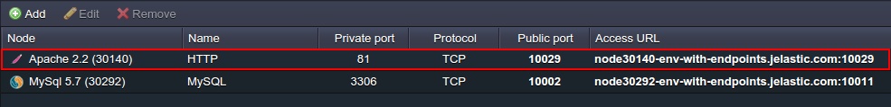

{}**Note:** Do not choose port *80* as private port for this task, as Apache uses it by default for the incoming HTTP-requests handling. Otherwise, the whole process, described below, will become pointless.{}

2\. Now, [deploy](/deployment-guide) your application twice to different contexts (e.g. *prod* and *dev*).
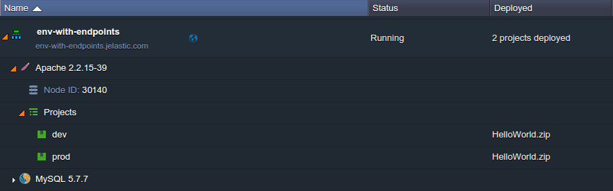

3\. The next step is configuring Apache itself - thus, click the **Config** button next to this server and open its main configuration file (the **conf > <i>httpd.conf**</i> one).
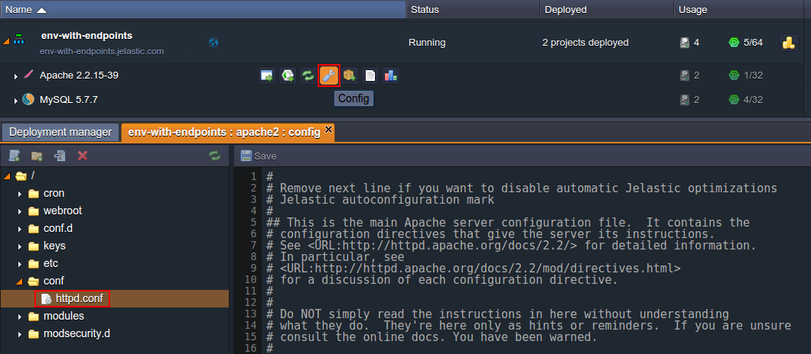

4\. Scroll down and add the following string to the registry of listened ports:

```
Listen 0.0.0.0:{port}
```

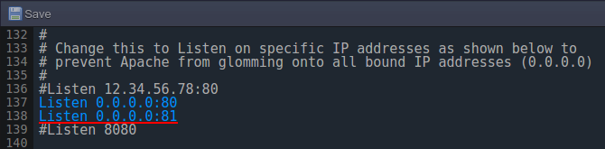

Here, the ***{port}*** parameter should be substituted with the private port number you've stated during the addition of the endpoint (we've chosen the *81st* one).

5\. After that, move to the end of the file and duplicate the **VirtualHost** section, specifying the corresponding port number (the same as in the step above - *81st* in our case) within its heading.
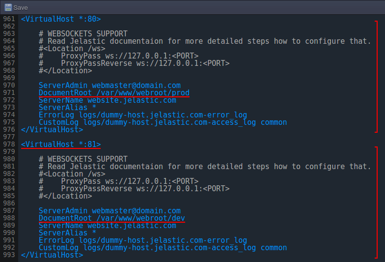
Then adjust the appropriate *DocumentRoot* locations for both virtual hosts with the corresponding projects (*prod* - for the default one and *dev* - for the custom section beneath).

6\. **Save** the performed changes and **Restart** the Apache server to apply them.
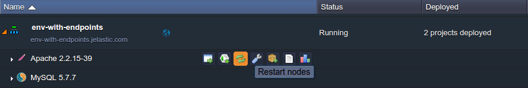

7\. Now you can connect to your *prod* project as usual, e.g. using the **Open in browser** button (or entering the external [custom domain](/custom-domains) if one was additionally bound to your app), while for accessing its *dev* version, you just need to specify the used endpoint's Access URL.

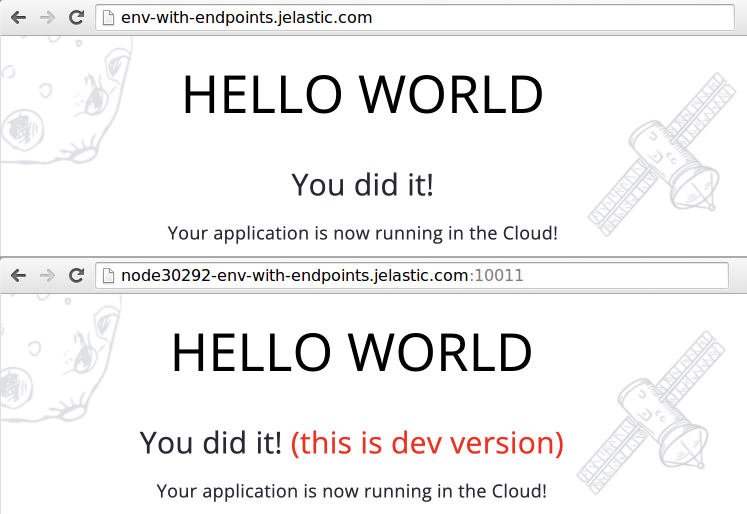

As a result, you've got two connection points to your two projects, which allow you to perform any desired testing or development tasks at one of the copies, with zero influence on the another one. Moreover, they can be swapped in a few clicks if necessary.

Stay tuned for more useful examples of practical endpoints' usage in the nearest future.


## What's next?

* [Public IP](/public-ip/)
* [Remote Access to MySQL](/remote-access-mysql/)
* [Dump import/export to MySQL](/dump-import-export-to-mysql/)
* [Application Lifecycle](/how-to-manage-application-lifecycle/)