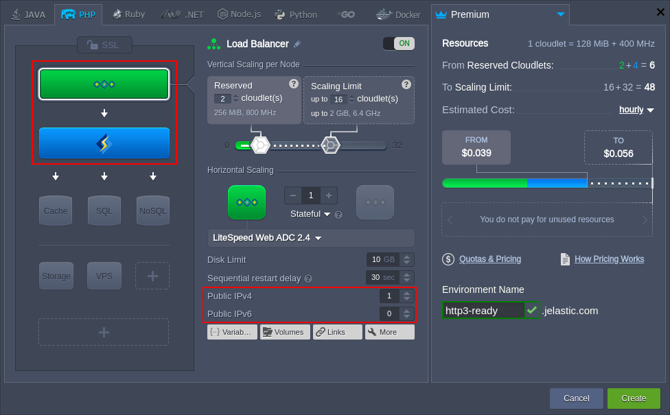

# HTTP/3 (QUIC) Support

**HTTP/3** (formerly known as "*HTTP over QUIC*") is the to-become third major version of the Hypertext Transfer Protocol family. Featurewise, it is very similar to HTTP/2 but offers some significant advantages due to changes to the underlying method of utilization. Namely, the HTTP/3 is built on ***QUIC*** transport protocol, which works over UDP instead of TCP.

Currently, HTTP/3 is already provided by some solutions (e.g. *LiteSpeed* and *NGINX*) and is [adopted by the platform](#http3-support-implementation) through the latest releases of the following stacks:

* _**load balancers:** [LiteSpeed Web ADC](/litespeed-web-adc/), [Varnish](/varnish/), [NGINX](/nginx-load-balancer/)_
* _**application servers:** [LiteSpeed WS](/litespeed-web-server/), [LLSMP & LEMP](/lemp-llsmp/), [NGINX PHP](/nginx-php/), [NGINX Ruby](/nginx-ruby/)_

Below, you can check the:

* [technical preconditions of the HTTP/3 implementation](#technical-implementation-specificspreconditions)
* [benefits of the HTTP/3 (QUIC)](#http3-quic-key-features)
* [integration in the platform](#http3-support-implementation)

## Technical Implementation Specifics/Preconditions

The main reason behind HTTP/3 implementation is that HTTP/2 reached its limit in the speed improvements due to the bottleneck of the TCP protocol. Despite being reliable, all the round-trips required by handshakes, delivery feedbacks, ordering guarantees, and checksums of the TCP can be considered weak and redundant. Herewith, as a part of the TCP/IP stack, TCP is implemented in operating system kernels, and devices firmware, making significant changes to TCP is next to impossible.

{}**Tip:** Below, we've provided some examples of the limitations provided by TCP:

* a single TCP connection can transfer data over multiple streams; however, packet loss holds the whole connection (and all its streams) until TCP retransmits the packet
* TCP does not provide built-in TLS, so secure connections require an additional round-trip, creating a delay{}

UDP suffers no such limitations and is just as widespread as TCP, which allows achieving improvements without significant changes to the existing operating systems and devices firmware. Thus, HTTP/3 has adopted the QUIC transport protocol (initially developed by Google), which is based on UDP, provides [significant benefits](#http3-quic-key-features). Also, being already in use by prominent internet companies such as Google and Facebook, the efficiency and reliability of the QUIC solution cannot be denied.

## HTTP/3 (QUIC) Key Features

By using QUIC instead of TCP as its base, HTTP/3 can take advantage of the numerous benefits it provides. Herewith, QUIC implementation on top of UDP allows offering features similar to TCP but without some of the choke points. So, let's sum up the main distinguishing features of the HTTP/3 when compared to its predecessor HTTP/2:

* *enhanced multiplexing* - packet loss affects only the appropriate single stream (not all of them within the same connection)
* *faster connection setup* - protocol handles security features by itself, decreasing the number of round-trips for establishing a connection (especially noticeable on high-latency networks, e.g. for mobile users)
* *connection migration* - the use of connection ID instead of destination IP allows ensuring packet delivery even in case of a network switch (e.g. download over HTTP/3 will proceed when wifi connection is changed to the mobile network)

Generally, HTTP/3 aims to provide faster and more reliable connections, which will be especially noticeable by those with higher latency networks. So, from a performance standpoint, mobile users will reap the most benefits, but these are the improvements that everyone can appreciate.

## HTTP/3 Support Implementation

The support for the HTTP/3 (QUIC) protocol is still in its earliest implementation stages. However, it is already provided by some solutions (e.g. [LiteSpeed](https://www.litespeedtech.com/latest-techs/http-3-is-coming)) and is in development by others.

Below, you can view the most accurate list of the software stacks at the platform that provide HTTP/3 support by default:

* ***load balancers***
    * *[LiteSpeed Web ADC](/litespeed-web-adc/):* all versions
    * *[Varnish](/varnish/):* *5.2.x*, *6.x.x* versions and above
    * *[NGINX](/nginx-load-balancer/):* since the *1.16.1* release
* ***application servers***
    * *[LiteSpeed WS](/litespeed-web-server/):* all versions
    * *[LLSMP](/lemp-llsmp/):* all versions
    * *[LEMP](/lemp-llsmp/):* since the *1.16.1* release
    * *[NGINX PHP](/nginx-php/):* since the *1.16.1* release for PHP *7.2.26*, *7.3.13*, *7.4.1* versions and above
    * *[NGINX Ruby](/nginx-ruby/)*: since the *1.16.1* release for Ruby *2.4.9*, *2.5.7*, *2.6.5*, *2.7.0* versions and above

Just [create an environment](/setting-up-environment/) topology that includes any of the application servers or load balancers mentioned above.

Herewith, you'll need to additionally attach a [public IP address](/public-ip/) to bypass the Shared Load Balancer and allow working directly with the server over HTTP/3.

{}**Note:** As of the client-side, the HTTP/3 (QUIC) support is currently enabled by default in *Chromium*, can be configured in *Chrome* (chrome://flags), and is [not yet implemented](https://bugzilla.mozilla.org/show_bug.cgi?id=1158011) by the *Firefox* browser.{}

## What's next?

* [FTP/FTPS Support](/ftp-ftps-support/)
* [Websockets Support](/websockets/)
* [LiteSpeed Web Server](/litespeed-web-server/)
* [LiteSpeed Web ADC](/litespeed-web-adc/)
* [Public IP](/public-ip/)