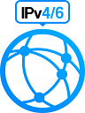
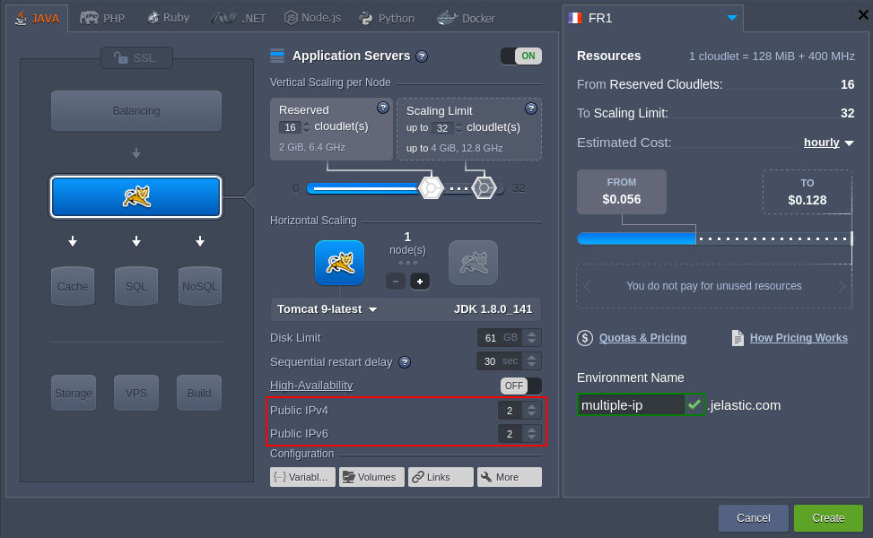
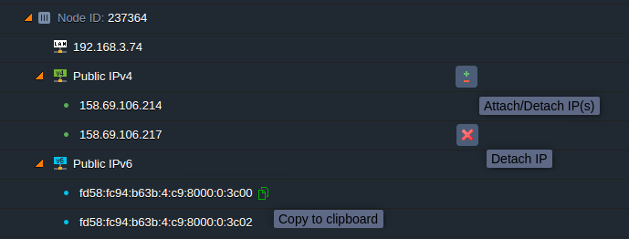
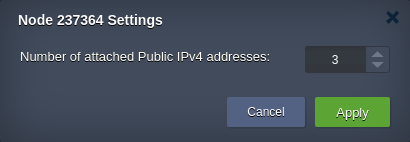
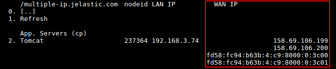

# Multiple Public IP Addresses for a Single Container

{}{}

The platform supports assigning multiple [public IP](/public-ip/) addresses (of both IPv4 and IPv6 revisions) to a single container. Herewith, the assigned IPs could be either of one of the versions or both of them simultaneously.

For example, if hosting several web-sites on a single node, the multi-IP option allows to handle them as separate production-ready services due to the ability to apply dedicated [custom domain name](/custom-domains/) and [SSL certificate](/secure-sockets-layer/) to each of them. Also, this option can be helpful for operating network appliances (e.g. load balancers) with multiple IP addresses for each network.

{}**Note:** Both Public IPv4 and IPv6 are paid options, charged separately (either for the same or different price) on hourly basis. The exact cost and allowed number of IPs per node/per environment can be seen within the **[Quotas & Pricing](/resource-consumption/#how-much-do-resources-cost) &gt; Account Limits** dashboard tab.{}

You can assign multiple IP addresses through your platform dashboard by means of the appropriate spinners at topology wizard when either creating an environment or changing its topology.

Here, you can select or enter the required number of addresses of both types through the appropriate **Public IPv4** and **Public IPv6** boxes. If meeting the limits, please, contact your [hosting provider](https://www.virtuozzo.com/application-platform-partners/) to increase the available addresses count.

## Managing Multiple Public IP Addresses

On the main dashboard screen, each node within the environment topology list is supplemented with details on all assigned IP addresses, displayed in the following order: 

* **Private IP** - automatically attached internal IP address; is always displayed first just under the *Node ID* value
* **Public IPv4** - single external IP record or expandable list of all v4 addresses, comes second
* **Public IPv6** - single external IP record or expandable list of all v6 addresses, appears last

Also, you can **Copy to clipboard** and **Detach** each particular address using the appropriate buttons. And the **Attach/Detach IP(s)** option next to the addresses list title allows to adjust the total number of assigned IPs of the corresponding type, i.e. for each block separately:

The ***Node Settings*** box displays the number of currently attached addresses with the **Apply** button dimmed until you make some changes.

{}**Note:** The very first added Public IP of each type that is added to an instance is considered a ***primary*** one (is always displayed first within the IP list). It can be deleted only if no more assigned addresses of a same version have left at a node. This address is used for both incoming and outgoing traffic, whilst the rest of IPs can only receive it.{}

Also, all IP addresses, assigned to a container, are shown within environment topology details at terminal upon connecting to an environment via [SSH Gate](/ssh-access/). 

Here, all container external addresses are displayed within the **WAN IP** column (in the same order as at the dashboard, i.e. IPv4 > IPv6), whilst the **LAN IP** one contains its internal address.

{}**Note:** In case the required type of the newly attached IP is not indicated explicitly (e.g. within [Cloud Scripting](https://docs.cloudscripting.com/) solution or application/add-on package settings at [platform Marketplace](/marketplace/)), the IPv4 is used by default.{}

These is a set of [API methods](/api-overview/) that you can use to perform tasks related to Public IP. For the detailed API reference on Public IP, please proceed to the following section.

## API Reference on Multiple Public IPs

In this section, you can find information on [platform API](https://www.virtuozzo.com/application-platform-api-docs/) methods that are provided for you to work with multiple Public IP addresses.

1\. To attach or detach a Public IP address via platform API, the ***SetExtIpCount*** method is provided.

_https://[[hoster-api-host](/paas-hosting-providers/)]/1.0/environment/control/rest/setextipcount?**envname**=[string]&**session**=[string]&**type**=[string]&**count**=[int]&**nodegroup**=[string]&**nodeid**=[int]_

This method is used with the following parameters:

* ***envname***- name of a source environment     
* ***session***- ID of a current user session
* ***type*** - version of Public IP (*ipv4* or *ipv6*)
* ***count*** - number of IP addresses to be added or removed per container 
* ***nodegroup*** - group of a destination node (e.g. *bl*, *cp*, *sqldb*, *nosqldb*, *storage*, *vps*, or *build*)
* ***nodeid*** - ID of a destination node 
 
In order to increase or reduce the number of particular IPs (IPv4 or IPv6) on a destination container, you need to specify the ***count*** according to the number of the already assigned addresses. 

{}**Note:** The ***AttachExtIp*** and ***DetachExtIp*** methods, which were provided earlier to add and remove Public IP address respectively, are now deprecated but still can be used due to the backward compatibility.{}

2\. To swap Public IP addresses between two nodes within the same or separate environments, you can use the ***SwapExtIps*** method.
  
_https://[{hoster-api-host}](/paas-hosting-providers/)/1.0/environment/control/rest/swapextips?**envname**=[string]&**session**=[string]&**sourcenodeid**=[int]&**destnodeid**=[int]&**sourceip**=[string]&**destip**=[string]_

This method is used with the following parameters:  

* ***envname*** - name of a source environment
* ***session*** - ID of a current user session
* ***sourcenodeid*** - ID of a source node to move a Public IP address from
* ***destnodeid*** - ID of a destination node to move a Public IP address to (can belong to another environment)
* ***sourceip*** - Public IP address on a source node to be swapped
* ***destip*** - Public IP address on a destination node to be swapped

In order to swap all the Public IP addresses between the source and destination nodes, omit the ***sourceip*** and ***destip*** parameters.

{}**Note:** The ***SwapExtIps*** method can be currently used only with Public IPv4.{}

## What's next?

* [Public IP](/public-ip/)
* [Shared Load Balancer](/shared-load-balancer/)
* [HTTP Load Balancing](/load-balancing/)
* [TCP Load Balancing](/tcp-load-balancing/)