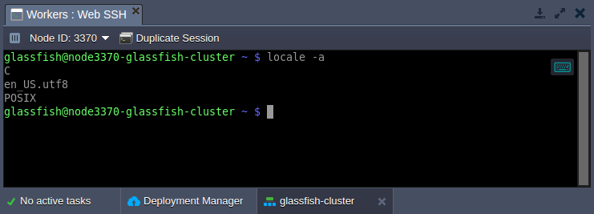
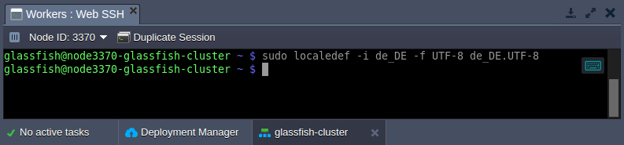
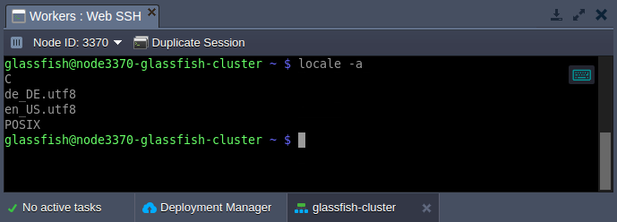

# Managing Locale Settings

A **locale** is a set of language and cultural rules, which define preferences that you want to see in your interface and applications. It covers aspects such as language for messages, different character sets, lexicographic conventions, and so on. Below, we'll overview how to view and change the locale settings on your containers.

1\. By default, all the platform-managed templates are provided with English language preferences. You can view the current ***[locale](http://man7.org/linux/man-pages/man1/locale.1.html)*** settings on the container using the following command (e.g. can be run via [Web SSH](/web-ssh-client/)):
```bash
locale -a
```



2\. To add a new language support, the ***[localedef](http://man7.org/linux/man-pages/man1/localedef.1.html)*** tool can be used:
```bash
sudo localedef -i {language}_{country} -f {codeset} {language}_{country}.{codeset}
```



here:

* ***{language}_{country}*** - provides language and country code
{}**Tip:** Check the list of the locales available for generation by executing the ***ls /usr/share/i18n/locales*** command.{}

* ***{codeset}*** - sets the character encoding identifier (e.g. *UTF-8*)

3\. Verify the new locale addition by checking the list of all supported ones:
```bash
locale -a
```



As you can see, the new language was added and can be used by your applications.


## What's next?

* [Web SSH Access](/web-ssh-client/)
* [OOM Killer Overview](/oom-killer-troubleshooting/)
* [Custom Error Page Settings](/custom-error-page/)
* [Application Lifecycle Management](/how-to-manage-application-lifecycle/)