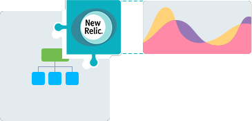
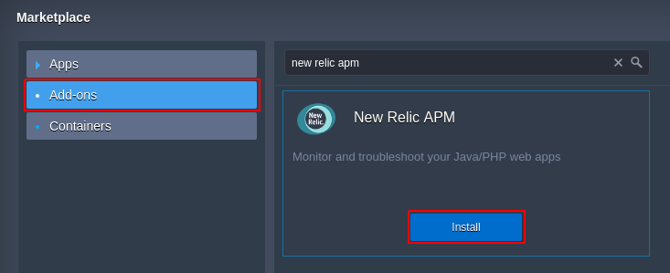
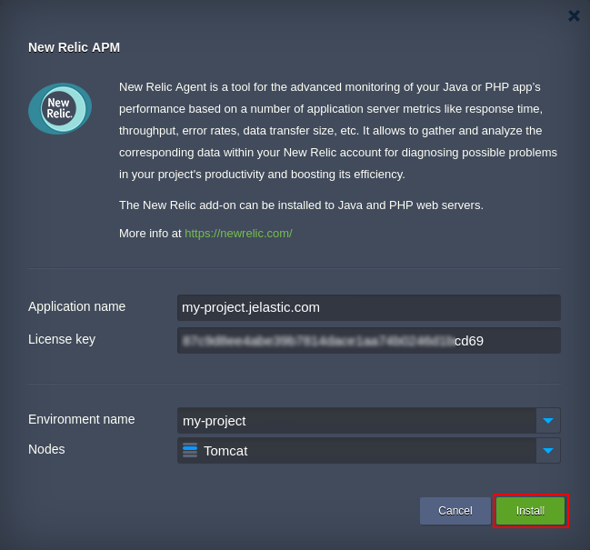
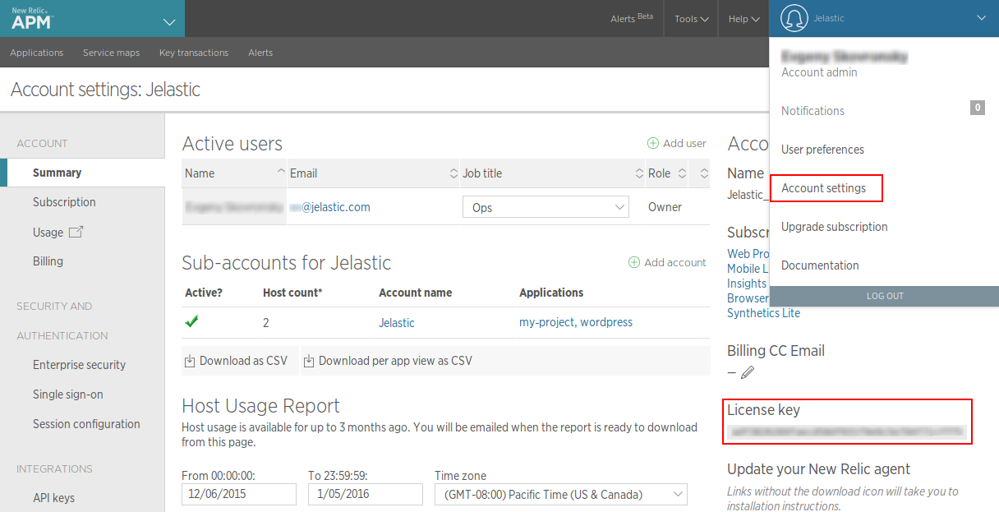
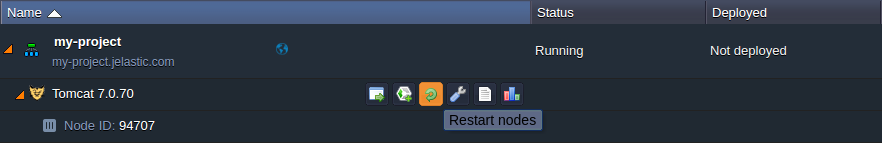
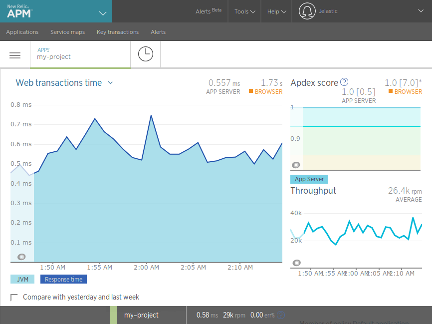

# New Relic Monitoring for Your Application inside the PaaS

**[New Relic](https://newrelic.com/)** is an application performance monitoring (APM) tool for Developers and Ops, focused on providing the deep insight into the project's performance and reliability in real-time. Designed to pinpoint and diagnose the occurred issues, it can track throughput of your web transactions, analyze application exceptions, find slowness in queries or web requests and, generally, gives the great amount of useful data for the fast and comfortable troubleshooting.

Since New Relic is one of the most frequently used and extremely popular solutions for supervising application metrics, we have prepared a special add-on to simplify its delivery. Implemented on the base of [JPS](/jps/) (Packaging Standard), it gives opportunity to install this software in a single mouse click and start tracking the most crucial application server information in a matter of minutes. In addition, you can always stay up-to-date with the embedded option for automatic installation of available New Relic updates.

So, let's explore how to unveil the latent performance capacities of your application with the help of New Relic - to proceed with the add-on installation, you'll need to have:
 
* the already registered New Relic account, with your unique user identifier (i.e. license key)
* at least a single environment created at any of [our partners'](https://www.virtuozzo.com/application-platform-partners/) platforms, with the deployed app you'd like to track

Once these conditions are fulfilled, you can easily integrate New Relic agent to your cloud environment - just follow the steps below.

{}**Note:** Subsequently, the installed New Relic monitoring software can be [smoothly updated](/update-new-relic/) to its latest version with the corresponding inbuilt add-on option.{}

## New Relic Add-On Installation

With the platform, the New Relic add-on can be installed on the top of either *Java-*(handled as a [Java agent](/javaagent/)) or *PHP*-based environment (being implemented in a view of [PHP extension](/php-extensions/)).

Anyway, the installation flow remains similar - so, as an example, we'll use a Java environment with **Tomcat** application server.

{}**Note:** The currently supported Java application servers are **Tomcat**, **TomEE**, and **Jetty** of all versions. The ability to apply New Relic monitoring to other servers is planned to be added further.{}

1\. To start with, click the **Marketplace** button at the top dashboard pane.

2\. Switch to the **Add-ons** section in the opened tab, find the ***New Relic APM*** solution within the appeared list (you can use the search input above) and click on **Install** for it.

{}**Tip:** The New Relic APM agent is also available at the [JPS Collection](https://github.com/jelastic-jps), alongside with the number of other useful JPS solutions the platform provides. 

You can [import](/environment-import/) and integrate any of them using the link to *manifest.jps* file within the appropriate repository.{}

3\. You'll see the installation frame appeared:

Here, the following data should be specified within the appropriate fields:  

* **Application name** - enter the label for this app to be shown at your New Relic dashboard, e.g. *my-project* (an environment domain is substituted by default here if switching among several available ones)
* **License key** - a unique identifier, that is bound to each New Relic user and can be viewed at the ***Account settings*** section of its [admin panel](https://login.newrelic.com/login) (stating it, you ensure that the collected data will be reported at your account)

{}**Note:** The ***License key*** field at add-on installation frame contains the key mask by default. You can complete the installation leaving it unchanged, but, obviously, you won't be able to explore the gathered statistics (because of the absence of the bound New Relic account).

Nevertheless, you can specify this parameter later within the New Relic add-on settings by means of the platform [Configuration Manager](/configuration-file-manager/).The paths for the required file are:

* for **Java** app servers:
    * **TomEE**,**Tomcat** - */opt/tomcat/lib/newrelic/newrelic.yml*
    * **Jetty** - */opt/jetty/lib/newrelic/newrelic.yml*
* for **PHP** app servers: the appropriate ***newrelic.license*** parameter can be found in the */etc/php.d/newrelic.ini* file

Besides, the rest of add-on parameters can be modified within these files too.{}

* **Environment name** - select the name of environment the New Relic agent should be installed to (the suitable ones are highlighted within the drop-down list)
* **Nodes** - pick the instance for being monitored (currently, only application servers are available for choosing)

Click the **Install** button to confirm your entries and initiate the deployment process.
 
4\. In several minutes, the add-on will be added to your application:

5\. According to the above shown pop-up, you need to obligatory **Restart node(s)** to start gathering your app's efficiency trends. This can be performed with the appropriate button next to your application server.

{}Please, **pay attention** that if your project is run in a single app server node, the restart will cause a <u>temporary downtime</u> of your application, thus we leave for you to decide when to perform this operation.

However, in case your app server is [scaled horizontally](/horizontal-scaling/), the downtime will be minimized, since all the server instances will be restarted sequentially. You are able to get rid of this inconvenience at all, through setting the delay for executing this operation at each next node within a layer. In such a way, whilst one node is undergoing the maintenance, the rest ones will remain active.
{}

6\. Now, you can log in to your New Relic account and look inside the collected data on your application performance metrics. Keep an eye on the most crucial parameters in real time through your custom report dashboards, get the automatic notifications on the critical issues occurred and much more - see the full list of the provided [monitoring features](https://newrelic.com/products/application-monitoring/features).

As you can see, the New Relic add-on installation is really simple and will not take much time. At the same time, it's powerful enough to help dealing with arisen problems and doing away with lack of performance.

{}If you face any issues while integrating New Relic APM into your environment, feel free to appeal for our technical experts' assistance at [Stackoverflow](https://stackoverflow.com/questions/tagged/jelastic).{}

## What's next?

* [Application Monitoring](/view-app-statistics/)
* [New Relic Update](/update-new-relic/)
* [Java Agent Integration](/javaagent/)
* [PHP Extensions](/php-extensions/)
* [JPS Collection](https://github.com/jelastic-jps)