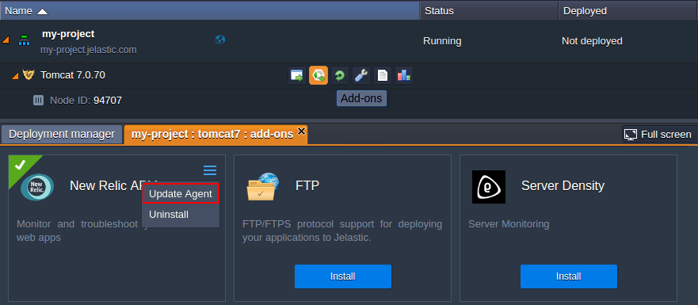
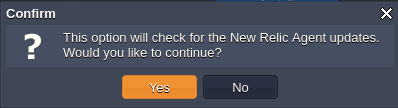
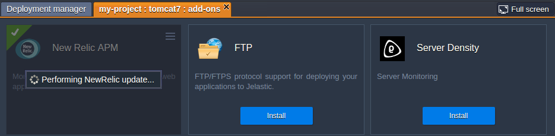
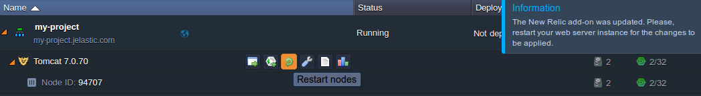

# How to Update Installed New Relic Monitoring Add-on
In order to keep in pace with the most recent [New Relic](/new-relic-installation) monitoring features, the platform provides the inbuilt update option for the dedicated add-on. It checks the presence of the newly released agent versions directly at the corresponding repositories and allows to update it in just a few clicks, without the necessity to handle this manually. So, let's see how to perform this!

## New Relic Agent Update
To find out whether any updates are available for your New Relic agent, open the **Add-ons** section for the required node (with the same-named button next to it) and find the ticked New Relic plank.
 
Click on the gear icon in its top corner and select the **Update Agent** option at the expanded list:

Confirm the initiation of the available updates' checking within the appeared dialog frame by clicking **Yes** and wait till the platform completes this.

As a result, the necessary files (if there are any) will be downloaded and installed.

After the add-on is successfully updated, you'll see the corresponding pop-up in the top right corner of the dashboard, which recommends you to restart the instance for these changes to be applied. 

So, follow this tip by clicking the appropriate button next to your application server.

{}**Note:** Please, **pay attention** that if your project is run in a single app server node, the restart will cause a <u>temporary downtime</u> of your application, thus we leave for you to decide when to perform this operation.

However, in case your app server is [scaled horizontally](/multi-nodes#app), the downtime will be minimized, since all the server instances will be restarted sequentially. And starting with [4.9 PaaS version](/release-notes-49#sequential-restart-deploy), you are able to get rid of this inconvenience at all, through setting the delay for executing this operation at each next node within a layer. In such a way, whilst one node is undergoing the maintenance, the rest ones will remain active.{}

That's it! Your New Relic add-on is updated and ready to work.
{}
Subsequently, the current version of your agent could be checked as follows:

* for *Java* servers - within the ***logs/newrelic_agent.log*** file, located in the dedicated directory with add-on files (see the [list of paths](/new-relic#paths) to it depending on a server)
* for *PHP* servers - via the ***phpinfo()*** output
{}

In such a way, you can be always up-to-date on the most recent cool features and possibilities the New Relic team provides.

## What's next?
* [New Relic Monitoring Integration](/new-relic-installation/)
* [Automatic Horizontal Scaling](/automatic-horizontal-scaling/)
* [Marketplace](/marketplace/)
* [JPS Collection](https://github.com/jelastic-jps)
* [Application Statistics](/view-app-statistics/)