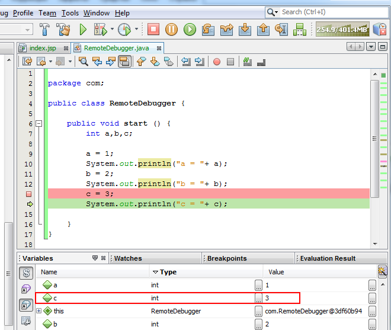

# Remote Debugging

With Public IPs in the platform, you can use remote debugging. Now you can debug your application running on the platform by connecting it with code in your IDE. First of all, let's consider the basic aspects of remote debugging.

**How does remote debugging work?**

Java provides this feature using listener binding mechanism. Basic concept is pretty easy and elementary:

* Application to be debugged would attach a socket to itself and then would listen debug instructions on that socket.
* Debugger would bind itself to that socket and then send instructions on that socket.

## Create Environment

1\. Log into the platform dashboard.

2\. Click **Create environment** to set up a new environment.


3\. Choose the instances you want to use (for example, ***Tomcat*** application server), set the cloudlets limit and switch on **external IP**. Then type the name of environment and click **Create**.


In a minute the environment will be created.

4\. Expand the list of environment and use **Additionally** button for your instance to see the number of your **Public IP**.


## Deploy an Application

1\. Upload your Java package to the **Deployment manager**.


2\. Once the package is in the platform, deploy it to the environment you have just created.


As an example we use simple application, which initializes three variables (a, b, c) in turn.
```java
package com;
public class RemoteDebugger {

   public void start () {
       int a,b,c;
       a = 1;
       System.out.println("a = "+ a);
       b = 2;
       System.out.println("b = "+ b);
       c = 3;
       System.out.println("c = "+ c);
       }
}
```


## Configure Debugging

1\. Open the application in your IDE (e.g. *NetBeans*) and create a new debugger (*Debug main project &gt; Attach Debugger*).


2\. Select the type of connector, insert your Public IP address (*host*), the number of the port, you would like to listen to and specify timeout settings (optional).


3\. Switch back to the platform dashboard and click the **Config** button for **Tomcat**.


4\. Navigate to **variables.conf** file and supply two arguments, **-Xdebug** and **-Xrunjdwp**.

*-Xdebug* tells JVM to run the application in debug mode, while *-Xrunjdwp* is used to supply debug parameters.
```
-Xdebug -Xrunjdwp:transport=dt_socket,server=y,suspend=n,address=5000
```


{}**Note:** The port number in **variables.conf** and in your **debugger** should be the same.{}

5\. **Save** the changes and **restart** Tomcat.

6\. Put the break point to your code to test remote debugging and start the newly created debugger. In our case the application should initialize only two variables instead of three.


Let's check **Tomcat logs** to ensure that debugging works properly.


As you see everything is ok, two variables have been initialized.

7\. If we put the break point one row down, three variables will be initialized by our app.




{}**Tip:** The instruction above is fully suitable for Jetty application server.{}

In case you use **GlassFish** as your application server you have to supply **-Xdebug** and **-Xrunjdwp** arguments via the **admin panel** page.

* When you created the environment, the platform sent you an email with credentials to the **GlassFish Admin Console**. Log in with these credentials.


* Navigate to **gfcluster-config &gt; JVM Settings** and select the **General tab &gt; Debug options**. Specify your debug mode and debug parameters.


* Go to **JVM options** and add two arguments: *-Xdebug* and *-Xrunjdwp:transport=dt_socket,server=y,suspend=n,address=5000*.


* **Save** all changes and **restart** GlassFish.

Hope this instruction will be useful for you.


## What's next?

* [WebSockets](/websockets/)
* [Email using external SMTP](/email-via-external-smtp/)
* [Public IP](/public-ip/)