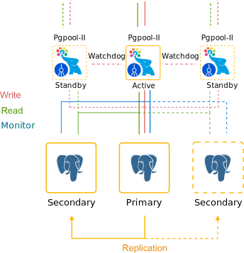

# Auto-Clustering of Instances via Topology Wizard

The platform provides an on-demand automatic clusterization for some of the managed templates. Such automation significantly simplifies and speeds up the creation of a reliable production-ready cluster for your project.

Below, we'll consider the following points:

* [supported stacks](#templates-with-supported-auto-clustering) (with clusterization specifics)
* [auto-clustering management](#auto-clustering-management)
* [cloud scripting usage](#setting-up-auto-clusterization-with-cloud-scripting)


## Templates with Supported Auto-Clustering

Currently, the following templates support the newly added clustering feature (with even more stacks to be added in the future):

* **application servers** - *[Tomcat/TomEE](#tomcattomee)*, *[GlassFish](#glassfish)*, *[Payara](#payara)*, *[Jenkins](#jenkins)*, *[WildFly](#wildfly)*
* **SQL databases** - *[MySQL](#mysql)*, *[MariaDB](#mariadb)*, *[Percona](#percona)*, *[PostgreSQL](#postgresql)*
* **NoSQL database** - *[Couchbase](#couchbase)*, *[MongoDB](#mongodb)*, *[Redis](#redis)*, *[OpenSearch](#opensearch)*
* **storage server** - *[Shared Storage Container](#shared-storage-container)*

{}**Tip:** Your particular service hosting provider can configure and implement auto-clustering for some additional stacks, which are not defined in the list.{}

### Tomcat/TomEE

A highly available Tomcat/TomEE cluster that can balance the load across compute nodes to enhance performance and resilience. The implementation provides session replication, context attribute replication, and cluster-wide WAR file deployment.

{}**Note:** The **Auto-Clustering** feature for Tomcat and TomEE is available since the following stack versions:

- **Tomcat** - *10.0.5*; *9.0.45*; *8.5.64*; *7.0.108*
- **TomEE** - *9.0.0-M3*; *8.0.5*
{}


{}[Learn More >>](/tomcat/){}

### GlassFish

Interconnection of the GlassFish servers with pre-configured session replication and load balancing.


{}[Learn More >>](https://www.virtuozzo.com/company/blog/glassfish-payara-auto-clustering-cloud-hosting/){}

### Payara

Interconnection of the Payara servers with pre-configured session replication and load balancing.


{}[Learn More >>](https://www.virtuozzo.com/company/blog/glassfish-payara-auto-clustering-cloud-hosting/){}

### Jenkins

A master Jenkins node in the master-slave mode with auto-scalable Java Engine workers and pre-installed plugins to support building and deployment automation for organizing continuous integration (CI) and continuous delivery (CD) pipelines.


{}[Learn More >>](https://www.virtuozzo.com/company/blog/jenkins-cluster-hosting-continuous-integration-delivery/){}


### WildFly

WildFly nodes in *Domain Mode* with enabled clustering to get high availability and guarantee the continuous performance of a deployed Java EE application.


{}[Learn More >>](https://www.virtuozzo.com/company/blog/wildfly-managed-domain-in-containers-auto-micro-clustering-and-scaling/){}

### MySQL

*Auto-Clustering is provided for the 5.7.x and 8.x MySQL versions only.*

Automatic clusterization of the databases with pre-configured replication and auto-discovery of the nodes.

Based on your requirements, you can select ***Scheme*** of the following types:

- **Primary-Primary** with Extra Secondaries

Pre-configured replication with two interconnected primary databases. During the horizontal scaling, the cluster is extended with additional secondary nodes.


- **Primary-Secondary** with Extra Secondaries

Pre-configured replication with one primary and one secondary database. During the horizontal scaling, the cluster is extended with additional secondary nodes.


{}[Learn More >>](https://github.com/jelastic-jps/mysql-cluster){}

### MariaDB

*Auto-Clustering is provided for the 10.x MariaDB versions only.*

Automatic clusterization of the databases with pre-configured replication and auto-discovery of the nodes.

Based on your requirements, you can select ***Scheme*** of the following types:

- **Primary-Primary** with Extra Secondaries

Pre-configured replication with two interconnected primary databases. During the horizontal scaling, the cluster is extended with additional secondary nodes.


- **Primary-Secondary** with Extra Secondaries

Pre-configured replication with one primary and one secondary database. During the horizontal scaling, the cluster is extended with additional secondary nodes.


- **Galera** Cluster

All servers can accept updates even if being issued concurrently.


{}[Learn More >>](https://github.com/jelastic-jps/mysql-cluster){}

### Percona

Automatic clusterization of the databases with pre-configured replication and auto-discovery of the nodes.

Based on your requirements, you can select ***Scheme*** of the following types:

- **Primary-Primary** with Extra Secondaries

Pre-configured replication with two interconnected primary databases. During the horizontal scaling, the cluster is extended with additional secondary nodes.


- **Primary-Secondary** with Extra Secondaries

Pre-configured replication with one primary and one secondary database. During the horizontal scaling, the cluster is extended with additional secondary nodes.


- **XtraDB** Cluster

A database clustering solution that ensures high availability, prevents downtime and data loss, and provides linear scalability for a growing environment.


{}[Learn More >>](https://github.com/jelastic-jps/mysql-cluster){}

### PostgreSQL

Pre-configured PostgreSQL database cluster with asynchronous primary-secondary replication and automatic addition of the new nodes into the cluster (as secondaries).



{}[Learn More >>](https://www.virtuozzo.com/company/blog/postgresql-auto-clustering-master-slave-replication/){}

### Couchbase

Automatically interconnected Couchbase servers with the pre-configured auto-scaling and rebalancing to provide a single highly available data storing system.


{}[Learn More >>](https://github.com/jelastic-jps/couchbase){}

### MongoDB

Automatic configuration of a highly-available and reliable MongoDB replica set with auto-discovery of the new nodes.


{}[Learn More >>](/mongodb-auto-clustering/){}

### Redis

Automatization for a distributed implementation of Redis Cluster - an open-source, in-memory data structure store. It is usually used for caching, data storing, as a message broker, and for other tasks. The provided topology consists of at least three Primary servers, each with a Secondary node to ensure the read load distribution and auto-recovery if the Primary goes down.


{}[Learn More >>](/redis-cluster/){}

### OpenSearch

Automatic clusterization of a community-driven, open-source search engine that provides a distributed, multitenant-capable full-text search. Solution provides built-in settings to add the *OpenSearch Dashboards* for data visualization and *Logstash* for processing logs.


{}[Learn More >>](/opensearch-cluster/){}

### Shared Storage Container

Automatically configured, reliable storage cluster (replicated volume) based on the [Gluster](https://www.gluster.org/) solution, which ensures data safety. In case of failure of one or several nodes, the *AutoFS* client automatically switches to the working instances, providing storage high-availability.


{}[Learn More >>](/shared-storage-container/){}


## Auto-Clustering Management

1\. The ***Auto-Clustering*** feature can be enabled for the node group through the same-named switcher in the central part of the topology wizard (if available for the [selected stack](#stacks)).


{}**Tip:** Based on the specific implementation, the ***Auto-Clustering*** option can be:

* mandatory enabled (e.g. for the *Couchbase* database)


* provided with some additional settings (e.g. cluster scheme and ProxySQL load balancer for the *MySQL* database)


* restricted by the minimum/maximum nodes count and/or scaling mode (e.g for the *MariaDB Galera* type)


{}

2\. Herewith, to get additional information on the cluster to be created, you can hover over the question mark next to the switcher. Within the appropriate pop-up frame, you can find a short description, which is usually supplemented with a topology scheme and a link to the more detailed overview.


{}**Tip:** Additional info on the various database cluster types can be viewed by hovering over the appropriate **Scheme**:


{}

3\. The other settings can be [configured](/setting-up-environment/) just as for any regular environment.


{}**Note:** After being configured, auto-clustering cannot be disabled from the topology wizard.{}

4\. If needed, you can track the cluster configuration logs via the platform console:

*https://app.**[{platformDomain}](/paas-hosting-providers/)**/console*


For example, you can use this info for debugging while developing packaged solutions with Cloud Scripting, which utilize the auto-clustering feature.


## Setting Up Auto-Clusterization with Cloud Scripting

In order to define auto-clustering settings in your [JPS solutions](/jps/), a new ***cluster*** property can be used. For example:

1\. Enable or disable auto-clustering for the specific layer.

```json
"nodeGroup": "couchbase",
"cluster": true | false
```

2\. Additional parameters for auto-clustering can be provided in the following way (for example, can be required to select a database cluster scheme):

```json
"nodeGroup": "mysql",
"cluster": {
  "scheme": "master"
}
```

3\. If needed, the default JPS [manifest](https://docs.cloudscripting.com/creating-manifest/basic-configs/) with the clusterization steps can be substituted with a custom one:

```json
"nodeGroup": "mysql",
"cluster": {
 "jps": "http://.../custom-manifest.jps",
 "settings": {
   "scheme": "master"
 }
}
```

4\. Based on the particular cluster requirements, some topology restrictions may be needed (e.g. the minimum/maximum number of nodes, scaling mode, etc.). It is implemented through the ***validation*** property.

Herewith, this parameter can be specified for any JPS package, e.g. check the YAML example below:

```yaml
type: install
name: Validation
nodes:
 image: alpine
 nodeGroup: cp
 count: 2
 validation:
   minCount: 2
   maxCount: 3
   scalingMode: stateful
```

That's it! Now, you can easily use the auto-clustering solutions supported by the platform, as well as all benefit from the implementation specifics.


## What's next?

* [Automatic Vertical Scaling](/automatic-vertical-scaling/)
* [Horizontal Scaling](/horizontal-scaling/)
* [Automatic Horizontal Scaling](/automatic-horizontal-scaling/)
* [JPS Overview](/jps/)
* [Cluster in the Cloud](/cluster-in-cloud/)