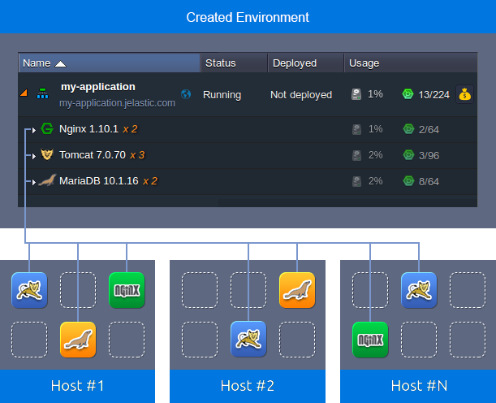
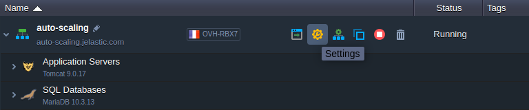
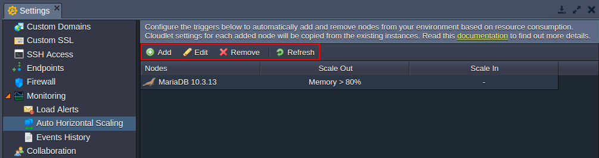
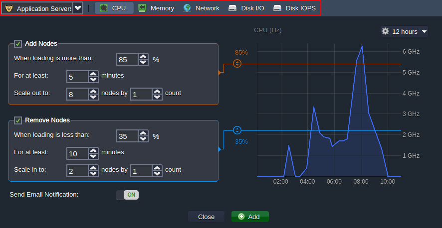
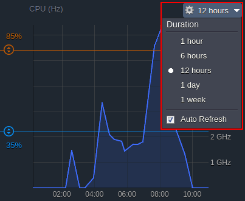
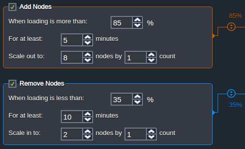
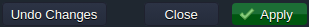
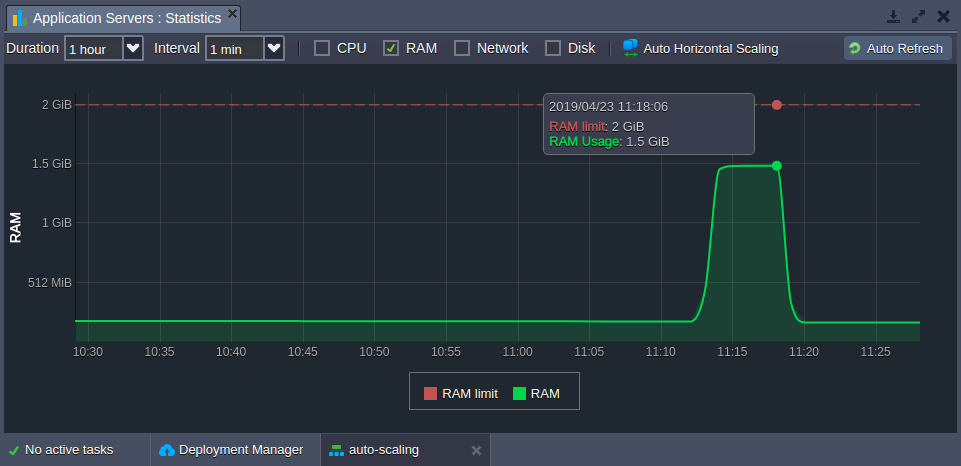
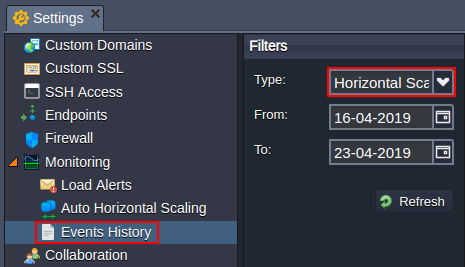
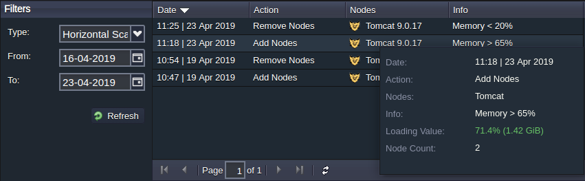

# Automatic Horizontal Scaling

In addition to the inbuilt [automatic vertical scaling](/automatic-vertical-scaling), the platform can automatically scale nodes horizontally, changing the number of containers within a [layer](/paas-components-definition/#layer) ([nodeGroup](https://docs.cloudscripting.com/creating-manifest/selecting-containers/#all-containers-by-group)) based on incoming load. Herewith, all instances within the same layer are evenly distributed across the available hardware sets (hosts) using the anti-affinity rules. Namely, when a new container is created, it is placed at the host with the least number of instances from the same layer and the lowest load mark, which ensures [reliability and high-availability](/isolated-containers) of the hosted projects.

Automatic horizontal scaling is implemented with the help of the tunable triggers, which are custom conditions for nodes addition (scale out) and removal (scale in) based on the load. Every minute the platform analyses the average consumption of the resources (for the number of minutes specified within the trigger) to decide if the node count adjustment is required.

Herewith, the statistic is gathered for the whole layer, so if there are three nodes, which are loaded for 20%, 50%, and 20% respectively, the calculated average value is 30%. Also, the scale in and out conditions are independent, i.e. the analyzed period for one is not reset when another one is executed.

Below, we'll overview how to:

* [set triggers for automatic scaling](#configure-triggers)
* [view triggers execution history](#execution-history)

## Triggers for Automatic Scaling

To configure a trigger for the automatic horizontal scaling, follow the steps below.

{}**Note:** When a single certified application server (not a custom Docker container) is scaled out on environment without [load balancers](/load-balancing), the NGINX balancer is added automatically. Herewith, if you require a different one for your application, it should be added manually before the first scaling event.{}

1\. Click the **Settings** button for the required environment.

2\. In the opened tab, navigate to the **Monitoring > Auto Horizontal Scaling** section, where you can see a list of scaling triggers configured for the current environment (if any).

Use the buttons at the tools panel to manage auto horizontal scaling for the environment:

* **Add** - creates a new trigger
* **Edit** - adjusts the existing trigger
* **Remove** - deletes unrequired trigger
* **Refresh** - updates the displayed list of scaling triggers

Click **Add** to proceed.

3\. Select the required environment layer from the drop-down list and choose the resource type to monitor via one of the appropriate tabs (*CPU*, *Memory*, *Network*, *Disk I/O*, *Disk IOPS*).

{}**Tip:** 
* the initial (master) node can be used as a [storage server](/master-container-storage) for sharing data within the whole layer, including nodes added through automatic horizontal scaling
* the *CPU* and *Memory* limits are calculated based on the amount of the allocated [cloudlets](/cloudlet) (a special platform resource unit, which represents 400 MHz CPU and 128 MiB RAM simultaneously)
{}

4\. The graph to the right shows the statistics on the selected resource consumption. You can choose the required period for displayed data (up to one week) using the appropriate drop-down list. Herewith, if needed, you can enable/disable the statistics' *Auto Refresh* function.

Also, you can hover over the graph to see the exact amount of used resources for a particular moment. Use this information to set up proper conditions for your triggers.

5\. Each trigger has **Add** and **Remove Nodes** conditions, which can be enabled with the corresponding check-boxes right before the title.

Both of them are configured similarly:

* **When loading is more (less) than** - the upper (lower) limit in *percentage* for the average load (i.e. executes trigger if exceeded)

{}**Tip:** 
* the required value can be stated via the appropriate sliders on the graph
* the *100%* value automatically disables the ***Add Nodes*** trigger, and *0%* - the ***Remove Nodes*** one
* the minimum difference allowed between ***Add*** and ***Remove Nodes*** conditions is *20%*
* the *Mbps* units can be selected for the **Network** trigger instead of the percentage
* we recommend setting the average loading for the ***Add Nodes*** trigger above the *50%* threshold to avoid unnecessary scaling (i.e. wasted resources/funds)
{}

* **For at least** - the number of *minutes* the average consumption is calculated for (up to one hour with a 5 minutes step, i.e. *1*, *5*, *10*, *15*, etc.)
* **Scale out (in) to** - the maximum (minimum) number of *nodes* for the layer, that can be configured due to automatic horizontal scaling
* **Scale by** - the *count* of nodes that are to be added/removed at a time upon trigger's execution

When configuring a trigger, we recommend taking into consideration the [scaling mode](/horizontal-scaling#scaling-mode) of the layer. For example, you should set lower loading percent in the ***Add Nodes*** trigger for the *stateful* mode, as content cloning requires some time (especially for containers with a lot of data) and you can reach resources limit before a new node is created.

6\. You automatically receive an email notification on the configured auto horizontal scaling trigger activity by default; however, if needed, you can disable it with the appropriate **Send Email Notifications** switcher.

7\. At the bottom of the form you have the following buttons:

* **Undo Changes** - returns to the previous state (for editing only)
* **Close** - exits the dialog without changes
* **Apply (Add)** - confirms changes for the trigger

Select the required option to finish trigger creation (adjustment).

## Triggers Execution History

You can view the history of scaling triggers execution for a particular environment.

In the example below, we'll apply high load for 5 minutes (see the RAM usage [statistics](/view-app-statistics) in the image below) on the application server with the following triggers configured:

* ***add node*** when average RAM load is more than 65% for at least 5 minutes
* ***remove node*** when average RAM load is less than 20% for at least 10 minutes

Now, let's see the automatic horizontal scaling behaviour:

1\. Navigate to the **Settings > Monitoring > Events History** section and choose the ***Horizontal Scaling*** option within the *Type* drop-down list.

Additionally, you can customize the period to display triggers activity for via the appropriate **From** and **To** fields.

2\. The following details are provided within the list:

* **Date** and time of the trigger execution
* **Action** performed (*Add* or *Remove Nodes*)
* **Nodes** type the scaling has been applied to
* **Info** about trigger execution condition

Additionally, upon hovering over the particular record, you can additionally check the **Loading Value** (resource usage on the moment of execution) and **Node Count** (resulting number of nodes).

The ***Add*** and ***Remove Nodes*** triggers are independent, so the removal condition (average load less than 20% for at least 10 minutes) is not reset and continued to check even after a new node addition. Such an approach provides a quicker detection of the sufficient average load during the specified interval. It's recommended to set a significant difference between scaling out and scaling in limits to avoid often topology change.

That's it! In such a way, you can configure a set of tunable triggers to ensure your application performance and track automatic horizontal scaling activity directly via the dashboard.

{}
In case you have any questions, feel free to appeal for our technical experts' assistance at [Stackoverflow](https://stackoverflow.com/questions/tagged/jelastic).
{}

## What's next?
* [Automatic Vertical Scaling](/automatic-vertical-scaling)
* [Horizontal Scaling](/horizontal-scaling)
* [Statistics Monitoring](/view-app-statistics)
* [Load Alerts](/load-alerts)

