# File Synchronization Between Several Application Servers in a Cluster

{}{}

As incoming traffic to your project grows, you need to improve your app performance to keep up with it. Some room of capacities for elastic extension is automatically provisioned in confines of a set server [vertical scaling](/automatic-vertical-scaling/) limit, but eventually you most likely will face the need to enlarge a number of its nodes (i.e. to scale it [horizontally](/horizontal-scaling/)) upon your service popularity rises.

For lots of the most widely used apps (like *WordPress*, *Drupal*, *Joomla*, *Liferay*, *Redmine* and similar ones) such distribution across multiple web server instances becomes a real problem, as usually all user-provisioned content is saved only on a node that has processed the corresponding file upload request.

To help you in getting rid of such content being out-of-sync upon building clustered solution for your application, the platform provides a special **File Synchronization** add-on, intended to keep the uploaded files set similar across multiple web-server instances. Herewith, synchronization could be applied not just in confines of one environment (i.e. for a single horizontally scaled node) but even across application servers in two separate environments, regardless of whether they run the same stack and/or application or different ones.

So, follow the guide below to dive into [implementation specifics](#file-synchronization-add-on-implementation) of this solution and to discover how it actually works in practice with the next steps:

* [Install Example WordPress Application](#install-application)
* [Test File Upload Without Synchronization](#test-file-upload-without-synchronization)
* [Apply File Synchronization](#apply-file-synchronization)
* [Check Sync Logs](#check-logs)


## File Synchronization Add-on Implementation

The **File Sync** solution is provided as a single-click [add-on](/marketplace/), implemented with a bundle of **[lsyncd](http://code.google.com/p/lsyncd/)** daemon and **cron** utility. Herewith, being wisely coupled with **[inotify](https://en.wikipedia.org/wiki/Inotify)**, *lsyncd* initiates file synchronization only when any actual changes are detected on the system. Such realization notably offloads CPU in comparison to the regular sync calls and keeps your data up-to-date all the time, which makes this solution simultaneously simple to use, powerful, and affordable.

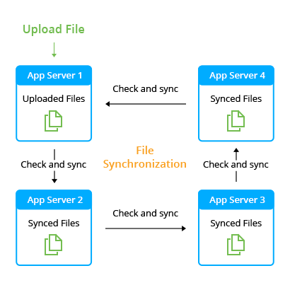

The **File Sync** add-on can be installed on top of any platform-managed application server stack (i.e. except for [Docker](/container-types/) containers). Before the appliance, you will be asked to select the folder to synchronize. In this way, you are able to sync only the part of your app server's file system that actually requires this. Thus, only changes within the selected directory (on any of specified application server instances) will trigger the synchronization.

Now, let's see how to put all of this into action step-by-step.


## Install Application

In our example, we will use the **WordPress** application, deployed to an environment with two *NGINX-PHP* application servers.
{}**Tip:** The instruction below is fully appropriate for other similar applications (*Drupal*, *Joomla*, *Liferay*, *Redmine* and so on) based on any supported programming language - Java, PHP, Ruby, etc.{}

1\. You can install your **WordPress** application [manually](/wordpress/) or locate the appropriate one-click package in [Marketplace](/marketplace/) to deploy it automatically.

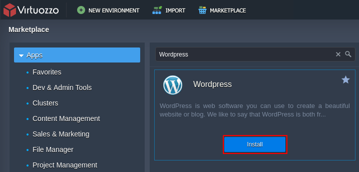

Click **Install** and provide the required details, such as *Environment*, *Display Name* ([alias](/environment-aliases/)) and *Region* (if several [regions](/environment-regions/) are available).

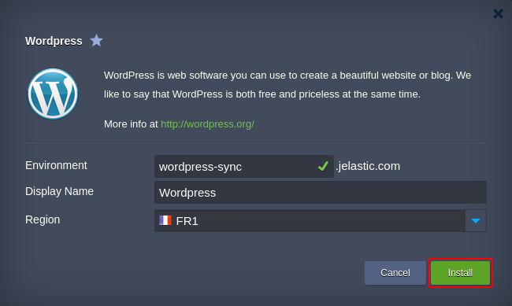

Confirm the installation and wait a minute for a message with your admin data to be shown (the same information will be simultaneously sent to you via email).

2\. Click **Change environment topology** and use the **+** button within the *[Horizontal Scaling](/horizontal-scaling/)* section to add one more app server node and, this way, to create a cluster.

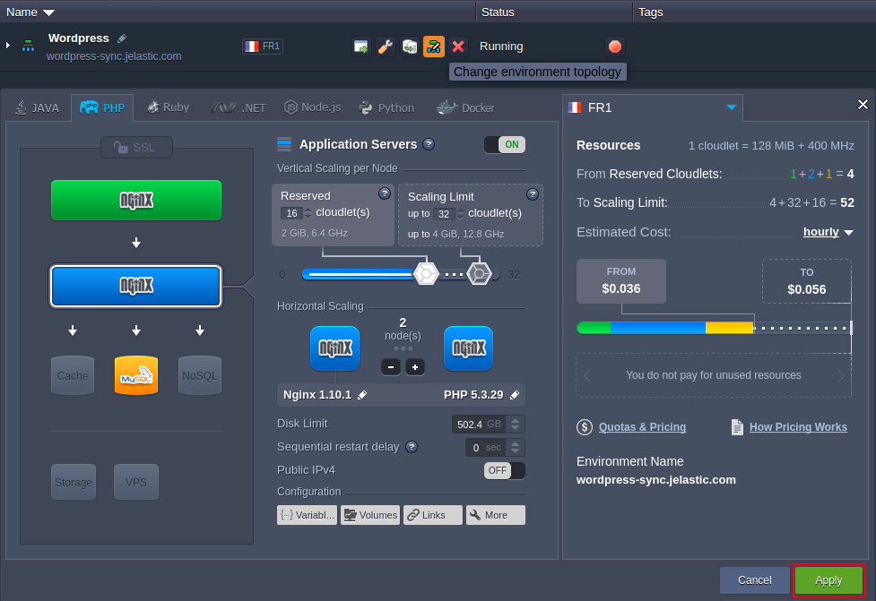

When finished, click **Apply**.

{}**Tip:** By using instructions in our documentation, you can easily add [extra app servers](/horizontal-scaling/), enable [high availability](/session-replication/) or even configure a [clustered](/cluster-in-cloud/) solution.

In our case, we have simply added one more app server to the environment but you can use a more complex scenario by setting the [clustered solution](/wordpress-cluster-devops/) for your WordPress application{}


## Test File Upload Without Synchronization

At this point, let's check how the file upload is processed without synchronization.

1\. Access the Wordpress admin panel by adding the */wp-login.php* suffix to your environment domain name and **Log In** using credentials you've received via email.

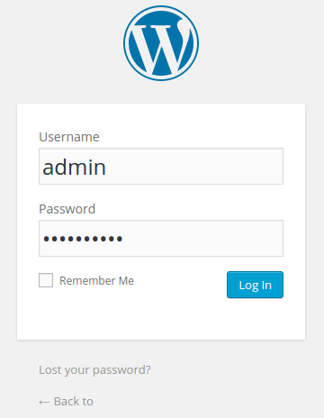

2\. Once logged in, make some custom changes (e.g. upload images or other files, edit themes, add pages, etc.).

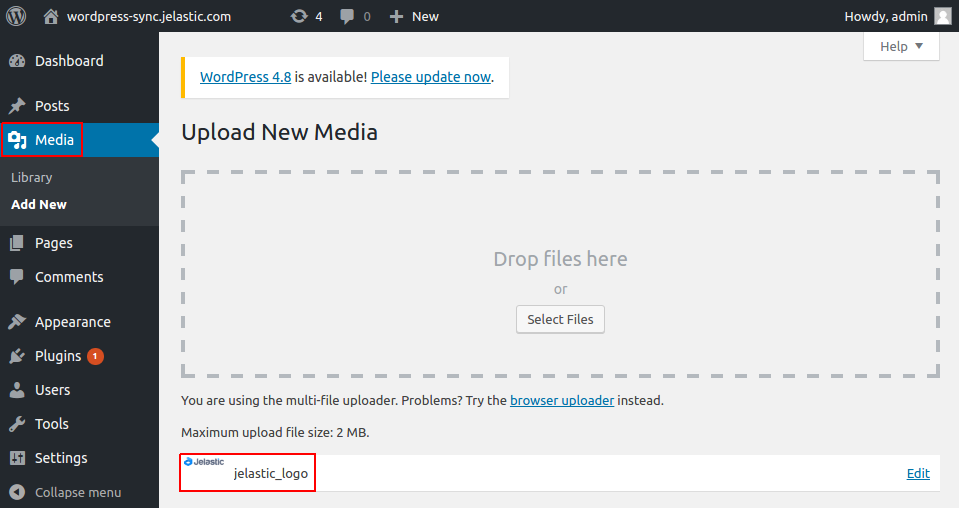

As an example, we've uploaded one image to the **Media** library.

3\. Now, return to the platform dashboard and click **Config** next to the app server layer.

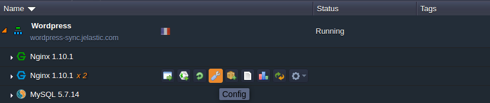

4\. Navigate to the **webroot** (click from *Favorites*) **&gt; ROOT &gt; wp-content** directory and compare its content within both nodes.

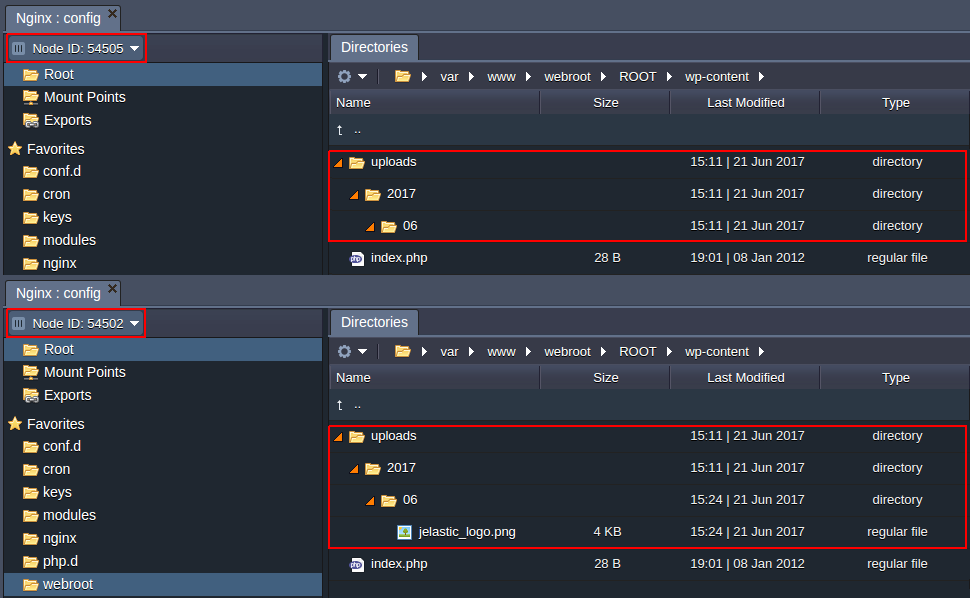

{}**Note:** The directory with uploaded files depends on the application you are running. Here is the list of such folders for some widely-used applications:

* **WordPress** - *webroot/ROOT/wp-content*
* **Drupal** - *webroot/ROOT/sites*
* **Joomla** - *webroot/ROOT/images*
* **Liferay** - *webroot/home/liferay/data*
{}

As you can see, one of the app server instances (*Node ID 54502* in our example) contains the newly added file in the **uploads** directory, whilst another one (with *54505* identifier) does not have it yet.


## Apply File Synchronization

So, to implement content synchronization inside our cluster, let's apply the **File Synchronization** add-on.

1\. Locate and **Install** the ***File Synchronization*** add-on within the platform [Marketplace](/marketplace/).

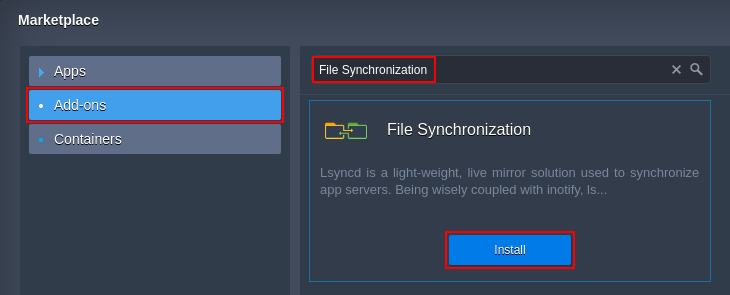

2\. In the opened dialog box you need to define some additional sync parameters.

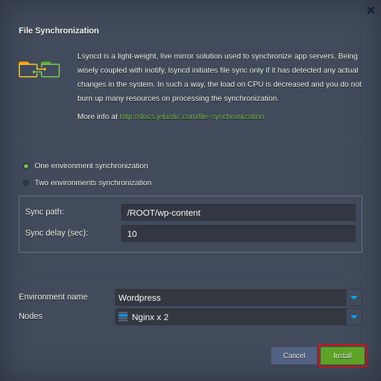

Here, specify whether file synchronization should run within *One* environment (as in our example) or between *Two* different *environments* (see the related dedicated options in the table below),. Apart of that, provide the following details:

* **Sync path** - path to a folder (relatively to the **webroot** directory) that should be synchronized on a chosen below (within the *Nodes* field) server, e.g. */ROOT/wp-content*
* **Sync delay (sec)** - synchronization delay, stated in seconds
* **Environment name** - to select the required environment from the list of available ones
* **Nodes** - the app server layer is fetched automatically upon selecting an environment

When you are finished, click **Install**.

{}**Tip:** In order to implement synchronization between two different environments, the add-on should be installed to web-servers in both of them (selecting another environment within the appropriate drop-down list each time) with the chosen *Two environments synchronization* option. Here, the following additional parameters should be specified:

- **2nd environment IP** - address of any application server node within the second environment (you can use internal IP for the case both environments are run on the same Platform and hardware [region](/environment-regions/); otherwise, external IP address is required)
- **Password** - optional box to set a password on synchronization (should be stated the same on both instances)

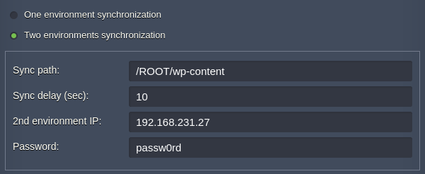
{}

3\. When installation is completed, you'll see a confirmation message.

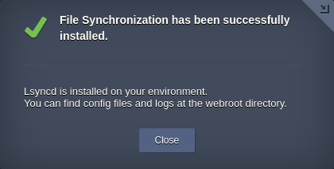

4\. At this point, you can check the uploaded file's presence within both nodes.

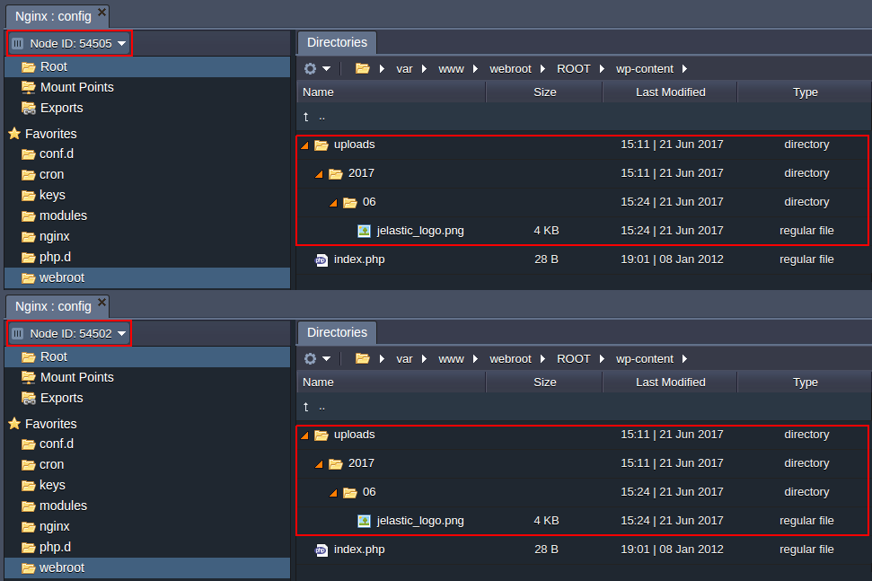

{}**Tip:** If you change the environment topology by adding more app servers, the add-on will apply the corresponding file synchronization to the new nodes automatically, with no manual adjustment needed.{}

{}**Note:** If there are [mount points](/mount-points/) in the synchronized directory, you need to add them to exceptions. Go to the ***\<sync_path>/lsyncd/etc/lsyncd.conf*** file and add the corresponding path. After that, restart synchronization by killing the *rsync* and *lsyncd* processes on each node:

```
for pid in $(ps aux | grep 'rsync\|lsyncd' |  awk '!/grep/{print $2}'); do kill -9 $pid; done
```
{}

It's that easy! File synchronization will be automatically performed every time you add or change anything in your WordPress (or any other application you maintain) so that data on your servers will always be identical.


## Check Logs

The synchronization process can be monitored via log files that are located within the ***webroot/lsyncd/var/log*** web-server directory.

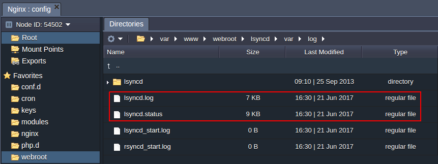

The most important information and status of synchronization can be viewed in the ***lsyncd.log*** and ***lsyncd.status*** files.

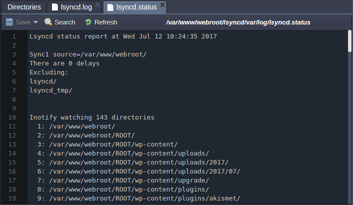

Hopefully, this instruction was helpful for you.

{}Have any questions on file synchronization between application servers? Feel free to get in touch with our technical experts at [Stackoverflow](https://stackoverflow.com/questions/tagged/jelastic).{}


## What's next?

* [Cluster in the Cloud](/cluster-in-cloud/)
* [WordPress Cluster](/wordpress-cluster-devops/)
* [Horizontal Scaling](/horizontal-scaling/)
* [High Availability](/session-replication/)
* [Marketplace](/marketplace/)