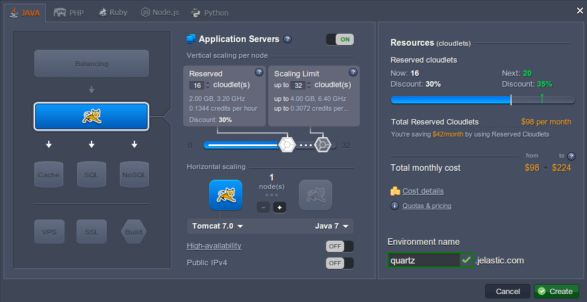
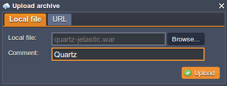
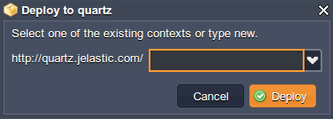
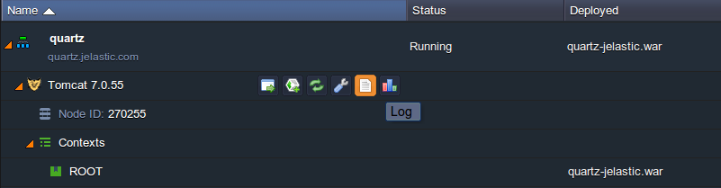
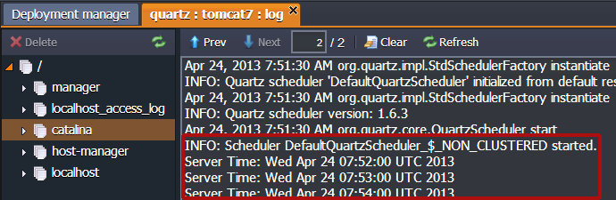

# Job Scheduling Using Quartz

**[Quartz](https://www.quartz-scheduler.org/)** is a full-featured, open source job scheduling service that can be integrated with, or used along side virtually any Java application - from the smallest stand-alone application to the largest e-commerce system. Quartz can be used to create simple or complex schedules for executing tens, hundreds, or even tens-of-thousands of jobs; jobs whose tasks are defined as standard Java components that may execute virtually anything you may program them to do.

If your application has tasks that need to occur at any given moment, or if your system has recurring maintenance jobs, then Quartz may be your ideal solution.

Let's see now how Quarts works in the cloud!


## Create Environment

1\. Log in to the platform dashboard.

2\. Create a new environment.


3\. Choose **Tomcat** as your application server and set the cloudlet limits Then type your environment name, for example, *quartz*, and click **Create**.



Wait just a minute for your environment to be created.


## Create Application

1\. Create your web application (in our case we are using Maven based application) and add the following dependencies to your **pom.xml** file in order to include Quartz libraries to your project:

```xml
<!-- Quartz API -->
    <dependency>
        <groupId>opensymphony</groupId>
        <artifactId>quartz</artifactId>
        <version>1.6.3</version>
    </dependency>
    <dependency>
        <groupId>commons-collections</groupId>
        <artifactId>commons-collections</artifactId>
        <version>3.2.1</version>
    </dependency>
    <dependency>
        <groupId>org.apache.directory.studio</groupId>
        <artifactId>org.apache.commons.logging</artifactId>
        <version>1.1.1</version>
    </dependency>
```

2\. Build your project with dependencies.

3\. Create a new Java class, which will implement your jobs. Here's an example, which displays server time:

```java
package com;
import java.util.Date;
import org.quartz.Job;
import org.quartz.JobExecutionContext;
import org.quartz.JobExecutionException;

public class HelloJob implements Job
{
    public void execute(JobExecutionContext context)
    throws JobExecutionException {

        System.out.println("Server Time: " + new Date());
    }
}
```

4\. Create a new **Servlet** (you can easily implement logic on another level) and specify Quartz trigger to define when the Quartz event scheduler will run your above job. In our case we have created *QuartzServlet.java* which contains command (logging which was implemented in HelloJob class) that is being executed every minute.

```java
package com;
import java.io.IOException;
import java.io.PrintWriter;
import java.text.ParseException;
import java.util.logging.Level;
import java.util.logging.Logger;
import javax.servlet.ServletException;
import javax.servlet.http.HttpServlet;
import javax.servlet.http.HttpServletRequest;
import javax.servlet.http.HttpServletResponse;
import org.quartz.CronTrigger;
import org.quartz.JobDetail;
import org.quartz.Scheduler;
import org.quartz.SchedulerException;
import org.quartz.impl.StdSchedulerFactory;

public class QuartzServlet extends HttpServlet {

    protected void processRequest(HttpServletRequest request, HttpServletResponse response)
            throws ServletException, IOException {
        response.setContentType("text/html;charset=UTF-8");
        PrintWriter out = response.getWriter();
        try {

            JobDetail job = new JobDetail();
            job.setName("dummyJobName");
            job.setJobClass(HelloJob.class);

            CronTrigger trigger = new CronTrigger();
            trigger.setName("TriggerName");
            trigger.setCronExpression("0 */1 * * * ?");

            Scheduler scheduler = new StdSchedulerFactory().getScheduler();
            scheduler.start();
            scheduler.scheduleJob(job, trigger);

        } catch (SchedulerException ex) {
            Logger.getLogger(QuartzServlet.class.getName()).log(Level.SEVERE, null, ex);
        } catch (ParseException ex) {
            Logger.getLogger(QuartzServlet.class.getName()).log(Level.SEVERE, null, ex);
        } finally {
            out.close();
        }
    }
    protected void doGet(HttpServletRequest request, HttpServletResponse response)
            throws ServletException, IOException {
        processRequest(request, response);
    }
    protected void doPost(HttpServletRequest request, HttpServletResponse response)
            throws ServletException, IOException {
        processRequest(request, response);
    }
    public String getServletInfo() {
        return "Short description";
    }
}
```

5\. Build your project into **WAR** file.


## Deploy Application

1\. Go back to the platform dashboard and upload the **WAR** file, you've just created.



2\. Deploy your application to the environment you've created earlier.



3\. Open your app in a browser and check the results. In our case we have to navigate to the quartz context (http://{env_name}.{hoster_domain}/quartz, according to Servlet "QuartzServlet" mapping) and check our application logs.



As you can see job scheduling using Quartz works like a charm.



Hope this instruction on Quartz deploying will be useful for you!


## What's next?

* [Setting Up a Cronjob](/cron-job/)
* [Log Files](/view-log-files/)
* [Configuration File Manager](/configuration-file-manager/)