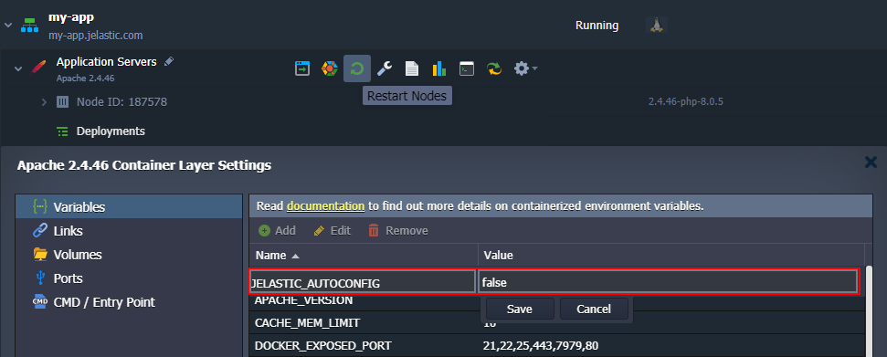
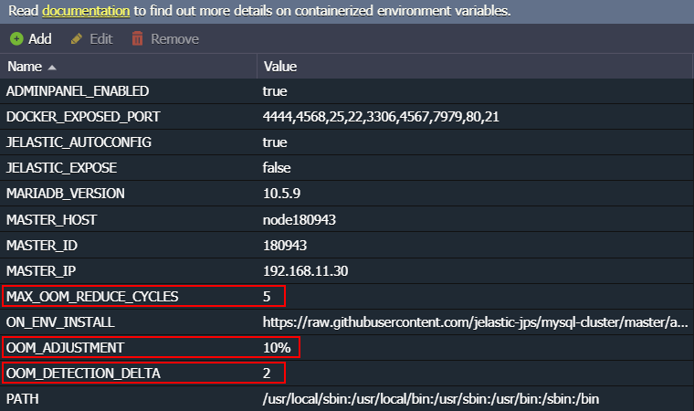

# Smart Auto-Configuration of Containers

In order to ensure efficient utilization of the resources, the platform can automatically configure some of the managed stacks in accordance with the scaling limit ([cloudlets number](/cloudlet/)). Currently, the following templates can benefit from this **Smart Auto-Configuration** feature:

- ***[Databases](/database-auto-configuration/):** MySQL, MariaDB, Percona*
- ***[PHP](/php-auto-configuration/):** Apache, NGINX*
- ***LiteSpeed:** [Web Server](/litespeed-web-server/), [ADC](/litespeed-web-adc/), [LLSMP](/lemp-llsmp/)*

{}**Tip:** Follow the links to view which settings are adjusted in each case.{}

The above-listed stacks have some peculiarities to support the implementation.

1\. Templates utilize a modern ***systemd*** initialization program, which contains multiple features and tools required for the auto-configuration implementation.

2\. A special ***JELASTIC_AUTOCONFIG*** [environment variable](/container-variables/) defines if the auto-configuration feature should be enabled (*true*, by default) or disabled (*false*).

If you want to disable *Smart Auto-Configuration*, add (or edit if it already exists) this variable with the *false* value via the dashboard.

Don't forget to **Restart Node(s)** to apply changes.

3\. Smart recovery after the OOM error causes automatic configurations re-adjustment to decrease the container's default memory consumption.

{}**Note:** Smart OOM recovery works on containers with the ***JELASTIC_AUTOCONFIG*** enabled and, currently, for the following database stacks only:

- *MySQL 8.0.26; 5.7.35*
- *MariaDB 10.3.30; 10.4.20; 10.5.11; 10.6.3*
- *Percona 5.7.33; 8.0.23*
{}

If [OOM killer](/oom-killer-troubleshooting/) actions make a container inoperable (due to some critical process being killed), we automatically restart this node and, due to smart recovery, decrease the ***innodb_buffer_pool_size*** parameter value. In case the situation occurs again, the mentioned reduction cycle is repeated.

You may customize the [environment variables](/environment-variables/) to adjust system behavior related to the OOM kills issue:

- ***OOM_DETECTION_DELTA*** - sets a period (two seconds by default) for the platform to analyze the **/var/log/messages** log after each service restart to decide if it was caused by OOM killer
- ***OOM_ADJUSTMENT*** - defines a value in %, MB, GB (*10%* by default) that the current *innodb_buffer_pool_size* parameter should be reduced after each OOM-caused restart
- ***MAX_OOM_REDUCE_CYCLES*** - configures a maximum number of cycles for *innodb_buffer_pool_size* reduction (*5* times by default)

Increase cloudlets limit for the container to reset adjustments due to OOM recovery.

## What's next?

* [Database Auto-Configuration](/database-auto-configuration/)
* [PHP Auto-Configuration](/php-auto-configuration/)
* [Configuration File Manager](/configuration-file-manager/)
* [Environment Variables](/environment-variables/)