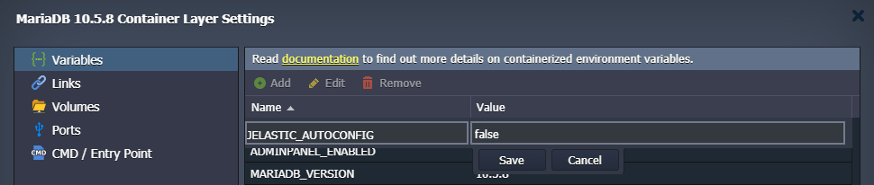
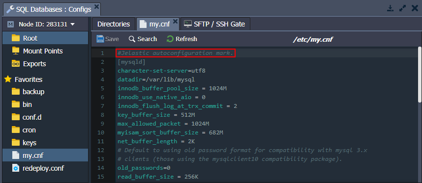

# Database Auto-Configuration

The platform **[Smart Auto-Configuration](/auto-configuration/)** automatically adjusts the ***MySQL***, ***MariaDB***, and ***Percona*** databases in accordance with the resource limit allocated to the containers. Namely, the changes affect the ***/etc/my.cnf*** configuration file and the following settings in particular:

- *key_buffer_size*
- *table_open_cache*
- *myisam_sort_buffer_size*
- *innodb_buffer_pool_size*

Starting with the **5.7** and **8.0** versions of the **MySQL/Percona** and **MariaDB 10.x**, two additional parameters are configured by the platform:

- *innodb_buffer_pool_instances* - deprecated in MariaDB since the *10.6.x* (always 1 pool instance) 
- *innodb_buffer_pool_chunk_size*

If you want to manually change any of the settings from the list above, you need to set the ***JELASTIC_AUTOCONFIG*** [environment variable](/container-variables/) to "*false*", "*disable*", or "*0*". Otherwise, your custom changes will be overwritten.

{}**Tip:** Alternatively, you can override any of the settings in the ***/etc/my.cnf*** file (including ones managed by the platform's *Smart Auto-Configuration*) by stating them in the ***/etc/mysql/conf.d/custom.cnf*** file.{}

### Legacy Implementation

If you want to manually change the auto-configured settings on the old containers, you need to remove the "*#Jelastic autoconfiguration mark.*" line at the start of the ***/etc/my.cnf*** file.

## What's next?

* [Smart Auto-Configuration](/auto-configuration/)
* [PHP Auto-Configuration](/php-auto-configuration/)
* [Configuration File Manager](/configuration-file-manager/)
* [Environment Variables](/environment-variables/)