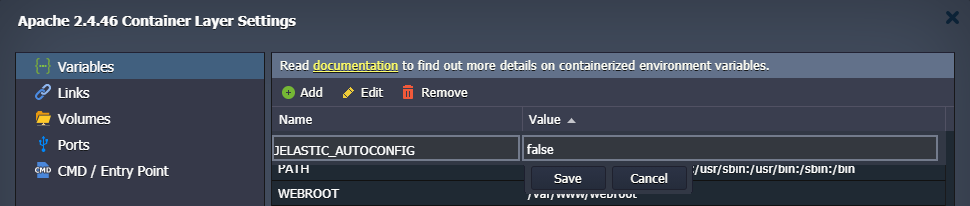

# Auto-Configurations for PHP Application Servers

The platform dynamic resources organization complements the basic PHP one to bring the maximum efficiency for PHP integration into the PaaS. Upon changing the amount of allocated resources for your environment (i.e. cloudlets count), the platform automatically adjusts the appropriate PHP directives to fit the new conditions. However, you can still configure parameters manually within your server's configuration file.

The type of basic requests' handling and dispatching system varies for different PHP application servers, so the directives they use are different too. However, the functionality of such parameters could be similar. To learn more about these directives for a particular application server, navigate to the corresponding section below:

* [Apache PHP](#apache-php-auto-adjustable-settings)
* [NGINX PHP](#nginx-php-auto-adjustable-settings)

Besides that, you can learn [How the Auto Configuration Works](#how-the-php-auto-configuration-works) or, if you want to redefine the values manually, proceed to the [How to Disable the Automatic Optimization](#disable-automatic-optimization) section of this guide.

## Apache PHP Auto Adjustable Settings

Dynamic requests handling in Apache PHP is implemented with the help of the ***prefork*** Multi-Processing Module (MPM), which helps to reveal full server potential. The MPM directives are listed in the main Apache ***/etc/httpd/conf/[httpd.conf](/php-application-server-config/#conf)*** configuration file.

Here is a complete list of parameters, which the platform configures for the ***[prefork](https://httpd.apache.org/docs/2.4/mod/prefork.html)*** module:

* ***StartServers*** - sets the number of child server processes created on startup.
* ***MinSpareServers*** (***MaxSpareServers***) - defines the minimum (maximum) number of server processes that are kept spare
* ***ServerLimit*** - sets the highest allowed value for the *MaxRequestWorkers* directive
* ***MaxRequestWorkers*** - configures the limit of simultaneous requests to be processed
* ***MaxConnectionsPerChild*** - defines a number of requests a single child process can serve

Based on the allocated resources (i.e. a number of dynamic [cloudlets](/cloudlet/) reserved for the Apache PHP server) and capacity of the CPU provided by your particular hosting provider, the platform automatically adjusts the ***ServerLimit*** and ***MaxRequestWorkers*** parameters:

***MaxRequestWorkers** = **ServerLimit** = min( **{containerRam}** / 30MiB, **{coresCount}** \* 5 )*

Due to this statement, both directives are stated equal to the lower value between:

* allocated to the node amount of RAM, divided by 30
* cores number of hoster's physical server the container is placed at, multiplied in 5 times

In such a way, parameters are dynamically changed based on the number of allocated cloudlets but won't grow over the hardware limits.

{}**Note:** If you'd like to state your custom value for these directives, be aware that incorrect values can cause your Apache PHP server instability:

* if ***ServerLimit*** is much higher than necessary, the unused shared memory is allocated; while stating parameter too low won't reveal the full server performance potential
* ***MaxRequestWorkers*** should be big enough to handle as many simultaneous requests as you expect to receive and small enough to ensure that there is enough RAM
{}

You may also be interested in [How the Auto Configuration Works](#how-the-php-auto-configuration-works) or how to [Disable the Automatic Optimization](#disable-automatic-optimization) to set your custom values for these directives.

## NGINX PHP Auto Adjustable Settings

Request handling in the NGINX PHP application server is managed by *FastCGI Process Manager* (FPM), which can be configured via the ***/etc/[php-fpm.conf](http://php.net/manual/en/install.fpm.configuration.php)*** file. It is automatically added to the *favorites* list in the [container file manager](/configuration-file-manager/) for quick access:

The FPM works in the ***ondemand*** mode (the ***pm*** directive) by default. It spawns new processes when needed (i.e. on demand) and removes idle ones. The only additional parameters for this mode are:

* ***pm.max_children*** - defines the maximum number of child processes (equal to the number of CPU cores available for the container, but no less than 2)

{}**Tip:** The exact value depends on the capacity of the CPU provided by your particular hosting provider and the number of allocated cloudlets for your container. In such a way, cloudlets count enlargement results in the automatic growth of the ***pm.max_children*** parameter.

This directive can be defined explicitly without [disabling the automatic optimization](#disable-automatic-optimization) through the appropriate ***PHPFPM_MAX_CHILDREN*** [variable](/environment-variables/).{}

* ***pm.process_idle_timeout*** - sets the delay before killing an idle process (*60* seconds)

If needed, you can [Disable the Automatic Optimization](#disable-automatic-optimization) to change the FPM mode and adjust other directives (be aware that incorrect values can cause your NGINX PHP server instability).

Also, to gain advanced performance, the PHP FPM listener utilizes the UNIX domain socket instead of the common TCP one. Such a solution is better suited for the communications within the same host, allowing to skip some checks and operations (like routing).

## How the PHP Auto-Configuration Works

You can check how the parameters mentioned above are changed based on the allocated resources. We'll consider it on the Apache PHP server example:

1\. [Create](/setting-up-environment/) a new PHP environment with the **Apache PHP** application server inside (if you don't have one).

Then, click the **Config** button for this node and find the ***prefork*** module configs in the ***/etc/httpd/conf/httpd.conf*** file.

Remember the values of the directives for the current cloudlets number (*16* in our case).

2\. Now, with the help of the **Change Environment Topology** button, set a new resource limit for the Apache PHP server (e.g. *32* cloudlets). Refresh the ***/etc/httpd/conf/httpd.conf*** file and compare values of the *prefork* parameters with the ones in the previous step.

As you can see, the directive values increased automatically due to a higher amount of available resources allocated, so the automatic optimization works. Similar to this, upon lowering the cloudlets count, these parameters' values will be reduced.

## Disable Automatic Optimization

To state your custom values instead of the automatically configured directives, you need to disable the automatic optimization. Otherwise, your custom changes will be reverted during the container restart/update.

{}**Note:** Inappropriate directive values may cause your server instability, so it is <u>*not recommended*</u> to apply any manual changes unless you know exactly what you are doing.{}

If you want to manually change any of the auto-configured settings, you need to set the ***JELASTIC_AUTOCONFIG*** [environment variable](/container-variables/) to *false*.

### Legacy Implementation

On the old containers, you just need to remove the line with the optimization mark at the beginning of the corresponding configuration file:

* **Apache PHP** - "*# Jelastic autoconfiguration mark*" within the ***/etc/httpd/conf/httpd.conf*** file

* **NGINX PHP** - "*; Jelastic autoconfiguration mark*" within the ***/etc/php-fpm.conf*** file
 

After the corresponding string is deleted, the parameters' values won't be auto-configured by the platform optimization mechanism so that you can state your custom parameters. Don't forget to **Save** the file to apply the new configurations.

## What's next?

* [Smart Auto-Configuration](/auto-configuration/)
* [Database Auto-Configuration](/database-auto-configuration/)
* [Configuration File Manager](/configuration-file-manager/)
* [Environment Variables](/environment-variables/)
* [PHP Devs Center](/php-center/)