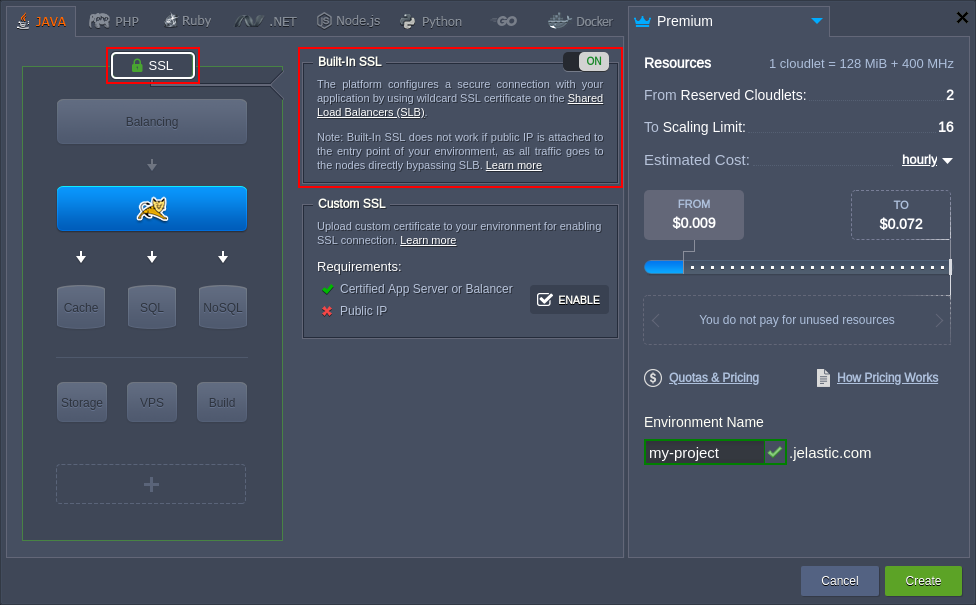

# Built-In SSL Certificates

**Built-in wildcard SSL** by the platform is an excellent solution for those who are searching for a quick and reliable way to secure their website.  
The built-in SSL certificate (can be referred to as ***{hosterName} SSL*** in the dashboard) offers:

* **Convenient Management** - configured and working SSL with a single click in the topology wizard
* **Fast Validation** - domain level verification, including your site check and security seal issuing, is performed in a matter of minutes
* **Enterprise-Level Data Encryption** - the strength provided by built-in SSL certificates makes your customers feel comfortable with their security

So, to get the **built-in SSL certificate**, perform the following simple steps:

1\. Log into your platform dashboard and open the topology wizard through clicking the **New Environment** button at the top-left corner (or by selecting the **Change Environment Topology** icon next to the existing environment).

2\. In the opened topology wizard, [set up your environment](/setting-up-environment) up to your needs, then switch to the **SSL** section at the top-left part of the frame and enable the built-in SSL with the appropriate switcher.

{}**Note:** Built-in SSL is not compatible with [public IP](/public-ip) address attached to your servers and is applied to the specified environment name domain only (e.g. *my-project.jelastic.com* for the image above).{}
To initiate your environment installation, click the **Create** button (or **Apply** to adjust the existing one).

Now, upon clicking the **Open in Browser** button for this environment, you'll see that communication with it is performed over the *HTTPS* protocol.

## What's next?

* [Custom SSL](/custom-ssl/)
* [Let's Encrypt SSL](https://www.virtuozzo.com/company/blog/free-ssl-certificates-with-lets-encrypt/)
* [Self-Signed Custom SSL](/self-signed-ssl/)
* [Security Configs for Applications with NGINX Balancer](/nginx-balancer-security/)