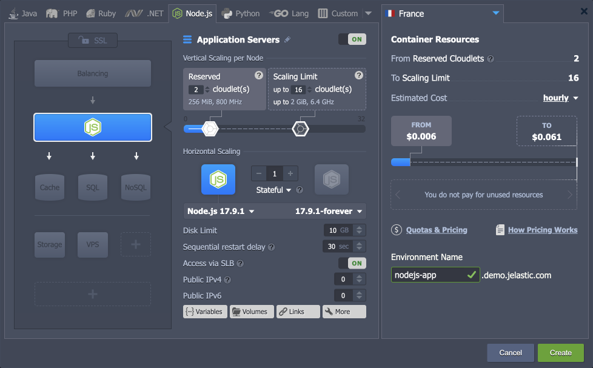

# Let’s Encrypt SSL Add-On with NodeJS

The platform automates SSL certificate binding for most software stacks when working with the **[Let’s Encrypt](https://www.virtuozzo.com/company/blog/free-ssl-certificates-with-lets-encrypt/)** add-on. However, the out-of-box automation is difficult for the Node.js nodes due to the stack specifics. In the Node.js application, Let’s Encrypt certificates are issued but are not bound - just stored at the **/var/lib/jelastic/keys** directory. You can manually use them in your application by creating a Web server and reading the certificates directly from the code.

{}**Tip:** As an alternative, you can place a [load balancer](/load-balancing/) node in front of your Node.js server to act as a reverse proxy. The *Let’s Encrypt SSL* add-on can be installed on such a balancer, benefiting from out-of-box automation.

Such an approach is preferable for larger projects that want to utilize the [horizontal scaling](/horizontal-scaling/) feature as it will require a load balancer node anyway.{}

This guide will provide a basic example of how you can implement the Let's Encrypt SSL add-on for the Node.js application.


## Using SSL with NodeJS

1\. [Create an environment](/setting-up-environment/) with the **Node.js** application server.



2\. Install the [Let’s Encrypt](https://www.virtuozzo.com/company/blog/free-ssl-certificates-with-lets-encrypt/) add-on to generate free SSL certificates for your application.


Due to the Node.js engine specifics, the Let’s Encrypt add-on just generates SSL certificates. You must manually adjust your application code to read certificates from:

- */var/lib/jelastic/keys/privkey.pem*
- */var/lib/jelastic/keys/fullchain.pem*
- */var/lib/jelastic/keys/ca.cer*

3\. Create a new app or integrate [HTTPS configs](https://nodejs.org/api/https.html#https_https_createserver_options_requestlistener) into the existing application. Check the examples below:

- **new application** – replace the content of the default ***server.js*** file in the **/home/jelastic/ROOT** directory

```
const https = require('node:https');
const fs = require('node:fs');

const options = {
  key: fs.readFileSync('/var/lib/jelastic/keys/privkey.pem'),
  cert: fs.readFileSync('/var/lib/jelastic/keys/fullchain.pem')
};

https.createServer(options, (req, res) => {
  res.writeHead(200);
  res.end('hello world\n');
}).listen(443);

console.log("The HTTPS server has started at: https://localhost:443/");
```

- **existing application** – for example, deploy the default “*Hello World*” package and edit the */home/jelastic/ROOT/server.js* file to work over HTTPS

```
#!/usr/bin/env node

var https = require("https"),
    url = require("url"),
    ejs = require("ejs"),
    fs = require("fs"),
    os = require("os"),
    staticResource = require("static-resource"),
    port = 443,
    serverUrl,
    handler,
    favicon;

const options = {
  key: fs.readFileSync('/var/lib/jelastic/keys/privkey.pem'),
  cert: fs.readFileSync('/var/lib/jelastic/keys/fullchain.pem')
};

serverUrl = "https://localhost:" + port + "/";
handler = staticResource.createHandler(fs.realpathSync("./public"));

favicon = fs.realpathSync('./public/favicon.png');

https.createServer(options, function (req, res) {
    var path = url.parse(req.url).pathname;

    if (path === "/") {
        res.writeHead(200, {"Content-Type": "text/html"});
        res.write(ejs.render(fs.readFileSync("./index.ejs", "utf8"), {
            hostname: os.hostname()
        }));
        res.end();
    } else if (req.method === 'GET' && path === '/favicon.png') {
        res.setHeader('Content-Type', 'image/png');
        fs.createReadStream(favicon).pipe(res);
    } else {
        if (!handler.handle(path, req, res)) {
            res.writeHead(404);
            res.write("404");
            res.end();
        }
    }
}).listen(port);

console.log("The HTTPS server has started at: " + serverUrl);
```

4\. Run your application via [Web SSH](/web-ssh-client/). In our example, we use the ***forever*** [process manager](/nodejs-process-managers/) (*sudo* is needed to listen on the privileged port *443*).

```
cd /home/jelastic/ROOT
sudo forever start server.js
```

{}**Note:** The command should be adjusted for different process managers. Or you can start your application without it:

```
sudo node server.js
```
{}

That’s all! Go to your Node.js application over ***https://*** to verify access and certificate validity.


## Certificate Update

Let’s Encrypt SSL certificates remain valid for 90 days. After that, they should be updated for the encryption to remain valid. The add-on provides automated renewal 30 days before the expiration. However, after the certificate update, you need to restart (reload is preferred, if possible) the server to apply new certificates.

The operation can be automated alongside the certificate update by means of the ***webhooks*** – a custom script executed after the default add-on operations.

Go to the **/var/lib/jelastic/keys/letsencrypt** folder (create if missing) and add the ***settings-custom*** file. Based on the [Node.js process manager](/nodejs-process-managers/), your restart/reload script may vary. For example:

```
deployHook=sudo forever restart /home/jelastic/ROOT/server.js
```


{}**Tip:** Alternatively, you can provide the ***.sh*** script with the required commands:

```
deployHook: /path/to/your/file.sh
```

Ensure that your script file is executable (**chmod +x {fileName}**). For example, the script content can be the following:

```
#!/bin/bash
 echo "This is example of deployHook script" >> /tmp/testFile
```

Also, you can configure the update hook via API using the ***deployHook*** parameter. See [Let's Encrypt SSL](https://www.virtuozzo.com/company/blog/free-ssl-certificates-with-lets-encrypt/) article for more details.{}

You can manually trigger certificate updates from the **Add-Ons** menu for your Node.js server.


## Additional Recommendations

- Create environment variables with paths to the Let’s Encrypt certificates to avoid "hardcoding" and simplify edits in case of certificate location changes.
  - **Let’s Encrypt certificate** - */var/lib/jelastic/keys/fullchain.pem*
  - **Let’s Encrypt private key** - */var/lib/jelastic/keys/privkey.pem*


- When working with the [Let’s Encrypt add-on via API](https://www.virtuozzo.com/company/blog/free-ssl-certificates-with-lets-encrypt/), you can use the ***deployHook*** parameter to handle custom logic once certificates got issued/updated.


## What's next?

- [Built-In SSL](/built-in-ssl/)
- [Custom SSL](/custom-ssl/)
- [Let's Encrypt SSL](https://www.virtuozzo.com/company/blog/free-ssl-certificates-with-lets-encrypt/)
- [Custom Domains](/custom-domains/)
- [Self-Signed SSL](/self-signed-ssl/)