# Self-Signed Custom SSL Certificates

One of the ways to secure your application is to use SSL-encrypted (Secure Sockets Layer) connection. With the platform, you can use both [Built-In SSL](/built-in-ssl/) and [Custom SSL](/custom-ssl) certificates.

Herewith, all custom SSL certificates require to be signed, and usually, this is done by the Certificate Authority (CA) companies (e.g. [Let's Encrypt](https://www.virtuozzo.com/company/blog/free-ssl-certificates-with-lets-encrypt/)). In this case, your certificate becomes reliable after signing, so others can trust it and any connection to your site or application is performed without issues.

Nevertheless, you can sign your custom certificate yourself and still receive a secure connection, but such a certificate will be untrusted. As a result, while opening your application, it will require a visitor to pass through the warning message, that highly recommends him to leave your web page, because of the untrusted secure connection.

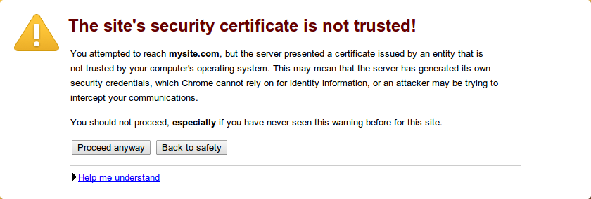

Most of these users will leave such a page, so we suggest that you don't use the self-signed certificates for production solutions, but it can still be used for development/testing examples or for your private site with a small audience<a id="generate"></a>.

So, let's find out how to generate such a certificate and apply it to the environment.


## Generate a Self-Signed SSL Certificate

In order to generate a self-signed certificate, you need to buy a **Domain Name** first (e.g. *mysite.com*). You can do this using any domain registrar.

Once that is done, you are ready to proceed to the generation of your SSL certificate with the help of any preferred tool. We'll use OpenSSL as an example. Depending on the operating system you are using, perform the following steps:

* [for Windows](#win)
* <a href="#unix" id="win">for Linux/MacOS/FreeBSD</a>

You are also able to generate the required files using our [Elastic Virtual Private Server](#vps).

### For Windows

[Download](https://code.google.com/archive/p/openssl-for-windows/downloads) the latest OpenSSL tool version. Extract the received archive and run the tool by double-clicking the ***openssl.exe*** file in the **bin** folder. Subsequently, the files created with OpenSSL will appear in the same **bin** directory by default.

1\. First, you need to generate an SSH private key for your root certificate (this is what signs all issued certificates). Create it as follows:

```bash
genrsa -out {filename} {length}
```

where:

- ***{filename}*** - name of the output key file with **.key** extension (e.g. *rootCA.key*)
- ***{length}*** - private key length in bits (e.g. *2048*)

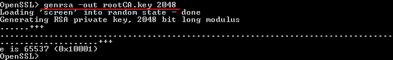

2\. Then you should generate the root CA certificate based on the prepared key. Use the ***req*** command with the ***x509*** option flag for outputting a self-signed root certificate instead of a certificate request:

```bash
req -config {config_path} -x509 -new -key {keyname} -days {days} -out {filename}
```

where:

- ***{config_path}*** - path to the *openssl.cnf* configuration file, located in the directory with extracted OpenSSL files (specified according to the *C:\path\to\openssl.cnf* format)
- ***{keyname}*** - your root key name (the one you've generated in the previous step, *rootCA.key* in our case)
- ***{days}*** - number of days the current certificate will be valid
- ***{filename}*** - the preferred name of the output certificate file with **.crt** extension (e.g. *rootCA.crt*)

Set the required information for your CA certificate by answering the appeared question.

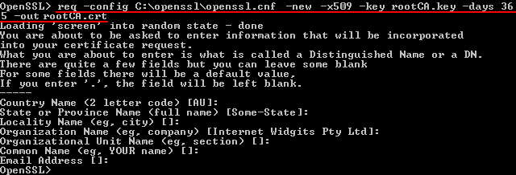

As a result, you'll receive a self-signed root certificate for your own CA.

3\. Now, you can create a private key and self-signed certificate for your purchased hostname. Let's start with the key: generate it in the same way you did for the root one.

```bash
genrsa -out {filename} {length}
```

where:

- ***{filename}*** - name of the output key file with **.key** extension (e.g. *host.key*)
- ***{length}*** - private key length in bits (e.g. *2048*)

{}**Note:** DO NOT protect your key with a passphrase; otherwise, you'll get an error during its addition to the platform dashboard.{}

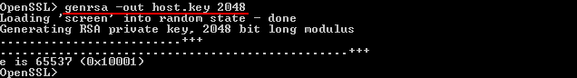

4\. Next thing you need is a certificate signing request (CSR). Execute the following command:

```bash
req -config {config_path} -new -key {keyname} -out {filename}
```

where:

- ***{config_path}*** - path to the *openssl.cnf* configuration file, located in the directory with extracted OpenSSL files (specified according to the *C:\path\to\openssl.cnf* format)
- ***{keyname}*** - your server key name (the one you've generated in the previous step, *host.key* in our case)
- ***{filename}*** - the desired name of the output request file with **.csr** extension (e.g. *host.csr*)

You'll see a set of questions appear again. Answer them to complete the certificate information with your data.
{}**Note:** The ***Common Name*** parameter value has to be equal to your purchased domain name; otherwise, your certificate won't be validated.{}

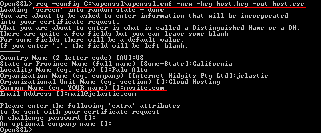

5\. The final step is the generation of your self-signed certificate based on the created request with the help of a root CA certificate. For that, we'll use the ***x509*** command with the following options:

* ***-req*** - means that a certificate request input file format is expected
* ***-CAcreateserial*** - initiates the creation of the CA serial number file (if it does not exist)

```bash
x509 -req -in {requestname} -CA {CA_certificate} -CAkey {CA_key} -CAcreateserial -out {filename} -days {days}
```
where:

- ***{requestname}*** - name of the input request file (*host.csr* in our case)
- ***{CA_certificate}*** - specifies the CA certificate that will be used for signing (*rootCA.crt* in our case)
- ***{CA_key}*** - sets the CA private key to sign a certificate with (*rootCA.key* in our case)
- ***{filename}*** - the desired name of the output certificate file with **.crt** extension (e.g. *host.crt*)
- ***{days}*** - number of days the current certificate will be valid

<a id="unix"></a>
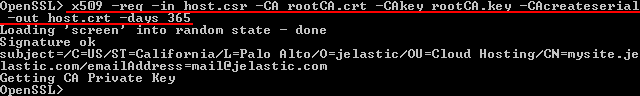

Great! Now you have the self-signed SSL certificate for your application.

### For Linux/MacOS/FreeBSD

In case you don't have the OpenSSL tool installed yet, get it with the appropriate command (according to your OS package manager) executed within your terminal. E.g. for Ubuntu/Debian Linux distribution use the following one:

```bash
sudo apt-get install openssl
```

When the installation process is completed, proceed to generation of the required files. All newly created with OpenSSL files will appear in the **home** directory of your local machine user by default.

1\. First, you need to generate an SSH private key for your root certificate (this is what signs all issued certificates). Create it as follows:

```bash
openssl genrsa -out {filename} {length}
```

where:

- ***{filename}*** - name of the output key file with **.key** extension (e.g. *rootCA.key*)
- ***{length}*** - private key length in bits (e.g. *2048*)

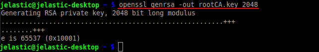

2\. Then you should generate the root CA certificate based on the prepared key. Use the req command with the ***x509*** option flag for outputting a self-signed root certificate instead of a certificate request:

```bash
openssl req -x509 -new -key {keyname} -days {days} -out {filename}
```

where:

- ***{keyname}*** - your root key name (the one you've generated in the previous step, *rootCA.key* in our case)
- ***{days}*** - number of days the current certificate will be valid
- ***{filename}*** - the preferred name of the output certificate file with **.crt** extension (e.g. *rootCA.crt*)

Set the required information for your CA certificate by answering the appeared question.

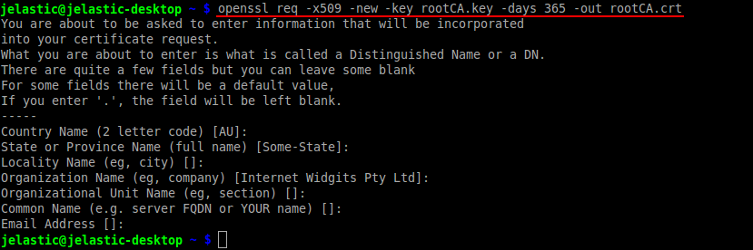

As a result, you'll receive a self-signed root certificate for your own CA.

3\. Now you can create a private key and self-signed certificate for your purchased domain. Let's start with the key: generate it in the same way you did for the root one.

```bash
openssl genrsa -out {filename} {length}
```

where:

- ***{filename}*** - name of the output key file with **.key** extension (e.g. *host.key*)
- ***{length}*** - private key length in bits (e.g. *2048*)

{}**Note:** DO NOT protect your key with a passphrase; otherwise, you'll get an error during its addition to the platform dashboard.{}

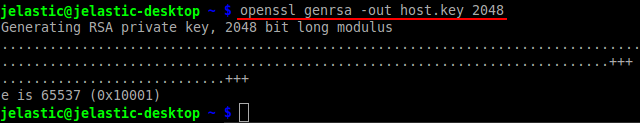

4\. The next thing you need is a certificate signing request (CSR). Execute the following command:

```bash
openssl req -new -key {keyname} -out {filename}
```

where:

- ***{keyname}*** - your server key name (the one you've generated in the previous step, *host.key* in our case)
- ***{filename}*** - the desired name of the output certificate file with **.csr** extension (e.g. *host.csr*)

You'll see a set of questions appear again. Answer them to complete the certificate information with your data.

{}**Note:** The ***Common Name*** parameter value has to be equal to your purchased domain name; otherwise, your certificate won't be validated.{}

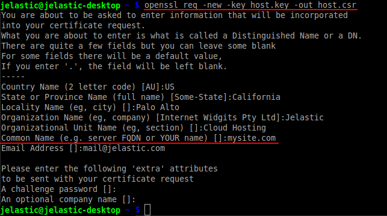

5\. The final step is the generation of your self-signed certificate, based on the created request with the help of the root CA certificate. For that, we'll use the ***x509*** option with the following flags:

- ***-req*** - means that a certificate request input format is expected
- ***-CAcreateserial*** - initiates the creation of the CA serial number file (if it does not exist)

```bash
openssl x509 -req -in {requestname} -CA {CA_certificate} -CAkey {CA_key} -CAcreateserial -out {filename} -days {days}
```

where:

- ***{requestname}*** - name of the input request file (*host.csr* in our case)
- ***{CA_certificate}*** - specifies the CA certificate that will be used for signing (*rootCA.crt* in our case)
- ***{CA_key}*** - sets the CA private key to sign a certificate with (*rootCA.key* in our case)
- ***{filename}*** - desired name of the output certificate file with **.crt** extension (e.g. *host.crt*)
- ***{days}*** - number of days the current certificate will be valid

<a id="vps"></a>
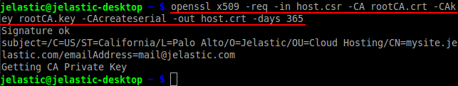

Great! Now you have the self-signed SSL certificate for your application.

### Elastic VPS

You also have the possibility to create your self-signed certificate using the [Elastic VPS](/vps) server. For that you need to:

* create an environment with Elastic VPS inside
* connect to it in a preferred way (using [Public IP](/vps-public-ip) or via [SSH Gateway](/vps-ssh-gate/))
* access the OpenSSL shell with the corresponding ***openssl*** command
* create a self-signed certificate following the *[Linux/MacOS/FreeBSD](#unix)* section of this guide (the only difference is all the commands should be executed without the ***openssl*** word at their beginning, as you are already inside the OpenSSL shell)

Once the generation process is finished, you need to download the created certificate files (e.g. via [Configuration File Manager](/configuration-file-manager)) to apply them to the necessary environment afterward.


## Attach Certificates

Now, follow the steps as for any other custom SSL upload:

* [Adjust Environment Topology](/custom-ssl#adjust-topology)
* [Domain Name and A Record Settings](/custom-ssl#set-domain)
* [Upload Certificate to the Environment](/custom-ssl#upload-certificates)

That's it! If you enter the bound custom domain name (or the attached external IP address) into your browser's address bar with the ***https://*** connection protocol, you'll see the mentioned warning message opened, informing you that the used SSL certificate is not trusted.


Since it's your site, click the **Proceed anyway** button (or the similar one depending on your browser).

{}**Note:** For some browsers (e.g. Mozilla FireFox), even if you've decided to proceed, it's required to add this page to your browser's exceptions list before you are able to continue.

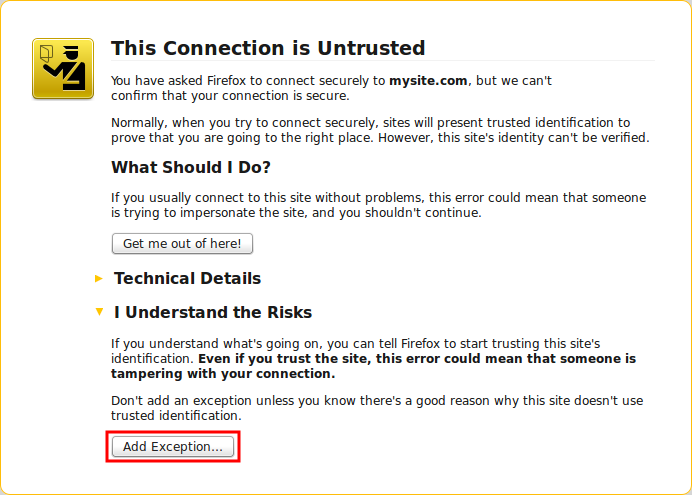
{}

After that, you'll be redirected to your site via the encrypted protocol.

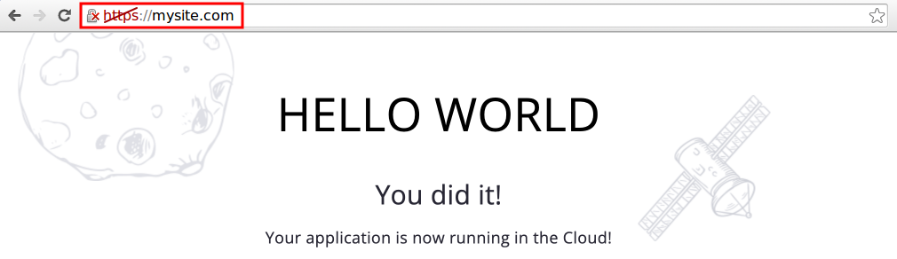

Now, you can be sure all interactions with your application are performed safely.


## What's next?

* [Built-In SSL](/built-in-ssl/)
* [Custom SSL](/custom-ssl/)
* [Let's Encrypt SSL](https://www.virtuozzo.com/company/blog/free-ssl-certificates-with-lets-encrypt/)
* [Custom Domains](/custom-domains/)