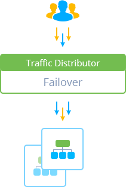

# Failover Routing for Traffic Distributor

Failover is a special routing method, that implements project protection through keeping a fully functional environment copy in reserve. In other words, you have primary server and backup one - all the requests are initially forwarded to the first backend, while the second one is kept on a standby and is used only in case the primary service goes down.

For such type of distribution, you, obviously, can not configure the traffic ratio distribution different from 100 to 0, i.e. you can only select which of your servers is primary and which is in backup. According to this, all of the incoming requests can go to one server at a time - either to main one or, in case of its unavailability, to the secondary one. Herewith, locating your backends in different [environment regions](/environment-regions/) will allow to easily overcome the hardware dependent failures.

Generally, your customer's requests are automatically redirected to the working server, so, even in case of failure, users won't notice any interruption in application work.

## What's next?

* [Traffic Distributor Overview](/traffic-distributor/)
* [Round Robin](/round-robin-traffic-routing/)
* [Sticky Sessions](/sticky-sessions-traffic-routing/)
* [Traffic Distributor Installation](/traffic-distributor-installation/)
* [Traffic Distributor Injection](/traffic-distributor-injection/)
