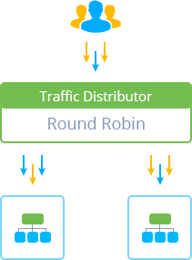

# Round Robin Routing for Traffic Distributor

Round Robin is the most common, simple and, simultaneously, the most frequently used routing method for [Traffic Distributor](/traffic-distributor/). It navigates request to backends in rotation, according to the specified server's weights, which provides high availability of the distributed application and allows to easily leverage server's load.

{}**Note:** This method should be selected only when you have identical content on your backends, since data requested by users will be loaded from both of them.{}

So, each backend is accessed based on the pre-defined priority level, which, in case of using Traffic Distributor, is set as percentage of all incoming requests, for example:

* if weights are the same (i.e. 50% on both backends), then every next request will go to a different server each time; this results in even resources utilization and equal traffic distribution
* if the stated ratio is 70% to 30%, then, out of each 10 consecutive requests, 7 will go to the first environment and 3 - to the second one; may be useful to make this or that backend to respond more or less frequently (i.e. to leverage server's load)
* in case you state 100% for any server - only that backend will be declared in settings and will process all the incoming requests; can be used for different purposes, e.g. to perform [invisible application update](/blue-green-deploy/) or to migrate environment to a new hardware without downtime

## What's next?

* [Traffic Distributor Overview](/traffic-distributor/)
* [Sticky Sessions](/sticky-sessions-traffic-routing/)
* [Failover](/failover-traffic-routing/)
* [Traffic Distributor Installation](/traffic-distributor-installation/)
* [Traffic Distributor Injection](/traffic-distributor-injection/)