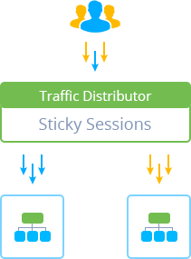

# Sticky Sessions Routing for Traffic Distributor

This method is used to achieve server-affinity by sticking user to a particular backend, which allows to work with just one application version. Herewith, on the first visit, customer is routed based on the servers' weights, while assigned backend is remembered, ensuring that all subsequent requests from this user go to the same environment.

Commonly, this is implemented through remembering IP address, which is not optimal, as there could be a lot of customers behind a proxy, resulting in unfair balancing. Thus, the platform uses an advanced solution based on the [session cookies](https://en.wikipedia.org/wiki/HTTP_cookie#Session_cookie) to make a persistent routing, when each browser becomes an unique "user", allowing to make balancing more even.

In such a way, Sticky Sessions distribution of a *new users* is similar to the [round robin](/round-robin-traffic-routing/) method and is performed according to the pre-set priority. For example, setting 50% to 50% will make both application versions being visited by the equal amount of unique users, which is useful for [performing A/B Testing](/ab-testing/). But, irrespectively of the server's weights, the *"old" user's* requests will always be redirected to the hosts they are assigned to, until their session is expired or cookie is removed.

## What's next?

* [Traffic Distributor Overview](/traffic-distributor/)
* [Round Robin](/round-robin-traffic-routing/)
* [Failover](/failover-traffic-routing/)
* [Traffic Distributor Installation](/traffic-distributor-installation/)
* [Traffic Distributor Injection](/traffic-distributor-injection/)