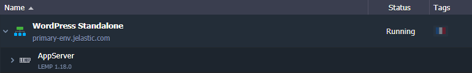
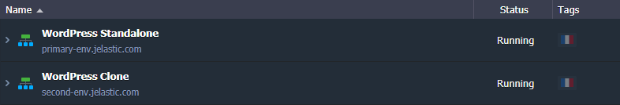
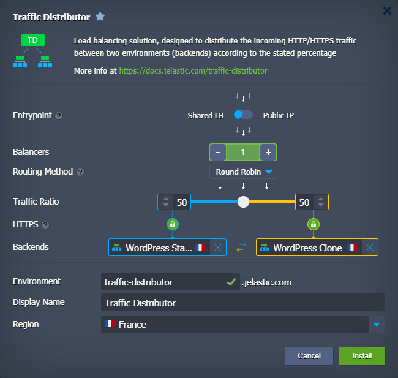
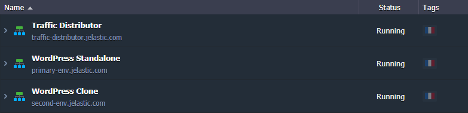
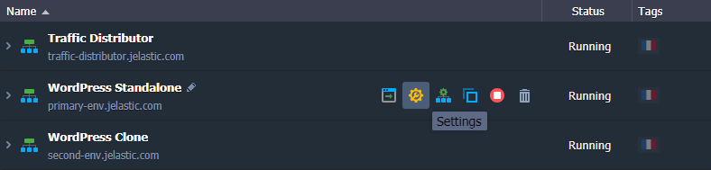
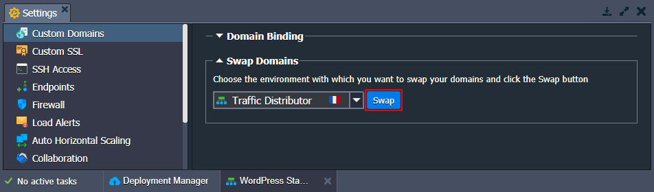
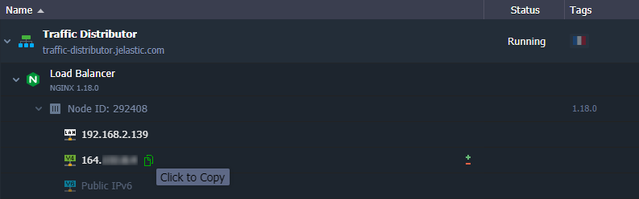

# Integrate Traffic Distributor with Running Application

In most cases, developers face the problem of traffic distribution between several backends when already having some running application, with a pool of existing users and constant incoming load. Thus, besides the general traffic sharing configuration difficulties, it is additionally complicated with the necessity to apply the appropriate "on-fly" changes to the front-end application instance. In many cases, it causes a temporary app downtime. So in order to minimize such negative influence on your customers, below we'll consider the ways to easily and painlessly integrate [Traffic Distributor (TD)](/traffic-distributor/) solution into your running application topology.

{}**Note:** Traffic Distributor provides the ability to benefit from a number of useful solutions, like:

* apply "invisible" application updates with [blue-green deployment](/blue-green-deploy/)
* examine performance, user experience, and new app version's stability through [A/B testing](/ab-testing/)
* increase service availability with advanced [failover protection](/failover-protection/)
{}

To achieve this, you'll need to pass through the following steps:

* [deploy new app version & add it to routing](#add-application-copy-to-routing)
* [configure app entrypoint via TD](#configure-app-entrypoint-via-td)

## Add Application Copy to Routing

For this example, we run an application in the Apache server within the *primary-env* environment.

1\. First of all, you need to set up one more environment with the same application inside (we'll name it *second-env*).

{}**Tip:** You can use the [environment cloning](/clone-environment/) feature to instantly get the identical environment copy (i.e. with all the appropriate data and settings being already set up inside) of any type.{}

{}**Note:** Don't forget to properly configure any "hardcoded" data (direct links, IPs, etc.) for the cloned environment if needed.{}

2\. Now, we are ready to [install Traffic Distributor](/traffic-distributor-installation/), specifying both these environments as backends.

{}**Tip:** If there are several [environment regions](/environment-regions/) available at the chosen hosting provider platform, you can subsequently [migrate](/environment-regions-migration/) one of your environments to a different hardware set. This will grant better failover protection, as you'll be able to deal with the hardware-dependent problem at one of your backends (if such occurs) by routing requests to the instance that remains operable.{}

3\. That's it! Traffic Distributor is already set and ready to handle requests to our application.

The only remaining thing is to redirect incoming traffic from the first environment to Traffic Distributor.

## Configure App Entrypoint via TD

Most applications in production have some [custom domain](/custom-domains/). In our example, the initial environment (*primary-env* in our case) already has a [custom domain name bound](/custom-domains/#how-to-bind-domain-to-environment).

For the proper redirection of requests (i.e. to process them through the distributor), we need to move the appropriate entrypoint to the TD environment. In such a way, it will be placed in front of the chosen pair of backends and share the incoming load among them based on specified settings.In order to accomplish this, follow one of the next simple procedures based on the used custom domain binding method:

* *if using CNAME or ANAME redirect* - [swap domains](#swap-domains) between the initial and TD environments
* *if using A Record* - [swap Public IPs](#swap-public-ips) to transfer used external IP to the TD environment

### Swap Domains

1\. Hover over the environment your custom domain is bound to (e.g. *primary-env*) and select **Settings** from the set of appeared functional icons.

2\. Within the opened environment settings tab, the required **Custom domains** section will be displayed by default. Go to the **[Swap Domains]/swap-domains/)** suboption and select Traffic Distributor environment within the drop-down list.

Now, click the **Swap** button and confirm this action within the pop-up to apply the changes.

3\. In a minute, your application custom domain name will be moved to the environment with Traffic Distributor so that both of your backends will become available via this domain.

### Swap Public IPs

The easiest way to pass public IP from *primary-env* (i.e. the one your custom domain is attached to) to Traffic Distributor is by using the corresponding **External Addresses Swap** functionality, available through platform [API](https://docs.jelastic.com/api/#!/api/environment.Binder-method-SwapExtIps) and [CLI](/cli-ip-swap/).

It allows performing the required configurations in a single command, sparing you from the manual *A Record* reconfiguration.

If you prefer to work **via GUI**,  you need to go to your domain registrar and manually substitute an external IP address in the A Record for your custom domain.

1\. Ensure that the NGINX balancer instance in your Traffic Distributor environment has an [external IP address](/public-ip/) attached. Copy its value from the dashboard.

2\. Then, access your DNS manager and re-configure your [A record](/custom-domains/#how-to-configure-dns-record) so that it points to this new IP address.

{}**Tips:** 
* For these changes to be applied, you need to wait for the current DNS record cache expiration (as until this happens, DNS servers may return the old domain address upon request). To know the exact period the domain's old IP address will be kept in cache, check the ***TTL*** setting value within your DNS manager (usually stated in *seconds*).
* Do not forget to recheck your application configurations for the hardcoded IP-dependent settings and adjust them accordingly.{}

3\. After the application entrypoint address is changed, you can detach [public IP](/public-ip/) from the initial *primary-env* (if no longer required for direct access) so that you do not pay for the unused option.

That's it! Now, all incoming traffic for your custom domain will be processed by the Traffic Distributor solution, which, in its turn, will route it according to the set traffic ratio between application backends.

## What's next?

* [Traffic Distributor Overview](/traffic-distributor/)
* [Traffic Distributor Installation](/traffic-distributor-installation/)
* [Blue-Green Deploy](/blue-green-deploy/)
* [Failover Protection](/failover-protection/)
* [A/B Testing ](/ab-testing/)