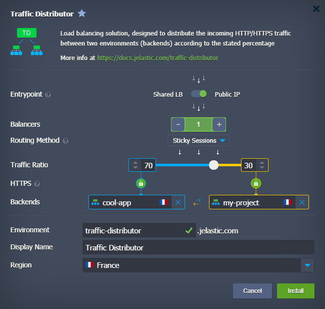
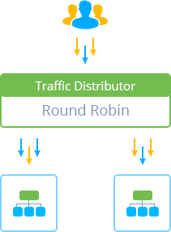
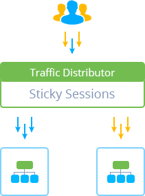
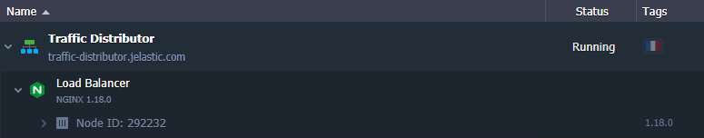

# Traffic Distributor Overview

{}{}

One of the most common problems you can face upon your project growth is the necessity to maintain multiple environments. It may be required for getting enough capacity (to serve all of the clients) or, e.g., for handling different app versions. In this situation, you'll most likely meet the problem of proper traffic distribution between such project copies, including a number of aspects like setting a proper method for requests routing, servers loading rates, etc. Solving all of these issues can become a challenge even for experienced developers.

So, in order to ease these problems' resolution, the platform offers a completely free and easy-to-use solution based on the automatically configured load balancer. It is delivered as a special ***Traffic Distributor*** add-on, which is available for quick one-click installation through [platform Marketplace](/marketplace/) and provides smart traffic routing based on your requirements.

With this solution, you are able to set intelligent workloads balancing between pair of hosts and benefit from the following features and opportunities it provides:

* *high availability and advanced failover* - share the load among two copies of your application, which could be located on [different hardware](/environment-regions/) to achieve better failure protection
* *Blue-Green (zero downtime) application deploy* - redirect all incoming requests to a single backend for the time another one is undergoing the maintenance
* *ongoing A/B testing* - route the incoming traffic between two different application versions and compare their performance and UX rates to choose the best one for production
* *intuitive UI* - configuration form allows setting all the main parameters of your traffic distributor (either during its creation or consequent adjustment), including availability to choose among three different [routing types](#routing-methods) to suit your needs the best: *Round Robin*, *Sticky Sessions*, and *Failover*
* *health check* - both backends are automatically checked for a normal response (i.e. for returning *200* status code, which indicates that the request was fulfilled) according to the [configurable parameters](/failover-protection) (frequency, timeout, etc.)
* *flexibility & extensibility* - aside from the main distribution settings, available through the add-on's graphic interface, you are also able to apply any required additional tuning (e.g. to set up caching, TCP mapping, SNI, etc.) via NGINX configuration files manually - no limitations are applied

Generally, compared to running a sole server, Traffic Distributor speeds up processing requests, decreases user's response delay, and handles more threads simultaneously.

## Routing Methods

With the Traffic Distributor solution, you can choose among three routing methods in order to get one that suits your needs the best. Each of the available options has its own specifics and usage purposes, which should be considered during the selection:

* [Round Robin](/round-robin-traffic-routing/) - the most straightforward and often used routing method, which allows distributing traffic among your environments equally, pointing each request to them in rotation (i.e. one-by-one) due to the set backend priorities.

{}**Note:** To use this option, you should provide identical content on your backends (since the user-requested data will be loaded from both of them).{}

* [Sticky Sessions](/sticky-sessions-traffic-routing/) - this routing type is based on "sticking" each user to a specific backend (according to the set servers' weights), which will process all their requests until the corresponding user session, created on the first app visit, expires

* [Failover](/failover-traffic-routing/) - this kind of traffic routing allows you to set the backup copy of your primary server and keep it on standby (i.e. in reserve). If some issue occurs with the main backend, all of the requests will be automatically redirected to the working server. Your users most likely won't even notice any interruption in the application work.

## TD Implementation

All you need to do to get your own Traffic Distributor is to fill in the form with a number of main parameters (like select the hosts to route the requests between, routing type, state traffic ratio, etc.) and start the [installation](/traffic-distributor-installation/) with a single button. After being created, Traffic Distributor will represent a separate environment with a predefined number of NGINX load balancer nodes and a special add-on installed on top of them. 

Before the installation, you can choose an entry point - i.e. requests will be processed through either [Shared Load Balancer](/shared-load-balancer/) or [public IP](/public-ip/) address(es).

{}**Tip:** Traffic Distributor works using standard *HTTP* and *HTTPS* protocols and is also suitable for other same-based protocols (including [WebSockets](/websockets/)). The load balancing itself is performed only during the *HTTP handshake* operation, after which the persistent WebSockets connection to the backend will be established.{}

In such a way, you can get an extremely flexible Traffic Distributor tool that can help you in accomplishing various goals. From simple scenarios of even servers' loading to more complex ones like applying [blue-green deployment](/blue-green-deploy/) to install app updates with zero downtime, performing [ongoing A/B testing](/ab-testing/), applying [advanced failover protection](/failover-protection/), etc.

## What's next?

* [Traffic Distributor Installation](/traffic-distributor-installation/)
* [Traffic Distributor Injection](/traffic-distributor-injection/)
* [Blue-Green Deploy](/blue-green-deploy/)
* [Failover Protection](/failover-protection/)
* [A/B Testing](/ab-testing/)