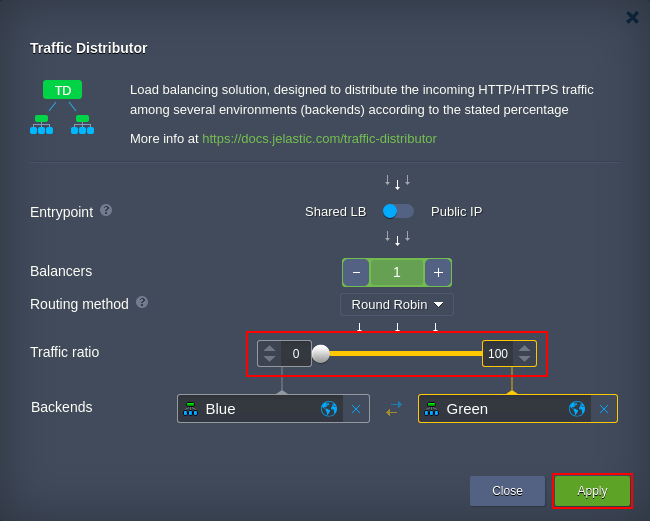

# Blue-Green Deployment with TD

With the help of [Traffic Distributor](/traffic-distributor), you are able to perform so-called &ldquo;invisible&rdquo; updates using the blue-green deployment method, which will not cause any downtime for your application. This possibility it's truly essential in the current reality of rapid development and fast growing concurrency, as you need to constantly update your project for it to remain demanded, conquer new users and, generally, not to fall behind your competitors. And if these frequent maintenances will interrupt normal application work and its availability, it will negatively affect your service appeal. 

So let's reveal how to get rid of such problems and apply blue-green updates to your project by means of the proposed traffic routing solution.

1\. Let's assume we have two environments (with the *Blue* and *Green* [aliases](/environment-aliases) set for each of them for better differentiation) and Traffic Distributor within a separate environment, intended to route traffic between them:

2\. In order to update application on backends to the latest version without the whole project downtime, it should be done in turn. So, at first, let's prevent the traffic from being directed to one of our environments (e.g. *Blue*) by [re-configuring the Traffic Distributor](/traffic-distributor-installation#reconfigure) add-on.

For that, move the **Traffic ratio** slider to the *0 ... 100* position, in such a way ensuring that the first backend won't be accessed.  
Click **Apply** to proceed.

3\. Now, when all the incoming traffic is only processed by the second (*Green*) environment, you can apply any changes to the *Blue* one without any haste, e.g. deploy and test a new application version:

4\. Now, as you need to update project on the second host, just repeat the *2nd - 3rd* steps above and switch environment roles (i.e. set the **Traffic ratio** slider to the opposite position of *100 ... 0*). This will allow the *Blue* project copy to process all requests and *Green* - to go on maintanance.

5\. Lastly, open the Distributor configuration frame once again and return the preferable servers' weights to restore the original operability, e.g.:

That's it! As a result, your application was updated on both backends, whilst your customers have continued to use the service without any interruption during all these operations.

## What's next?
* [Traffic Distributor Overview](/traffic-distributor/)
* [Traffic Distributor Installation](/traffic-distributor-installation/)
* [Traffic Distributor Injection](/traffic-distributor-injection/)
* [Failover Protection](/failover-protection/)
* [A/B Testing](/ab-testing/)