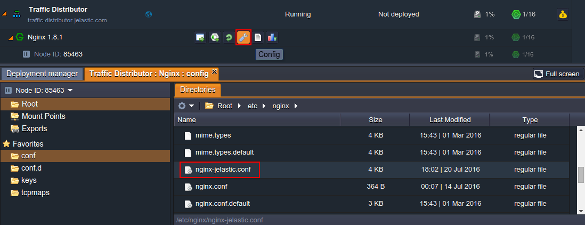
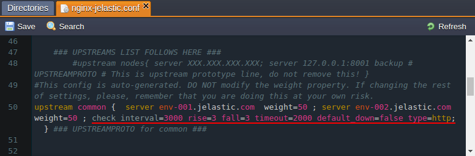
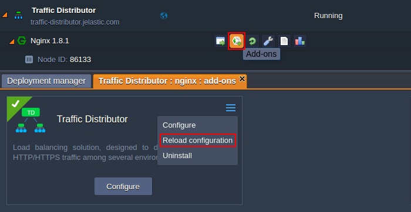

# Failover Protection with TD

[Traffic Distributor](/traffic-distributor/) allows to easily achieve advanced failover protection with the help of the in-build *health check* module, which automatically regularly tests backends for availability and excludes unavailable ones from routing. This functionality is enabled by default, however, you can adjust this module behaviour if required. Follow the steps below for that.

1\. Navigate to the NGINX **Config** panel with the same-named button and navigate to the */etc/nginx/nginx-jelastic.conf* file within **Root**:



Doubleclick to open it in a new tab for editing.

2\. Scroll down to the approximately *50th* line, where the add-on's configuration is declared, and find the required ***check*** module inside the ***upstream common*** section. It operates with the following parameters (where the ones in square brackets are optional):
```
check interval={interval} fall={fail_count} rise={rise_count} [timeout={timeout}] [default_down={true/false}] [port={port}] [type={type}]
```



where

* ***{interval}*** - delay between two consecutive check requests; is set in milliseconds
* ***{fail_count}*** - amount of checkup failures, after which the server will be marked as unavailable
* ***{rise_count}*** - amount of successful checkups, after which the server is marked as up and working
* ***{timeout}*** - timeout (in milliseconds) the health check module is waiting for reply from backend before the check request is considered as failed
* ***{true/false}*** - sets the initial state (*down* or *up* correspondingly) of both backends (i.e. until the corresponding amount of checkups is passed); states in *true* by default
* ***{port}*** - port number to be used while connecting to a backend to perform health check; by default is set to *0*, which means that the default server's port (according to the set protocol) will be used
* ***{type}*** - protocol type to be used for health check (i.e. to diagnose if backend is up):
    * **tcp** - a simple *TCP* socket connection
    * **ssl_hello** - sends *Client Hello* SSL packet, which should be responded with a *Server Hello* message
    * **http** - sends *HTTP* request packet to receive and parse the response
    * **mysql** - connects to the *MySQL* server and receives the greeting response
    * **ajp** - sends *AJP Cping* packet to receive and parse the *Cpong* response
    * **fastcgi** - sends a *FastCGI* request to receive and parse the response

According to the settings in the image above, both backends will be checked for the normal HTTP response (i.e. *200* status code, which means that the request was fulfilled) every 3 seconds. If check up is failed for 3 times in a row, the corresponding backend will be marked as "down" and excluded from the route, so that all the requests will go to the second environment. And when the fallen server is live again, it will be automatically re-added (namely, after 3 successful requests in a row) to the list of backends.

3\. After you've saved the made changes in NGINX balancer configurations, they can be applied without restarting the whole server (and, in such a way, avoid project downtime) through performing the graceful reload via the ***Reload configuration*** option in add-on's menu.



Confirm your decision via appeared pop-up and in a few seconds your new failover protection settings will take effect.


## What's next?

* [Traffic Distributor Overview](/traffic-distributor/)
* [Traffic Distributor Installation](/traffic-distributor-installation/)
* [Traffic Distributor Integration](/traffic-distributor-integration/)
* [Blue-Green Deploy](/blue-green-deploy/)
* [A/B Testing](/ab-testing/)