# Atlassian Confluence Clustering                                                                    

Let's create the **Atlassian Confluence** cluster with a few automatically scaled application servers. Using a cluster instead of a single server will increase the performance of your Confluence hosting through ability to serve much more requests simultaneously and provide some resiliency - if one node fails it won't cause the shutdown of other(s).
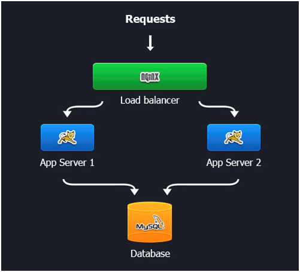

To set your Atlassian Confluence cluster just follow the next detailed instruction.

* **<big>Create a new environment</big>**
    * Log in to the platform dashboard.
    * Click **Create environment** and set up a new environment within topology Wizard.
    * Pick up two **Tomcat 7** application servers and select **MySQL** (or PostgreSQL) database. Then specify the amount of resources for each of these nodes, enter the name for your environment and confirm its creation.
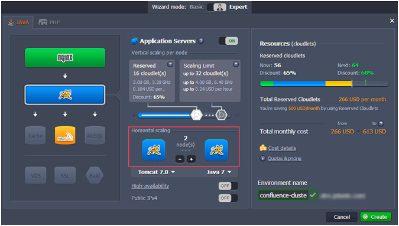
Just in a minute your new environment will appear in the environment list.

* **<big>Application Deployment</big>**
    * Open the [Confluence web-site](https://www.atlassian.com/software/confluence/download) and download **Confluence x.x.x Cluster – EAR/WAR** .zip package. Preferably use 5.3 version (OnDemand release) or higher.
    * Extract the downloaded **Confluence** package. Build a new **.war** package with Confluence folder contents (just include it to a new **.zip** archive and change archive’s extension to **.war**).
    * As the size of the archive exceeds the **Deployment manager** upload restriction (150MB), you should upload the created archive to any file storage system. Copy the link to your uploaded package.
    * Navigate back to the dashboard, open the *URL* tab in the **Deployment manager** and enter the link you've just copied. Press the **Upload** button.
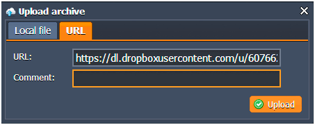
    * When uploading is successfully finished, deploy the application to the environment you've created before. 
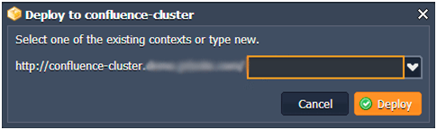
    * Then press the **Config** button next to the Tomcat instances. In the opened **Configuration manager** navigate to the **Home** directory and create a new folder in it (named, for example, *data*).
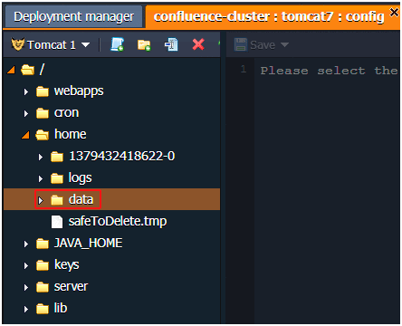
    * Now you should open the **confluence-init.properties** file, located in the ***webapps/ROOT/WEB-INF/classes/*** folder, and specify the path to the folder you've created in the previous step.
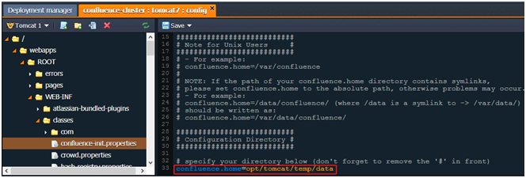

* **<big>Configuring database</big>**
    * Click the **Open in browser** button next to the MySQL node and log in to the **phpMyAdmin** panel with the credentials you've received after environment creation.
    * Create a new user and database with the same names, for example, *confluence*.
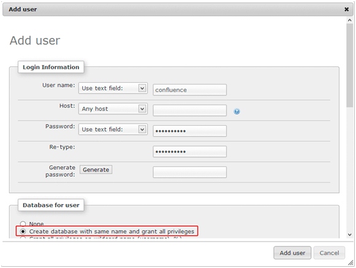
    * Navigate back to the platform dashboard. Find your environment in the list and click **Config** button next to the Tomcat instances.
    * Open the **lib** folder and upload the MySQL connector there.
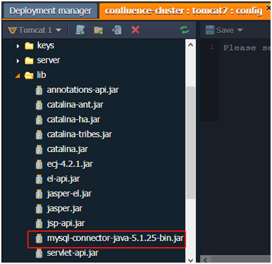
    * Press the **Restart node** button next to the Tomcat to apply the performed settings.
    
* **<big>Atlassian Confluence Cluster Installation</big>**
    * Press the **Open in the browser** button for your environment. The Confluence setup wizard will be opened.
    * Specify the license key in the appropriate field and confirm the cluster installation.
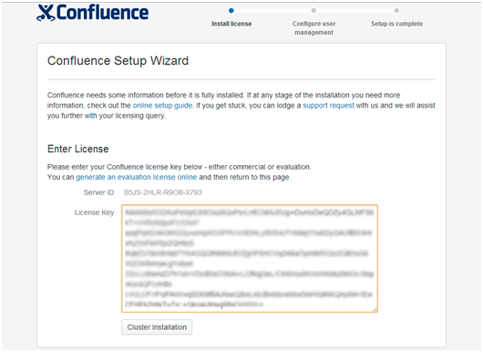
<i>**Note:** Don't try to enter the online generated key cause it doesn't fit for the cluster installation. You should buy the appropriate license for cluster or contact the Atlassian support in order to receive the Clustered Confluence Evaluation for testing.</i>
    * Specify the name of your cluster.
    * In the next window choose the direct **JDBC connection** to your database.
To fill in the **Database URL** field use the following format of the link to your database:  
*jdbc:mysql://mysql-{your_env_name}.{hoster_domain}/{db_name}?sessionVariables=  
storage_engine%3DInnoDB&useUnicode=true&characterEncoding=utf8*  
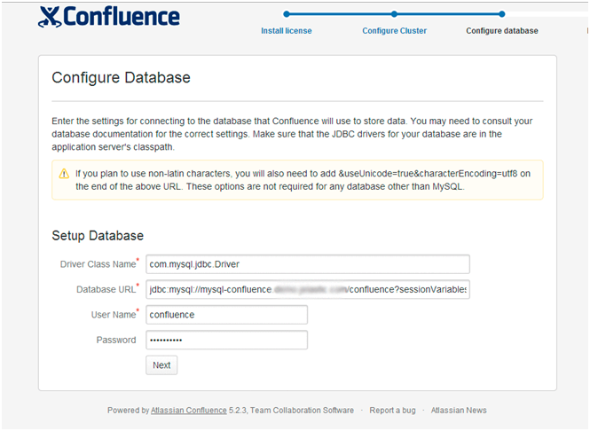
    * Go through the remained **Load content** and **Configure user management** Confluence installation steps.
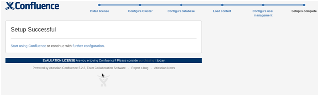
    * Finally, you can log in and start working with your own clustered Confluence application.
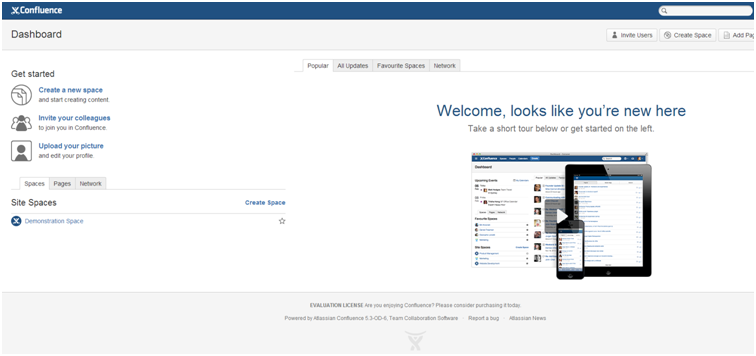

Enjoy! Hope this step-by-step instruction helped you.