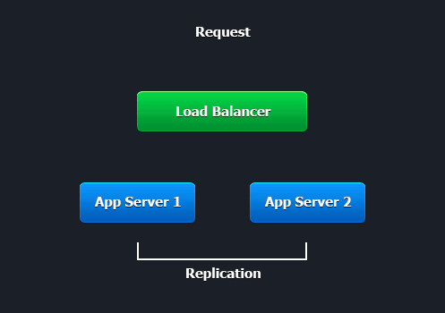

# Cluster in the Cloud
It's often needed to extend a Java/PHP application across multiple servers. This is especially crucial when your business fully depends on your application availability. The [high availability](/session-replication) helps to prevent failed transactions, error-filled shopping carts and lost work of the users. Extending the application across a number of the servers provides redundancy. As a result when one server fails, the whole app will not be brought down. Thus no server is a single point of failure for the application.

This is also important to have a scalable solution. If you run your application on the different servers, you want to be capable to handle session failover. The redundancy ensures that if one server dies, the remaining ones can take over the work of the failed one. Also there is the need to add more servers in order to avoid the overload of the remaining servers. This is gained with a help of the [horizontal scalability](/multi-nodes).

Obviously the platform [vertical scaling](https://www.virtuozzo.com/company/blog/vertical-scaling-for-java-applications/) also comes into the game nicely &ndash; the remaining server instance also gets the memory and processing power required to serve the doubled load.

Thus providing high availability for your application demands the related redundancy and scalability strengths. There is only one way to make sure this is achieved: a solution that adds **cluster to the cloud**. The cluster ensures that no server is a single point of failure. The cloud ensures that one server failure doesn't overload the rest of the servers.

Navigate to the following documents to get more detailed information on establishing highly available application in your environment.

**App Server Clustering**

* [Tomcat Cluster](/tomcat-clustering)
* [GlassFish Cluster](/glassfish-clustering)
* [PHP Sessions Clustering](/php-sessions-memcached)

**Database Server Replication**

* [PostgreSQL Replication](/postgresql-database-replication)
* [MySQL/MariaDB Replication](/database-master-slave-replication)
* [MongoDB Auto-Clustering](/mongodb-auto-clustering/)
* [Docker-Based Couchbase Cluster](/couchbase-cluster)

**Application Clustering**

* [Atlassian Confluence Cluster](/atlassian-confluence-cluster)
* [Concrete CMS Cluster](/concrete5-cluster)
* [ContentBox Cluster](/contentbox-clustering)
* [Cyclos Cluster](/cyclos-cluster)
* [Diaspora Cluster](/diaspora-cluster)
* [Hazelcast Cluster](/hazelcast-cluster)
* [JGroups Cluster](/jgroups-cluster)
* [Joget Cluster](/joget-cluster)
* [Liferay Cluster](/liferay-cluster)
* [TYPO3 Cluster](/typo3-cluster)
* [Wordpress Cluster](/wordpress-cluster-devops/)
* [XWiki Cluster](/xwiki-clustering)