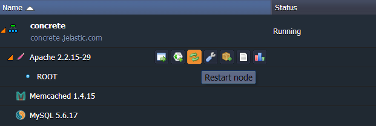

# Concrete CMS Cluster

**Concrete CMS** is a free and open source content management system (CMS) designed for easy usage so even newbies with a minimal set of technical skills can work with it. You can edit the content of your site without leaving the page instead of using an administrative interface or web editors.

Within the current instruction we'll describe not just simple way to deploy the Concrete CMS app (this can be found in [the appropriate document](/concrete-cms/)) but a way to configure a high-available cluster for its running.

To enhance availability and reliability of the service, we are going to set up a complex solution with 2 **Apache** servers, 2 replicated **MySQL** databases, a **Memcached** node and **NGINX** load balancer.


In this case Memcached is used to backup the Apache server sessions. So if one server fails, the second will take the sessions from Memcached and perform the further serving. NGINX is going to balance the traffic inside the cluster. And replicated MySQL primary and secondary databases increase the performance, data security and the fail-over capabilities of your environment.

Let's get started!


## Create Environment and Deploy Concrete CMS

First of all, you need to create a new environment with one **Apache** server and one **MySQL** database in order to deploy the Concrete CMS application to it.

1\. Log into the platform dashboard and click the **Create environment** button at the top panel. You will see the topology wizard opened.

2\. Navigate to its **PHP** tab and pick up the following nodes:

* **Apache** application server
* **MySQL** database
* **Memcached** node

Also choose the **PHP 5.3** version within the appropriate drop-down list.


3\. Define the amount of cloudlets for the chosen nodes, specify the environment name (e.g. *concrete*) and click **Create**. In a minute or so your environment will appear at the dashboard.


4\. Then navigate to the official **[Concrete CMS](https://www.concretecms.org/download)** web-site and download its ***Latest Stable Version***.


5\. Switch back to the platform dashboard and click the **Upload** button at the **Deployment manager** panel. In the opened frame choose the received **.zip** archive for uploading.


6\. Once the package is in the platform, click the **Deploy to** button next to it and choose the environment you have just created. In the opened window specify the context Concrete CMS will be deployed to (or just leave it blank) and click the **Deploy** button.


Congrats! You have got your application deployed. Let's go on.


## Configure Session Storage

Now let's set up the sessions clustering in order to provide the high availability for our cluster.

1\. Click the **Config** button for Apache node. In the opened Configuration manager navigate to the **/etc/php.ini** file and activate the PHP **Memcached** module by adding the following line:

```ini
extension=memcached.so
```


2\. Find **Session** block in the same ***php.ini*** file and enable sessions support by editing the next two lines:

```ini
session.save_handler = memcached  
session.save_path = "< server >:11211"
```


{}**Note:** *< server >* is the Memcached IP or URL. You can find it by clicking **Info** button next to the Memcached node in your environment.


{}

3\. Save the changes you've performed and restart **Apache** server in order to apply new settings.



That's it! For now, if one application server instance in a cluster fails, user's session will be automatically picked up and served by another Apache instance.


## Database Configuration

The next step is to configure the primary-secondary (master-slave) database replication, aimed to ensure the protection of data in your Concrete CMS cluster.

1\. In order to set up the MySQL cluster you need to create one more environment with just single **MySQL** node, which will be used as a secondary database.


Wherein the role of the primary DB will belong to the MySQL server in the environment with Concrete CMS application deployed.

To configure the replication between these databases follow the detailed instructions in the [MySQL/MariaDB Primary-Secondary Replication](/database-master-slave-replication/) document.  

2\. Once you've adjusted the database clustering, navigate to the phpMyAdmin panel of the **primary DB** and create a new *concrete* database.


3\. You can make sure that database replication is configured properly by navigating to the admin panel of your **secondary** MySQL server. You'll see that the newly created and already replicated ***concrete*** DB is added to the list of databases in the appropriate tab.


## Concrete CMS Installation

Now it is time to complete the installation of our Concrete CMS. Press **Open in browser** button next to the environment with application deployed.

You'll be shown an installation wizard in a new tab. Its steps are rather simple. Therefore let's pay some attention to the defining the main settings.

Fill in the following fields:

* **Name Your Site**: insert the desired name of your site
* **Email Address**: type the email of administrator user
* **Password**: specify the password for administrator user
* **Server**: paste the link to the ***primary*** database <u>*without http://*</u>
* **MySQL Username**: enter login you've received in the email with credentials to ***primary*** DB while environment creation (*root* by default)
* **MySQL Password**: type the password from the same email
* **Database Name**: specify the name of the database you've created just after configuring the DB replication (*concrete* in our case)

Then choose if your site will contain the sample of content or will be blank and complete the installation process.


## Cluster Configuration

Finally, let's configure the cluster itself.

1\. Click the **Change environment topology** button for the environment with CMS deployed.


2\. Increase the number of **Apache** application servers by pressing the corresponding button. Note that **NGINX-balancer** node will be automatically added to your environment. Click **Apply**.


In such a way all the data between application server instances will be synchronized and there is no need to perform the double installation and configuration.

3\. Now you can open your Concrete CMS and start working with it.


That's it! You've got your highly available and reliable Concrete CMS application up and running.


## What's next?

* [Concrete CMS](/concrete-cms/)
* [Deployment Guide](/deployment-guide/)
* [Memcached](/memcached/)
* [Primary-Secondary Replication](/database-master-slave-replication/)