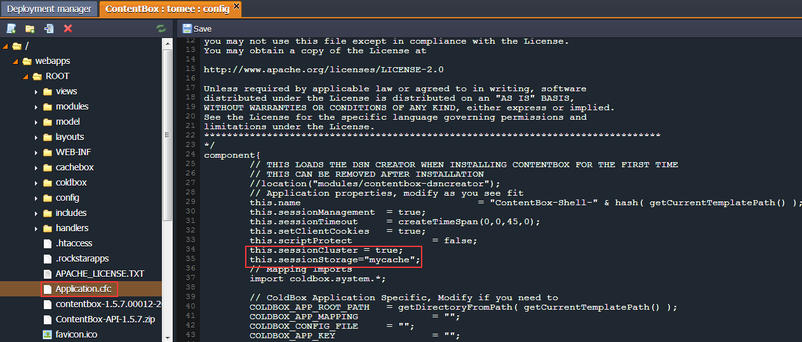

# ContentBox Clustering

**ContentBox** is an open-source modular content management engine for professionals. It is used for building the complicated web applications as well as blogs, websites, wikis, etc. This CMS is powered by the open source CFML engine named Railo, which you can deploy to any Java application server.

In this instruction we will show how to get the ContentBox hosting with the platform and configure the rapid and scalable caching with embedded Railo CFML cluster cache and Memcached system.

In the following cluster implementation we will use the session replication via Memcached. We'll get the shared clustered cache, where all the sessions are stored and simultaneously are available for all the servers in the cluster. See the scheme below:


Cluster will consist of two application server nodes with ContentBox deployed, which will be connected to one MySQL database. The Memcached node between them will be used for scaling out and storing a great amount of data and memory.<a id="list"></a>

So, let's get started.

- [Create Environment](#create-environment)
- [Database Configuration](#database-configuration)
- [ContentBox Deployment](#contentbox-deployment)
- [Railo CFML Admin Passwords](#railo-cfml-admin-passwords)
- [Cluster Configuration](#cluster-configuration)
- [Java Agent Enabling (Optionally)](#java-agent-enabling-optionally)
- [ContentBox Installation](#contentbox-installation)


## Create Environment

1\. Log in to the platform dashboard.

2\. Press the **Create environment** button in order to open the Environment Topology wizard.

3\. Select two instances of **TomEE** application server, pick **MySQL** as a desired database to work with and **Memcached** node as a cache storage. Set up the amount of resources for each of these nodes within cloudlet sliders, specify the environment name and press the **Create** button.


Just in a minute your environment will be created and appear in the dashboard list.


{}[Back to the list](#list){}


## Database Configuration

1\. Press the **Open in Browser** button next to the MySQL node.


2\. While creating the environment, the platform had sent you the credentials to phpMyAdmin panel. Log in with these credentials to create the same named new user and database.


{}[Back to the list](#list){}


## ContentBox Deployment

1\. Open the ContentBox [official web-site](https://www.contentboxcms.org/) in order to download its latest version as a **.war** archive.


2\. Navigate back to the platform dashboard and upload the ContentBox archive within **Deployment Manager**.


3\. After that deploy **ContentBox** to the environment you've created earlier.


{}[Back to the list](#list){}


## Railo CFML Admin Passwords

It is strongly recommended to specify your own admin passwords for the embedded Railo CFML engine instead of the default ones.

1\. Navigate to the **Server Admin** panel of the Railo CFML with the following URL format:  

*http:/\/mydomain.com/railo-context/admin/server.cfm*

2\. Log in to the panel with ***contentbox*** password.


3\. Open the **Security** menu located on the left side and choose the **Password** item:


4\. The opened tab gives you a possibility to specify a new administrator password and default password to all the apps, deployed on this server (Railo provides a server wide administrator and a web context administrator). Also you can enable the captcha verification on the login form in order to make sure it was submitted by human. To get the best security change both administrator password and web administrators password for all the applications.


{}[Back to the list](#list){}


## Cluster Configuration

1\. Use [this](/replication-memcached/) instruction to set up the **Memcached session replication** for your environment.

2\. Log in to the **Server Admin** panel of the Railo CFML again (use the *http:/\/mydomain.com/railo-context/admin/server.cfm* URL format) with the password you've specified in the previous instruction step. In the case you didn't change the default password, use the *contentbox* one.


3\. Open the **Extension > Applications** tab within the left hand menu. Install the **Railo Memcached driver** (circled below):


4\. Then click the **Services > Cache** menu item in order to create a new cache connection between the Railo server and Memcached. Type the name of connection, choose the **MemCache** cache type in the drop-down list and click **Create**.


5\. In the next window tick the *Allow to use this cache as client/session storage* line and specify your connection settings. Type the **IP address** and **port** number of your environment Memcached node (open the platform dashboard and click the **Info** button next to it to get this info). Confirm the creation of new connection.


6\. Verify the newly created connection by choosing it and clicking the appropriate button.


7\. Then navigate back to the platform and press the **Config** button next to the TomEE app server.


8\. Open the **webapps** directory and find the folder with deployed ContentBox application files (this folder is named as a context you've specified while the deployment; if you haven't, it is named *ROOT*). Open the ***Application.cfc*** and enable the sessions distribution via Memcached through adding the following lines:  

```
this.sessionCluster = true;  
this.sessionStorage="mycache";
```



8\. Then let's enable the ContentBox to use the same cache for distribution of content/RSS and monitoring, i.e. we'll expand its abilities from just a distribution sessions across the cluster till using the multiple levels of content caching and RSS feeds. In order to perform this, navigate to the ***CacheBox.cfc*** file (located in the *webapps/ROOT/config/* folder) and add the following definition of new cache under the caches section:

```
Memcached = {  
 provider = "coldbox.system.cache.providers.RailoProvider",  
 properties = { cachename = "mycache" }  
}
```


{}[Back to the list](#list){}


## Java Agent Enabling (Optionally)

1\. Extract the ContentBox archive you've downloaded at the very beginning and find the ***railo-inst.jar*** file in the *contentbox-x.x.x.war/WEB-INF/railo/lib/* folder.

2\. Click the **Config** button next to the TomEE server in your environment and navigate to the **home** folder in the opened configuration manager. Upload the ***railo-inst.jar*** library to this folder.


3\. Then navigate to the **server > <i>variables.conf</i>** file and specify the path to the **railo-inst.jar** library in it. To know the right path use the document with [TomEE variables.](/environment-variables/)


4\. Save the changes you've performed for both TomEE nodes and restart them.


{}[Back to the list](#list){}


## ContentBox Installation

1\. Press **Open in Browser** next to your environment. The ContentBox installation window will be opened.
 


2\. Specify the data source connection within Railo Administrator password you've set, and MySQL user/database, which you've created earlier.
 


{}**Note:** If you haven't changed the default password, it remains the same, **contentbox**.{}

3\. Verify that all the fields are filled correctly and submit the creation of the data source. After that ContentBox will prompt you for your ContentBox administrator user, site information, mail and rewrite settings.

{}**Note:** In the opened window of rewrites installation choose the ContentBox Express item in the dropdown list because deployed ContentBox .war archive contains the in-built rewrite engine.{}

4\. Finally, let's designate the Memcached as a content and RSS feeds storage. Open the top menu in the ContentBox and navigate to the **System > Settings** section. Then go to the **Content Options** tab located on the left side. Find the **Content Cache Provider** drop-down list and change the selected item from *TEMPLATE* to *Memcached*.


5\. Then you can go to the **RSS Options** tab and specify the same configuration for RSS Feeds caching.


That's all the configurations! Now you can distribute your sessions, managed content objects and RSS feeds with the clustered ContentBox hosting.


## What's next?

* [Cluster in the Cloud](/cluster-in-cloud/)