# How to Set Up Docker-Based Couchbase Cluster

{}{}

**[Couchbase](https://www.couchbase.com/)** is an open-source NoSQL database, which, being able to serve a lot of concurrent users, is maximally optimized for handling interactive applications and Big Data. As a general-purpose DB system, it can be easily utilized as a document-oriented database, key-value store and/or distributed cache storage.

Starting with the 4.x version, Couchbase provides [Multi Dimensional Scaling](https://docs.couchbase.com/server/current/introduction/intro.html), that makes this database scalable vertically and horizontally. Obviously, such a technology requires a suitable hosting platform for being deployed at, which is flexible enough to fully unleash its potential - just like our PaaS.

With an aim to achieve extra availability and improve the failover, multiple Couchbase instances can be united into a performant and reliable [clustering solution](/cluster-in-cloud/). For getting the insights on how to accomplish this within the platform, watch the following video tutorial:

<iframe class="wistia_embed" name="wistia_embed" src="https://fast.wistia.net/embed/iframe/h6i53wovrx?canonicalUrl=http%3A%2F%2Fblog.couchbase.com%2F2015%2Fdecember%2Fcouchbase-on-jelastic&canonicalTitle=Couchbase%20on%20Jelastic" allowtransparency="true" scrolling="no" frameborder="0" height="598" width="780"></iframe>

And below you can find out the step-by-step instruction with all of the required operations described in details. So, let's see how to set up a scalable Couchbase DB cluster at the platform:

* [create an environment](#environment-creation)
* [launch Couchbase](#launch-couchbase)
* [configure a cluster](#configure-couchbase-cluster)

## Environment Creation

In order to simplify the database deployment as much as possible, we'll leverage the tight integration of [Docker containers support](/dockers-overview/) at the platform, using the already prepared Docker template with the appropriate Couchbase image.

1\. Click the **New Environment** button at the top of the platform dashboard, switch to the ***Docker*** tab within the opened wizard and proceed with **Select Container** at the middle section.

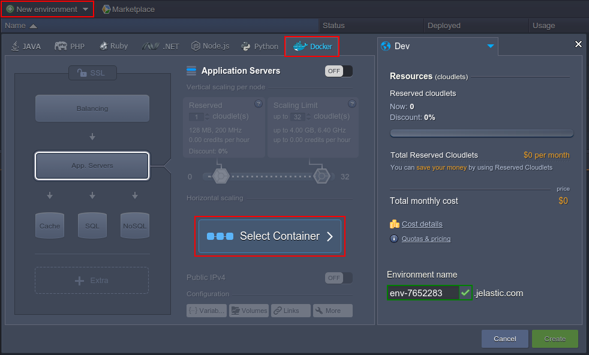

2\. Using the embedded **Search** at the dedicated tab, find and select the ***couchbase/server*** image.

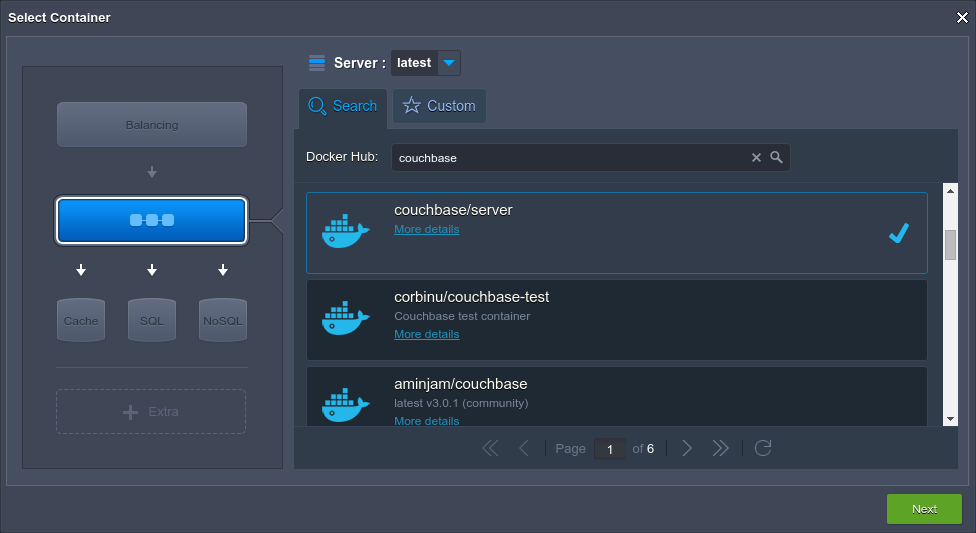

Click **Next** to continue.

3\. Now, set the required amount of servers within the *Horizontal scaling* section using the **+/-** buttons (we'll create 3 nodes as an example), and resource limits for them with the cloudlet sliders in the *Vertical scaling per node* part.

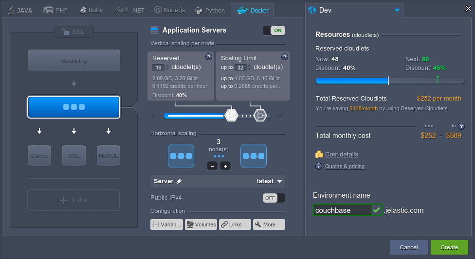

Finish pre-configurations by choosing the desired [environment region](/environment-regions/), specifying name (e.g. *couchbase*) for it and clicking the **Create** button.

4\. In a few minutes, your environment will appear at the dashboard. To ensure everything passed successfully and there weren't any problems, you can click the **Show Logs** button in the appeared pop up message.

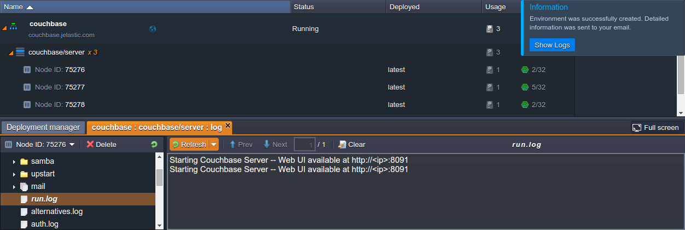

As you can see, logs doesn't show errors and just informs us that the web-UI can be accessed at the *8091* port.

## Launch Couchbase

In order to access the Couchbase web interface and start managing it, you can either attach the [public IP](/public-ip/) to your environment (which is a paid option) and open it at the *8091* port or just add the corresponding [endpoint](/endpoints/) (free of charge). We'll consider the letter case:

1\. Click **Settings** (the wrench pictogram) next to your environment, move to the ***Endpoints*** menu point at the appeared tab and hit the **Add** button in the central tools pane.

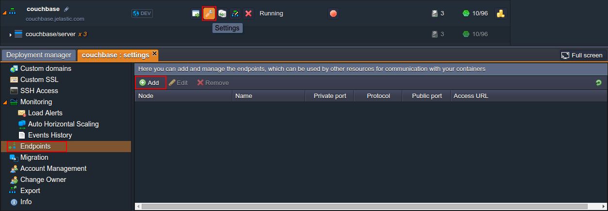

2\. At the displayed frame, specify the following data:

* **Node** - select the node you'd like to set the endpoint for (any of 3 servers your environment contains)
* **Name** - type the appellation for your endpoint
* **Private port** - specify the local node's port (we require the *8091* one to access web UI)
* **Protocol** - select the *TCP* protocol

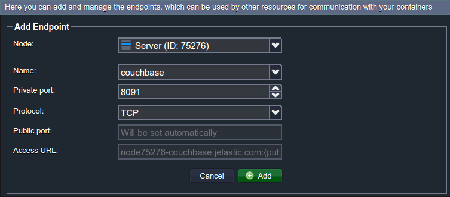

Confirm the creation with the **Add** button.

3\. Endpoint will be added in a moment, so just click on the *Access URL* field to easily copy the link.

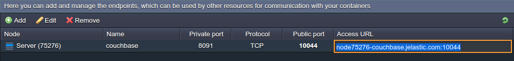

4\. Open this address within a new browser tab to launch the Couchbase web interface.

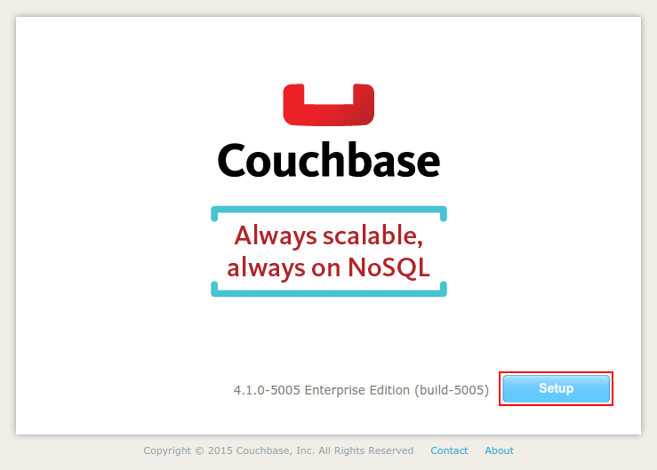

As you can see, it needs to be **Setup** before being used.

5\. Here, you'll be guided through five configurations steps, intended to help you to adjust Couchbase up to your needs.

For this example installation, we'll keep the settings without changes and will just click the **Next** button, accepting the terms of use at the 4th step and specifying the password at the last one.

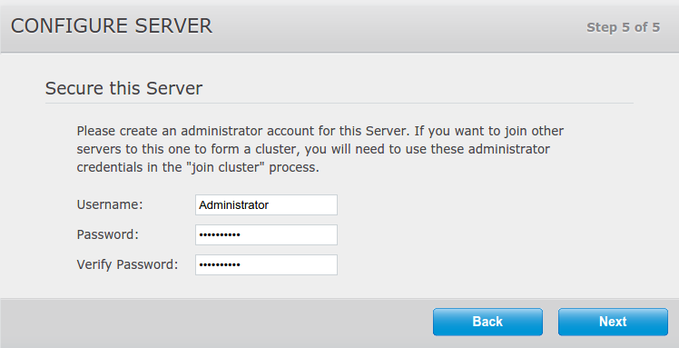

That's it! Now the server is configured and ready for work.

## Configure Couchbase Cluster

When you've already deployed and accessed Couchbase web interface, you can start cluster creation by linking the remained servers to the currently used one.

1\. Switch to the ***Server Nodes*** tab at the top pane and click the **Add Server** button.

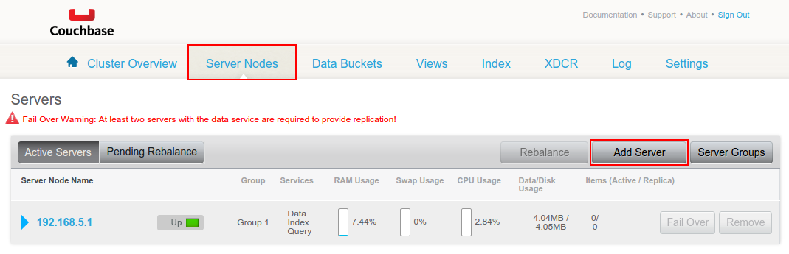

2\. At the appeared frame, fill in the required fields.

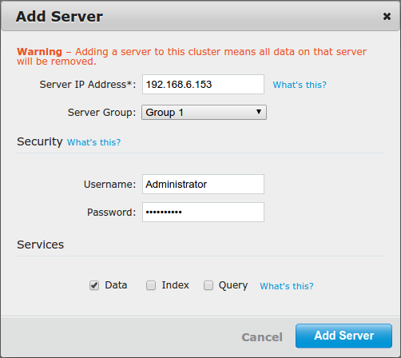

where:

* ***Server IP Address*** - IP address of the server you'd like to add to the cluster (can be found within the nodes' *Additionally* list at the dashboard)
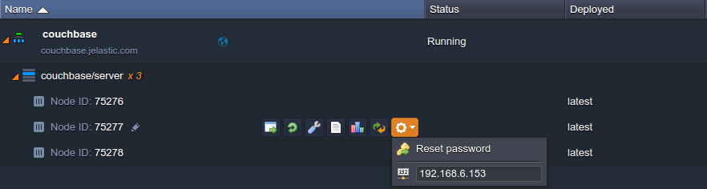
* ***Username / Password*** - administrator credentials you've specified during setup

Then, untick the *Index* and *Query* services and proceed with the **Add Server** button.

3\. Repeat the previous step for the remaining server(s). As a result, all the newly added nodes will be displayed at the ***Pending Rebalance*** tab for being included to the cluster after clicking the **Rebalance** button.

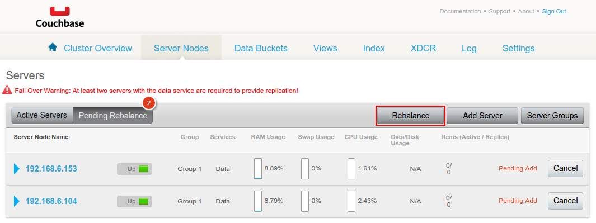

That's all! Just wait a while for the process completion to receive your own ready-to-go Couchbase Docker-based DB cluster, hosted at the platform.

{}If you face any issues while deploying or configuring your Couchbase cluster, feel free to appeal for our technical experts' assistance at [Stackoverflow](https://stackoverflow.com/questions/tagged/jelastic).{}

## What's next?

* [Cluster in the Cloud](/cluster-in-cloud/)
* [Docker Standard Support](/dockers-overview/)
* [Adding Docker Container](/docker-container-deploy/)
* [Container Configuration](/container-configuration/)