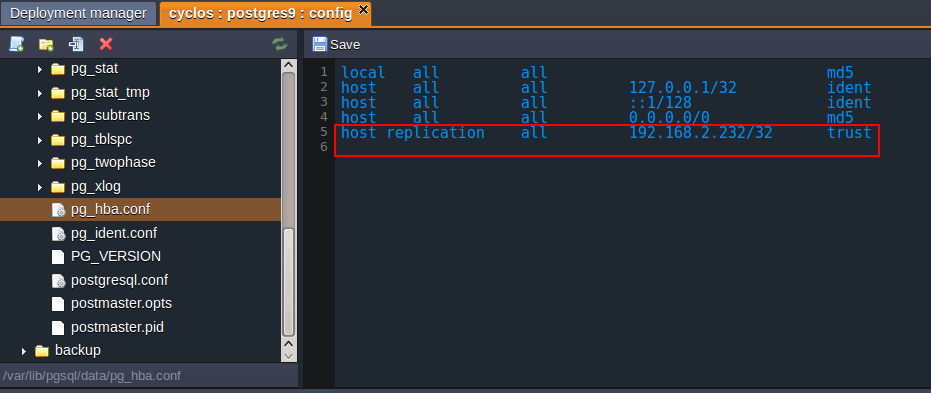

# Running Cyclos Cluster

**[Cyclos](http://cyclos.org/)** is a complete on-line banking system with additional modules such as e-commerce and communication tools. With dynamic structure of Cyclos you can 'build' a dedicated payment system from scratch just by changing the configuration.

Recently Cyclos released a new fourth version and the platform provided the ability to install it in one click. This can be done via [Cyclos site](https://license.cyclos.org/app/home) (you need to register first) or via JPS widget in our [Cyclos 4 document](/cyclos-4/).

In the platform, you can run Cyclos on **Tomcat, Jetty** and **Glassfish**. The database for Cyclos 4 is the open source database **PostgreSQL** (not less than 9.3). The minimal memory space requirements to run a single Cyclos instance is 500 MB (so you need to use at least 4 cloudlets).

In this tutorial we'll find out how to configure highly reliable and scalable Cyclos cluster with master-slave database replication and High Availability enabled within the platform.


The **[high availability](/session-replication/)** helps to prevent failed transactions and other troubles that can influence your users. Extending the application across a number of the servers provides redundancy. The redundancy ensures that if one of the servers fails, the users from that node will be automatically switched to the other instance of this Tomcat cluster. Thanks to the replication, the other instance already has all the sessions of the failed node, so end-users never notice any change.

In addition, the [PostgreSQL database master-slave replication](/postgresql-database-replication/) improves the performance and the fail-over capabilities of your environment.


## Environment Creation

Firstly, you need to prepare a basis for our application cluster - environment with all required containers.

1\. Log into your PaaS account.

2\. Click **Create environment** and select:

* **Tomcat 7** as your application server
* **PostgreSQL 9.3** as the database you want to use

{}**Note:** You need to use the version of PostgreSQL not less than 9.3.{}


Then enter your environment name, for example, *cyclos*, and click **Create**.

3\. It will take just a minute for your environment to be created.


## Cyclos Deployment

Now we are ready to deploy Cyclos application.

1\. To download Cyclos package navigate to the **[Cyclos web site](https://www.cyclos.org/)** and register if you haven't done this before.


2\. Confirm your account creation via received email.  
Sign in with your credentials and download the installation package.

{}**Note:** You can also use **one-click install** button in order to get Cyclos automatically installed. It is recommended to install Cyclos manually if you want to set a clustered solution.{}


3\. Extract the files from **.zip** package you have just downloaded.


4\. Create a **.WAR** file from **web** folder content (*cyclos-4.0.1/web/*).  
Just put the content of the **web** folder to another **zip** archive file, for example *cyclos_4.zip*, and rename it to **cyclos_4.war** or any other name with the **.war** extension.

5\. Upload your Cyclos **war** package to the **Deployment manager**.


6\. Once the package is in the platform, deploy it to the environment you have just created.


## Configure Database Replication

When Cyclos application is deployed you can proceed to database settings. So let's configure PostgreSQL master-slave replication in order to protect your application from downtime or data loss.

PostgreSQL in your environment with Cyclos deployed will be used as master database. For slave database you need to create a separate environment.

Navigate to the platform dashboard and create environment with **PostgreSQL** node which is going to be used as slave database. Name your environment (e.g. *cyclos-slave*) and click **Create**.


### Master DB Configs

1\. Find the environment with the **master database** in your environment list (with deployed Cyclos in our case). Click the **Config** button next to the PostgreSQL node.

2\. Open **conf &gt; <i>postgresql.conf</i>** file. Uncomment and change the following settings for enabling streaming replication:

```ini
wal_level = hot_standby
max_wal_senders = 3  
archive_mode = on  
archive_command = 'cp %p /tmp/%f'
```


3\. Open the ***pg_hba.conf*** configuration file, which is located in the same **conf** folder.

4\. Permit the standby database cluster connection by stating the following parameters:

```ini
host replication all {standby_ip_address}/32 trust
```

{}**Note:** You need to add one more spare line after the added settings.{}



Don't forget to **Save** the changes you've performed.

5\. Now you should access your environment with master DB via SSH and enter the PostgreSQL container it contains.

{}In the case you haven't done the similar operations before, you need to:
* [generate](/ssh-generate-key) an SSH keypair
* [add your public SSH key](/ssh-add-key/) to the dashboard
* [access your account](/ssh-access/) via SSH protocol{}


6\. Once you've entered the container, you need to stop it, delete the old WAL log file, and create a new empty one:

```bash
sudo service postgresql stop  
/usr/pgsql-9.3/bin/pg_resetxlog -f /var/lib/pgsql/data/
```

7\. Finally, start the container with the following command:

```
sudo service postgresql start
```


### Slave DB Configs

1\. Access the environment with standby database (named *cyclos-slave* in our case) via SSH in the same way you did it for the master one:


2\. Just after you've entered the DB container you need to stop it and remove the old database with the following commands:

```bash
sudo service postgresql stop  
rm -rf /var/lib/pgsql/data/
```

3\. Then copy a new database from the master server:

```bash
pg_basebackup -U webadmin -R -D /var/lib/pgsql/data/ --host={master_IP_address} --port=5432
```  

{}**Note:** You should substitute the *{master_IP_address}* value with the IP address of your master PostgreSQL server, located in the environment with Cyclos app deployed.{}


4\. To complete the configuration of standby PostgreSQL database switch back to your platform dashboard and click **Config** icon next to it.

5\. In the **conf** folder locate the ***postgresql.conf*** file, uncomment the ***hot_standby = off*** parameter in the *Standby Servers* section, and change its value to ***on***.


**Save** the changes you've performed.

6\. Finally, switch to your SSH console and run the container with slave DB:

```
sudo service postgresql start
```


After both of your databases are configured, log in to the admin panel of the master database (one in the *cyclos* environment) and create a new database:

* center the DB name (e.g. *cyclos4*)
* choose *template0* and *UTF8* encoding from the drop-down lists
* click **Create**


As a result you'll get a newly created database which will be replicated to the slave base also.

{}**Note:** As we've copied all the data and configurations from the master PG server to the slave PG server, credentials for admin access to the slave database became the same as to the master's one.{}


Navigate to the [PostgreSQL Replication](/postgresql-database-replication/) document to get more details on how to check if the database is replicated to the standby db.


## Configure Cyclos

Now we need to make final configurations of Cyclos application and then to complete full clustering settings by switching on High Availability.

1\. Open the platform dashboard and click **Config** button for **Tomcat**.


2\. Navigate to *webapps/ROOT/WEB-INF/classes* folder and create ***cyclos.properties*** file.

3\. Copy the content of ***cyclos-release.properties*** file in **class**folder and paste it to the newly created ***cyclos.properties*** file.

4\. In the opened ***cyclos.properties*** file, specify your master PostgreSQL data:  

* in *cyclos.datasource.jdbcUrl* parameter state the **host** together with the name of **database** created while DB configuration:

```bash
jdbc:postgresql://postgres-{env_name}.{hoster_domain}/{db_name}
```

* database **credentials** you've received via email


**Save** the applied changes and **Restart**Tomcat.

5\. Finally, let's configure the cluster itself. Press **Change environment topology** button next to your Cyclos environment.


In the opened wizard enable **High Availability**. Set up the amount of resources for automatically added NGINX-balancer node (it will handle and distribute all the requests in front of your cluster).


6\. Click **Open in Browser** and proceed to work.


{}**Note:** The first Cyclos opening can take a few minutes, please be patient.{}

After opening you need to go through several steps of Cyclos configuration wizard using credentials you've registered at the Cyclos site before.


That's all. Now you have your own highly-reliable Cyclos cluster in the cloud. This cluster ensures that no server is a single point of failure, and the cloud ensures that one server failure doesn't overload the rest of the servers.


## What's next?

* [Cluster in the Cloud](/cluster-in-cloud/)
* [PostgreSQL Replication](/postgresql-database-replication/)