# How to Setup Diaspora Cluster

**Diaspora** is an open-source user-owned distributed social network with more than 1 million accounts all over the world. This instruction is devoted to adjusting a highly-available and failover clustering solution for your Diaspora pode, built within a bundle of two clusters (app server's and database's).

This is a reasonably long tutorial, but it will cover such important things as master-slave database replication and file synchronization between several application servers. These configurations will increase an application's performance (which is especially important for such traffic demanding apps as Diaspora, with thousands and millions of users), ensure an even distribution of the load between servers and provide additional security and reliability. 

So, let's get started in order to see how simple it is, with the help of the platform's platform.


## Application Deployment

1\. Log in to the platform and click the **Create environment** button in the upper left corner of the dashboard.


2\. In the appeared **Environment topology wizard** navigate to the **Ruby** tab and choose **Apache** as your application server, **MySQL** as a database and **Redis** as a data structure server. Then state the required amount of resources for them using the cloudlet sliders, type your environment name (e.g. *diaspora-cluster*), and click the **Create** button.
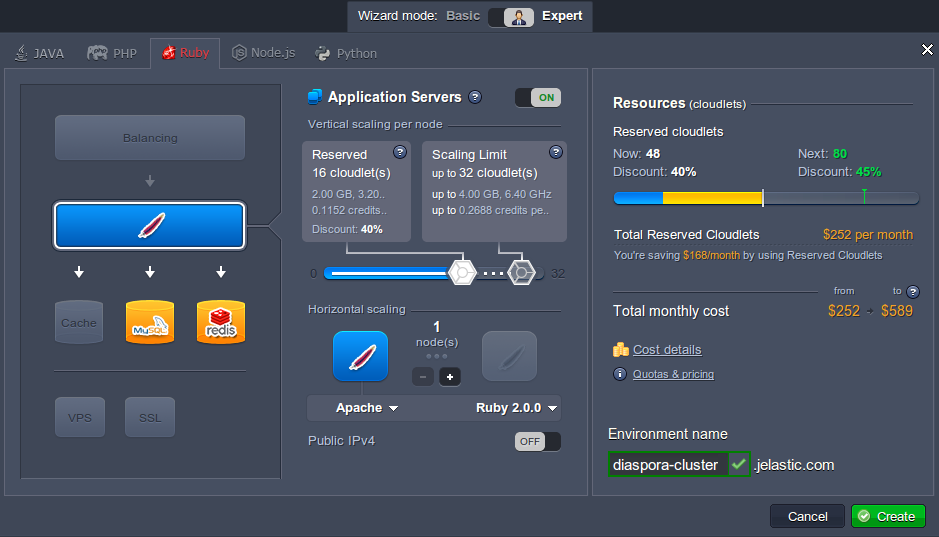

3\. In a minute your environment will appear at the dashboard.
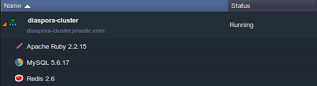

4\. Now you can start to deploy and configure your application. The full information about Diaspora deployment can be found in the platform's Documentation. Simply follow [How to install Diaspora* into PaaS](/diaspora) instruction.


## Database Configuration
Once your Diaspora application is successfully deployed and run, let's go on to the database replication adjusting. The first thing you'll need to do is to create a separate environment with a slave database for our DB cluster.

1\. Click on the same **Create environment** button and choose just one **MySQL** instance in the opened frame. State the resource limits for your slave database, edit the name of a new environment (e.g. type *diaspora-slave*) and click the **Create** button.
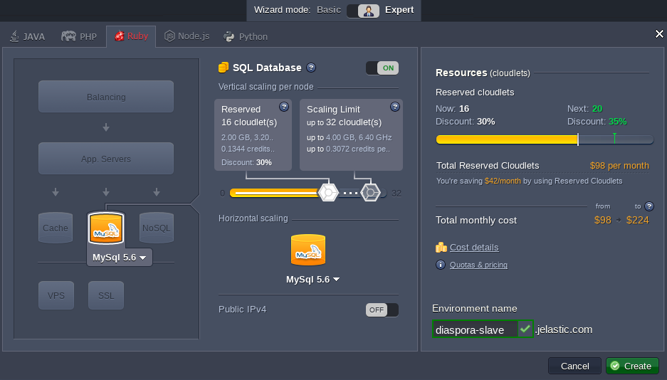

2\. In a few moments your environment will be created.
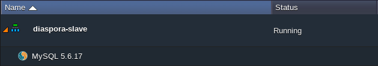
Now let's proceed directly to the databases configuration. 

### Master Database

1\. Let's start with the master database. Click the **Config** icon next to your MySQL node in the *diaspora-cluster* environment.
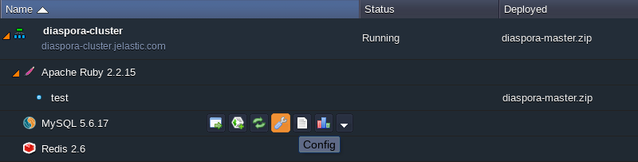

```
server-id = 1  
log-bin = mysql-bin  
binlog-format=mixed
``` 

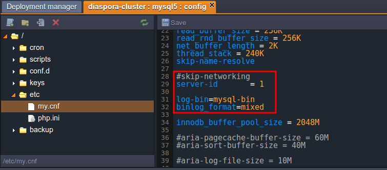

3\. **Save** the changes performed and **Restart** your MySQL server to apply them.
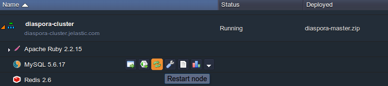

4\. Then click **Open in browser** for your MySQL node and log in to the opened admin panel (with credentials you've received via email earlier).
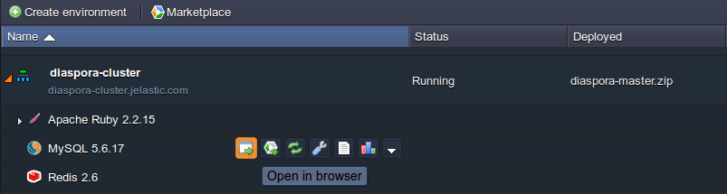

5\. Select ***Add slave replication user*** option in the *Master replication* section of the **Replication** tab.
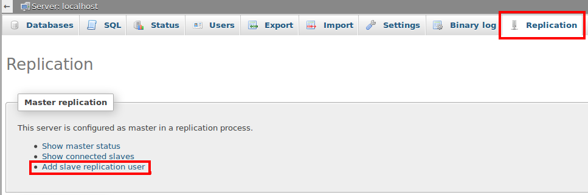

6\. Specify the desired ***User name*** (e.g. *slave*) and ***Password*** for your slave replication user. Click the **Go** button.
![diaspora MySQL user](11-database-configure-replication.png

7\. After that, grant *replication client* and *replication slave* privileges for the newly created user and proceed to the **Go** button in the bottom right corner.
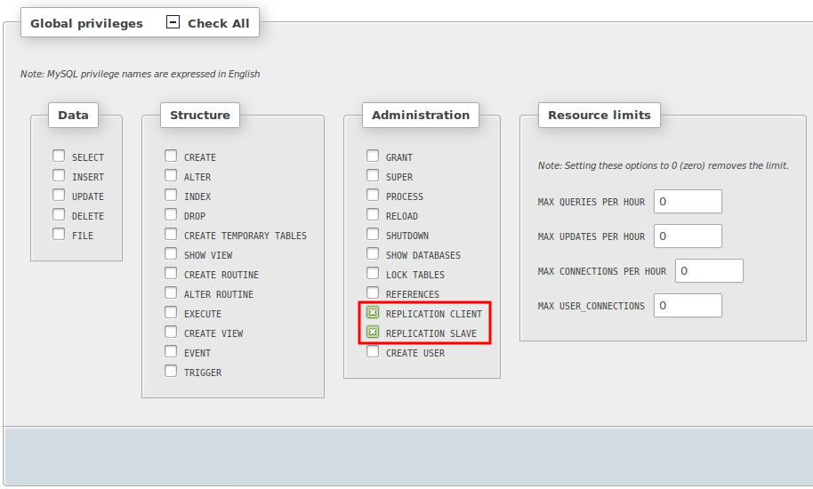

### Slave Database
Let's configure the slave database now.

1\. Select the **Config** icon next to the MySQL server of *diaspora-slave* environment.
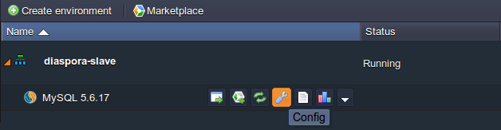


2\. Navigate to the **my.cnf** file inside the *etc* folder and edit the following parameters:  
<i>server-id = 2  
slave-skip-errors = all</i>  

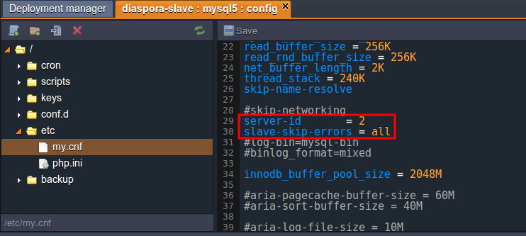

3\. In the same way as for the master database perform the following:

* **Save** changes to the file;
* **Restart** your slave MySQL node;
* **Open** it **in Browser** and log in using credentials the platform has sent you during the slave environment creation.

4\. Select ***configure*** link in the *Slave replication* section of the **Replication** tab.
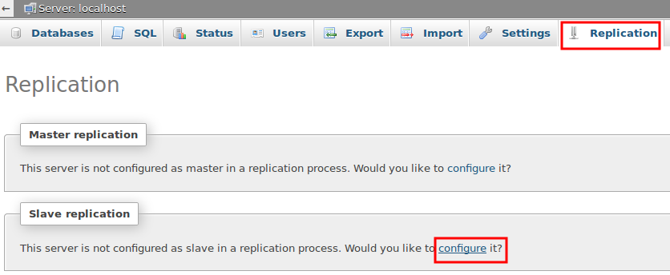

5\. Enter ***User name*** and ***Password*** of your slave replication user. Then specify ***Host*** of your master database (its URL without <u>http:// part)</u> and click **Go** to continue.
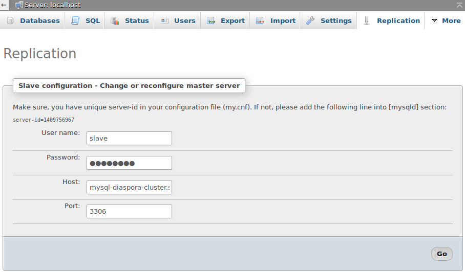

6\. Now you need to enable the replication. Click on **Control slave > Full start** option to do that.
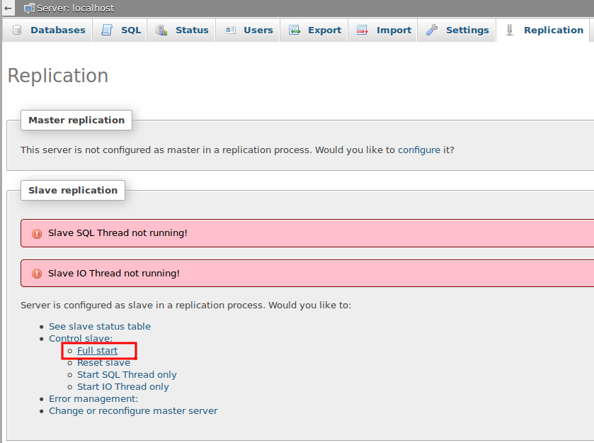

7\. Finally, let's ensure master-slave replication works for our databases. To do this, create a new database at your master DB server: go to the **Databases** tab, specify a new database name (e.g. *Jelastic*) and click the **Create** button.
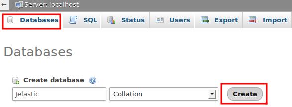

8\. Navigate back to your slave server's admin panel and ensure the newly created database has appeared.
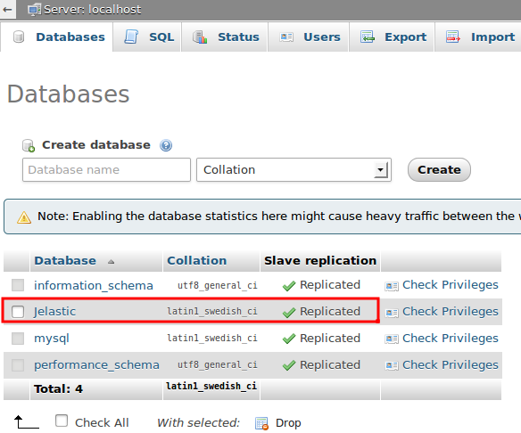


## Cluster Configuration

1\. Now that database replication is working, let's proceed to your cluster configuration. You need to increase the number of application servers (scale them horizontally) for that. Click on the **Change environment topology** icon next to your *diaspora-cluster* environment.
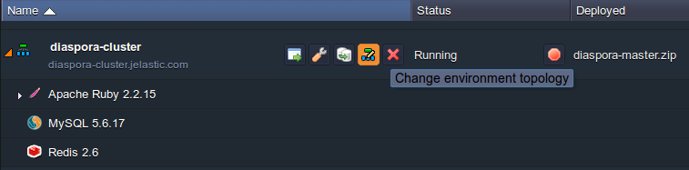

2\. Simply use **+** and **-** buttons in the central wizard pane in order to change the number of Apache nodes. Set this value to a minimum of 2 nodes and click the **Apply** button.
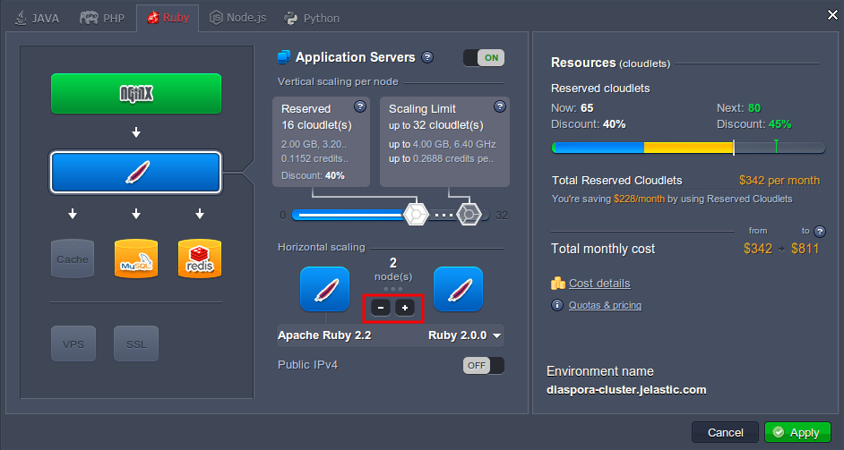
{}**Note:** An NGINX-balancer server will be automatically added to your environment. It will be responsible for the even load distribution between the chosen amount of computing nodes.{}

3\. Wait just a few minutes for new instances to be added.
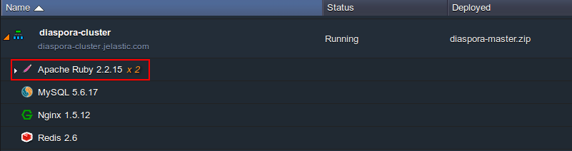


## File Synchronization

When you have the highly-available cluster configured, let's try to upload some files to the app server without synchronization enabled.

1\. **Open** the Diaspora application **in browser** first.
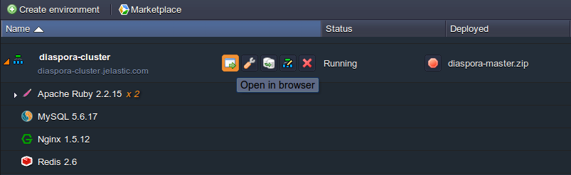

2\. Create a new user (just follow the embedded Diaspora wizard) and post any image to your stream. You should receive something like the following:
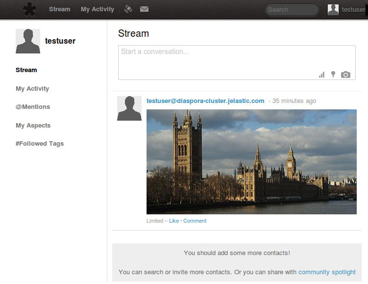

3\. Then switch back to the platform dashboard and click the **Config** icon for Apache Ruby servers. Navigate to the *webroot/ROOT/public* folder for both servers (you can switch between separate servers in cluster using the corresponding drop-down list at the tools panel) and compare their content.
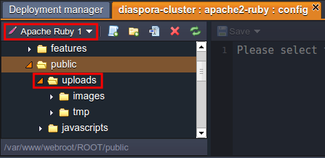
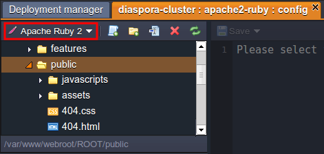
As you can see, the *uploads* folder is present at one server only.

4\. Let's configure the synchronization of files in order to fix this. Add this **File Synchronization** javascript to your bookmarks (simply drag it to the appropriate browser panel).
<div align="center"><table style="width: 192px; height: 46px;" align="center"><colgroup><col width="*"></colgroup><tbody><tr><td style="text-align: center;">**<a href="javascript:(function(d,%20s,%20id)%20{var%20js,%20fjs%20=%20d.getElementsByTagName(s)[0];if%20(d.getElementById(id))%20return;js%20=%20d.createElement(s);%20js.id%20=%20id;js.async%20=%20true;js.src%20=%20'//download.jelastic.com/syncjelastic/script.js';fjs.parentNode.insertBefore(js,%20fjs);void%200;}(document,%20'script',%20'jelastic-file-sync'))">File Synchronization</a>**</td></tr></tbody></table></div>

5\. While at the platform dashboard, click on our script in order to run it.
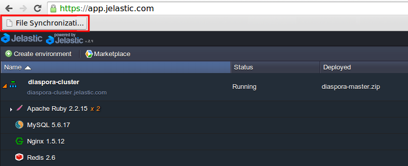

6\. In the opened frame select the previously mentioned **public** folder (and any other folders you would like to synchronize) and click the **Apply** button.
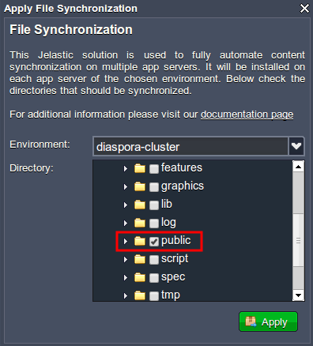
{}
Note: DO NOT select the whole **webroot** folder because this will disable the synchronization.
{}

7\. Ensure an ***uploads*** folder exists at all of your servers.  
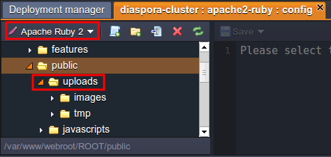

As you can see, the ***uploads*** folder has also appeared at the second node. For now, synchronization will be automatically performed every time you add or change anything in your application.

{}**Note:** 
If you change the environment topology by adding more app servers, you need to initiate the script again in order to keep the synchronization process running at all nodes.
{}
Congrats! You are finally done with Diaspora cluster configuration and you now have a powerful social network, which can support a lot of users and is protected from various issues associated with performance and reliability.