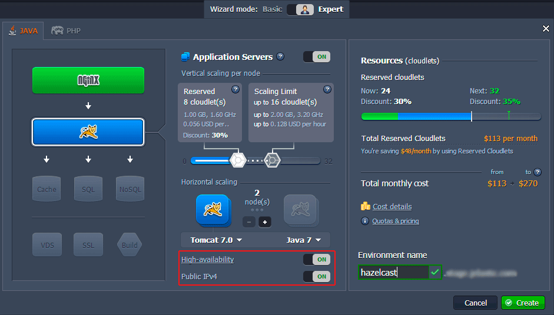
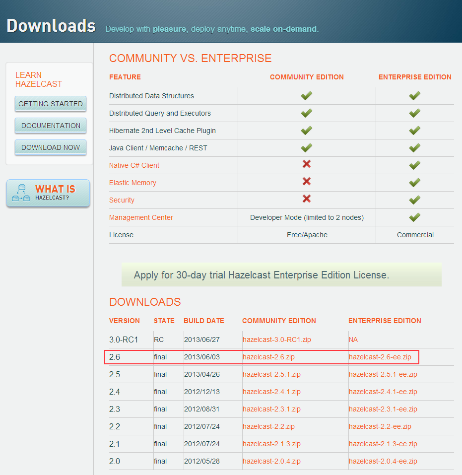
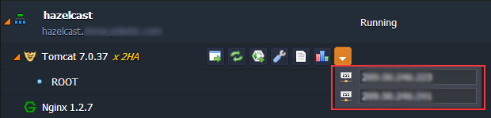
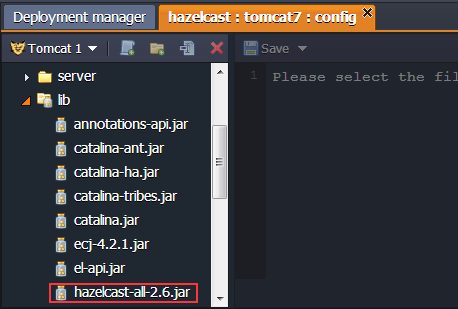
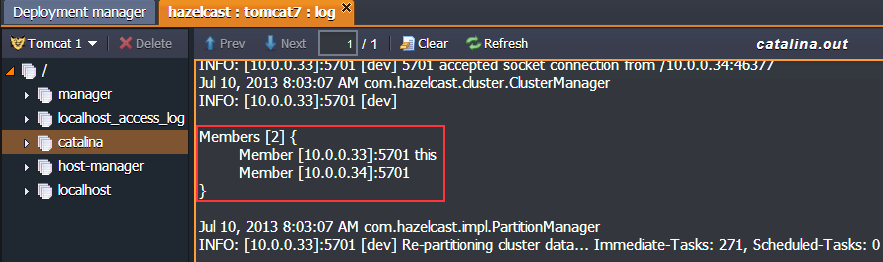
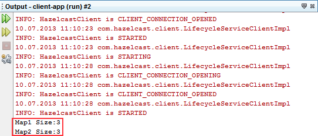

# Hazelcast Cluster

**Hazelcast** is a platform designed specially for sharing and distributing the data inside the application cluster. In this tutorial we will show how to configure Hazelcast clustering inside the PaaS.


## Create Environment

1\. Log in to the platform dashboard.

2\. Click the **Create environment** button to open the topology wizard. Pick up **Tomcat** as an application server, enable **Public IP**, and turn on **High-availability**. This will pair up the nodes and create Tomcat cluster in such a way. The NGINX load balancer will be added automatically.

Set the resource limits within cloudlet sliders for the both instances and click **Create**.



In about a minute your environment will appear at the dashboard.


## Download Hazelcast Package

1\. Open the [official web-site](https://hazelcast.com/) and download the latest stable Hazelcast platform release.



2\. Extract the downloaded **.zip** package.


## Create Application

Let's use the **Hazelcast cluster** to create a simple *Java server* and a *client application*.

### Java Server

1\. Create a new Java class server application.

2\. Import the libraries from the Hazelcast package you've downloaded before (they are located in *hazelcast-x.x.x/lib folder*).

In this example we will work with application, which runs the first server and uses the customer's queue and map:

```java
package com;
import com.hazelcast.core.Hazelcast;
import java.util.Map;
import java.util.Queue;
public class HazelcastServer {
    public void run() {
        Map<Integer, String> mapCustomers = Hazelcast.getMap("customers");
        mapCustomers.put(1, "Joe");
        mapCustomers.put(2, "Ali");
        mapCustomers.put(3, "Avi");
        System.out.println("Customer with key 1: " + mapCustomers.get(1));
        System.out.println("Map Size:" + mapCustomers.size());
        Queue queueCustomers = Hazelcast.getQueue("customers");
        queueCustomers.offer("Tom");
        queueCustomers.offer("Mary");
        queueCustomers.offer("Jane");
        System.out.println("First customer: " + queueCustomers.poll());
        System.out.println("Second customer: " + queueCustomers.peek());
        System.out.println("Queue size: " + queueCustomers.size());
    }
}
```

3\. Create the listener for your servlet, which will be used for automatic running your code after it was deployed.

```java
package com;
import javax.servlet.ServletContextEvent;
import javax.servlet.ServletContextListener;
public class AppServletContextListener implements ServletContextListener{
    @Override
    public void contextDestroyed(ServletContextEvent arg0) {
        System.out.println("ServletContextListener destroyed");
    }
    @Override
    public void contextInitialized(ServletContextEvent arg0) {
        System.out.println("ServletContextListener started");
        new HazelcastServer().run();
    }
}
```

4\. Modify the ***web.xml*** file by adding the *< listener >* section to it.

```xml
<web-app version="3.0" xmlns="http://java.sun.com/xml/ns/javaee" xmlns:xsi="http://www.w3.org/2001/XMLSchema-instance" xsi:schemaLocation="http://java.sun.com/xml/ns/javaee http://java.sun.com/xml/ns/javaee/web-app_3_0.xsd">
    <session-config>
        <session-timeout>
            30
        </session-timeout>
    </session-config>
    <listener>
        <listener-class>com.AppServletContextListener</listener-class>
    </listener>
</web-app>
```

5\. Finally, build your **.war** project file.

### Client Application

Use the Native Hazelcast Java Client API to create a new Java class.

The following sample performs connection to all the cluster's nodes and shows the amount of customers in the map:

```java
package com;
import com.hazelcast.client.ClientConfig;
import com.hazelcast.client.HazelcastClient;
import com.hazelcast.core.HazelcastInstance;
import com.hazelcast.core.IMap;
public class HazelcastClientClass {
    public static void main(String[] args) {
        ClientConfig clientConfig1 = new ClientConfig();
        ClientConfig clientConfig2 = new ClientConfig();
        clientConfig1.addAddress("first_server_node_public-ip:port");
        clientConfig2.addAddress("second_server_node_public-ip:port");
        HazelcastInstance client1 = HazelcastClient.newHazelcastClient(clientConfig1);
        HazelcastInstance client2 = HazelcastClient.newHazelcastClient(clientConfig2);
        IMap map1 = client1.getMap("customers");
        IMap map2 = client2.getMap("customers");
        System.out.println("Map1 Size:" + map1.size());
        System.out.println("Map2 Size:" + map2.size());
    }
}
```

{}**Note**: To see public IP addresses of your nodes click the additional button for the cluster.



In the case your cluster includes 2 different nodes the port number for each of them should be the similar.{}


## Application Deployment

1\. Navigate back to the dashboard and use **[Deployment Manager](/deployment-manager/)** for uploading earlier created **.war** application.

2\. [Deploy](/deployment-guide/) the uploaded package to the environment with Tomcat cluster.

3\. Then press the **Config** button next to the Tomcat nodes to open the configuration manager. Navigate to the ***lib*** folder and upload *hazelcast-all-2.6.jar* file there.



4\. To apply the new configurations restart your application servers by clicking **Restart node** button.


5\. To make sure your Hazelcast cluster was successfully created open the Tomcat server logs.



As it is shown in the picture above, both instances of Tomcat server were clustered and  Hazelcast server apps can communicate between themselves.

6\. Run your client application locally. It will connect to each of server nodes and display the map size for both of them.



Now you have your own clustered highly reliable and scalable Hazelcast hosting.


## What’s next?

- [Cluster in Cloud](/cluster-in-cloud/)
- [WordPress Cluster](/wordpress-cluster-devops/)
- [Horizontal Scaling](/horizontal-scaling/)
- [High Availability](/session-replication/)
- [Marketplace](/marketplace/)