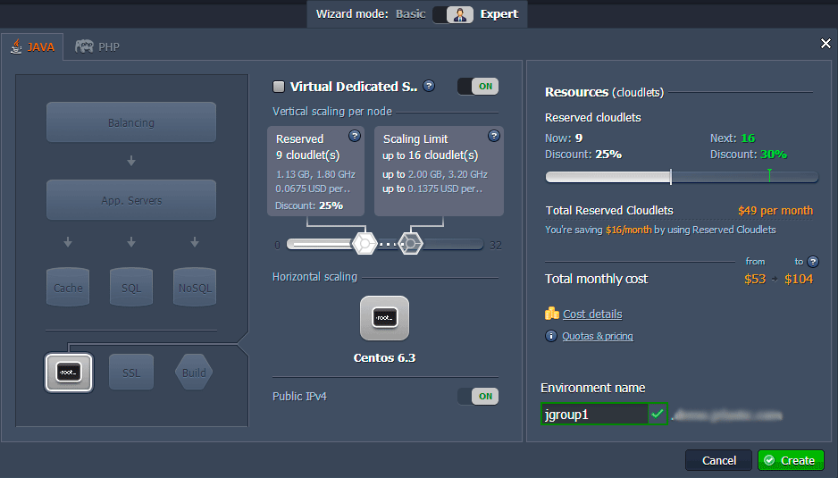
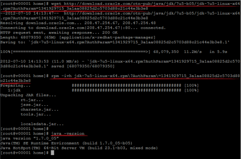
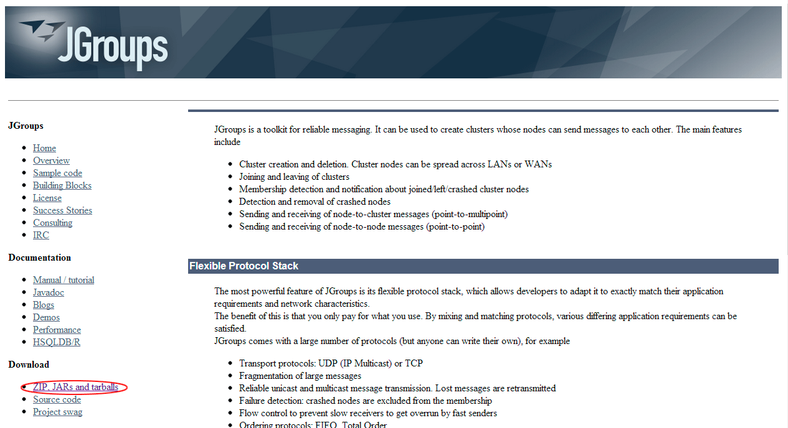
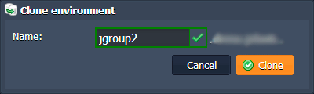
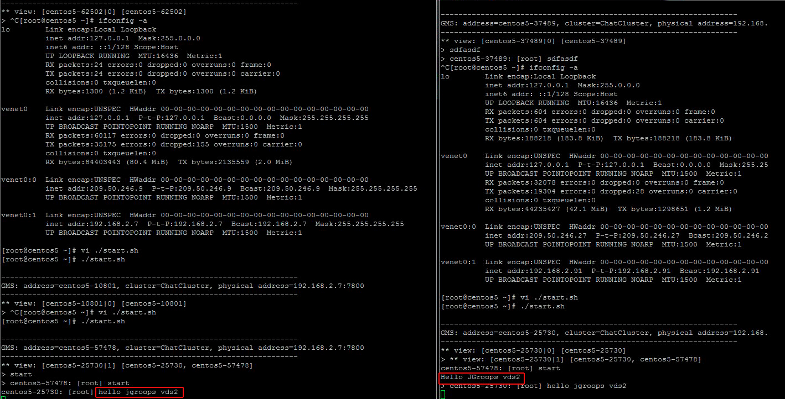

# JGroups Cluster in the Cloud
                                                                          
JGroups is a Java toolkit, which allows to set up the multicast communication between nodes in the cluster by sending the messages. The main benefit of JGroups is a provided flexible protocol stack, which can be adopted by developer to satisfy all the application needs, even through mixing and creating new protocols.

See the list of the key JGroups features:

* Easily create and remove the cluster
* Add and delete members of the cluster
* Receive the notifications when something in the cluster is changed
* Send and receive both node-to-cluster and node-to-node messages

In this tutorial we will describe how to get and configure your JGroups cluster with the platform. Just perform the following steps.

* **<big><span type="A">Create an environment</big>**</span>
    * Log in to the PaaS account.
    * Open the environment topology wizard by clicking the **Create Environment** button.
    * Pick up **VDS** node and specify the amount of resources available for it. Enter the name for your environment and confirm its creation.

In just a minute your environment will appear in the dashboard.

    * Establish the SSH connection using any SSH client following the instruction in the [VDS](/vds) document (step B).

* **<big><span type="A">Java installation</big>**</span>
    * Open the console and specify your VDS credentials, which you've received via the email while creating the environment.
    * Using the following commands download and install Java 7.
    ```bash
    wget {utility_address}
    rpm -ivh {java_rpm_package}
    ```



* **<big><span type="A">Creation of the application</big>**</span>
    * Go to the official [JGroups web site](http://www.jgroups.org/). Download the latest version of the JGroups package there by clicking the link, circled in the image below.

    * Extract the downloaded archive, find the ***jgroups-all.jar*** file and add it to your classpath.
    * Then create your own Java application.  
    In this example we use a simple chat app, which sends messages between two server nodes.
    ```java
    package com.mycompany.simplechat;
    import java.io.BufferedReader;
    import java.io.InputStreamReader;
    import org.jgroups.JChannel;
    import org.jgroups.Message;
    import org.jgroups.ReceiverAdapter;
    import org.jgroups.View;
    public class SimpleChat extends ReceiverAdapter{
      JChannel channel;
      String user_name=System.getProperty("user.name", "n/a");
      public static void main(String[] args) throws Exception {
          new SimpleChat().start();
      }
       private void start() throws Exception {
          channel=new JChannel("tcp.xml");
          channel.setReceiver(this);
          channel.connect("ChatCluster");
          eventLoop();
          channel.close();
      }
      private void eventLoop() {
          BufferedReader in=new BufferedReader(new InputStreamReader(System.in));
          while(true) {
              try {
                  System.out.print("> "); System.out.flush();
                  String line=in.readLine().toLowerCase();
                  if(line.startsWith("quit") || line.startsWith("exit")) {
                      break;
                  }
                  line="[" + user_name + "] " + line;
                  Message msg=new Message(null, null, line);
                  channel.send(msg);
              }
              catch(Exception e) {
              }
          }
      }
      @Override
      public void viewAccepted(View new_view) {
          System.out.println("** view: " + new_view);
      }
      @Override
      public void receive(Message msg) {
          System.out.println(msg.getSrc() + ": " + msg.getObject());
      }
    }
    ```
    * After that create ***tcp.xml*** file and specify the cluster configuration for JGroups   
in it.
    You can use the example below:
    ```xml
    <config xmlns="urn:org:jgroups"
          xmlns:xsi="http://www.w3.org/2001/XMLSchema-instance"
          xsi:schemaLocation="urn:org:jgroups http://www.jgroups.org/schema/JGroups-3.2.xsd">
      <TCP bind_port="7800"
           loopback="false"
           recv_buf_size="${tcp.recv_buf_size:20M}"
           send_buf_size="${tcp.send_buf_size:640K}"
           max_bundle_size="64K"
           max_bundle_timeout="30"
           enable_bundling="true"
           use_send_queues="true"
           sock_conn_timeout="300"
           timer_type="wheel"
           timer.min_threads="4"
           timer.max_threads="10"
           timer.keep_alive_time="3000"
           timer.queue_max_size="500"
           thread_pool.enabled="true"
           thread_pool.min_threads="1"
           thread_pool.max_threads="10"
           thread_pool.keep_alive_time="5000"
           thread_pool.queue_enabled="false"
           thread_pool.queue_max_size="100"
           thread_pool.rejection_policy="discard"
           oob_thread_pool.enabled="true"
           oob_thread_pool.min_threads="1"
           oob_thread_pool.max_threads="8"
           oob_thread_pool.keep_alive_time="5000"
           oob_thread_pool.queue_enabled="false"
           oob_thread_pool.queue_max_size="100"
           oob_thread_pool.rejection_policy="discard"/>
      <TCPPING timeout="3000"
               initial_hosts="${jgroups.tcpping.initial_hosts:localhost[7800],localhost[7801]}"
               port_range="1"
               num_initial_members="10"/>
      <MERGE2 min_interval="10000"
              max_interval="30000"/>
      <FD_SOCK/>
      <FD timeout="3000" max_tries="3"/>
      <VERIFY_SUSPECT timeout="1500"/>
      <BARRIER/>
      <pbcast.NAKACK2 use_mcast_xmit="false"
                      discard_delivered_msgs="true"/>
      <UNICAST/>
      <pbcast.STABLE stability_delay="1000" desired_avg_gossip="50000"
                     max_bytes="4M"/>
      <pbcast.GMS print_local_addr="true" join_timeout="3000"
                  view_bundling="true"/>
      <MFC max_credits="2M"
           min_threshold="0.4"/>
      <FRAG2 frag_size="60K"/>
      <!--RSVP resend_interval="2000" timeout="10000"/-->
      <pbcast.STATE_TRANSFER/>
    </config>
    ```
    * Finally, build your **.jar** project file.

* **<big><span type="A">Deploying application</big>**</span>
    * Connect to your VDS node. You can use the WinSCP client as it is described in [this instruction](/standalone-application).
    * After you’ve successfully established the connection you need to create a new folder for your application (e.g. *home/jgroups*).
    * Then upload the **.jar** file of your app to the new directory via your client application.</ol>

* **<big><span type="A">Configuring JGroups</big>**</span>
    * Navigate back to the platform dashboard and press **Clone environment** button next to your environment. It will create the identical copy of your existing environment with all the data, deployed packages and configurations. More information about this feature you can find here.


    * To ensure the correct work of our sample application we paste the local IP of the first VDS node instead of *[ip-vds1-local]* and second VDS node’s local IP instead of *[ip-vds2-local]*.
    ```bash
    java -Djava.net.preferIPv4Stack=true -Djgroups.bind_addr=[ip-vds1-local] -Djgroups.tcpping.initial_hosts=[ip-vds1-local][7800],[ip-vds2-local][7800] 
    -Dfile.encoding=UTF-8 -jar /root/SimpleChat-1.0-SNAPSHOT-jar-with-dependencies.jar
    ```

That's all. Now you can run your application and test JGroups cluster work to make sure everything is fine.

