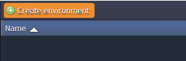

# Joget Cluster Tutorial

**Joget Workflow** is an open source building platform with a wide range of the tools. It enables you to easily create full-fledged enterprise web applications for the cloud and mobile. Also it is a rapid application development platform with the complete agile development capabilities, such as consisting of processes, drag-and-drop forms, lists, extension via plugins, CRUD and UI elements, not just back-end EAI/integration/task-based or orchestration interface.

With the developed Joget plugin architecture you can easily extend and integrate the platform with other systems.

Joget provides developers with the following capabilities:

* building not just processes, but apps
* increasing productivity and efficiency of your application
* comfortable work with a user-friendly GUI
* reducing the cost of training for employees

To get the highly-available and reliable clustered Joget environment in the platform follow the instruction below.


## Create Environment

1\. Log in to the platform dashboard and click **Create environment**.



2\. In the opened environment topology wizard choose your Java app server (e.g. **Tomcat**) and obligatory switch on **High-Availability** to pair up your application instances.

Pick up the database you want to work with (for example, *MySQL*). Specify the amount of resources for each node within cloudlet sliders.

3\. After that specify the name for your new environment (e.g. *joget-cluster*) and press the **Create** button at the bottom of the wizard.


In just a minute your clustered environment will be created and appears in the dashboard.


## Upload Java Package

1\. Navigate to the Joget [official site](https://www.joget.org/) and download the latest **Joget Workflow Enterprise Edition** (Linux bundle) by clicking the **Download Now** button.


2\. Extract the files from the downloaded package and find there ***jw.war*** and ***jwdesigner.war*** files in the *joget-enterprise-linux-x.x.x/apache-tomcat-x.x.x/webapps* folder. Upload them to the dashboard within **Deployment manager**.


3\. Deploy uploaded **.war** files to the different contexts (for example ***jw*** and ***jwdesigner*** respectively).


## Configure Database

1\. Open phpMyAdmin panel for the MySQL node by clicking **Open in Browser** button next to it in your environment. Log in using credentials the platform has sent you after adding the DB node to the environment.

2\. Create the new ***jwdb*** database for your Joget cluster.


3\. Navigate to the **Query** window and import there ***jwdb-empty.sql*** file (it is located in *joget-enterprise-linux-x.x.x/data* folder of the extracted package) according to your needs. All the necessary tables will be created.


## Configure Joget

1\. Go back to the platform dashboard and click the **Config** button for your servlet container (Tomcat in our case).


2\. In the opened config manager navigate to the ***app_datasource-default.properties*** file in the **home/wflow** folder and specify there the properties for the database connection using the code below as an example:

```
workflowDriver=com.mysql.jdbc.Driver  
workflowUrl=jdbc\:mysql\:mysql-{your_environment_name}.{hoster's_domain}:3306/jwdb?characterEncoding\=UTF-8  
workflowUser=root  
profileName=  
workflowPassword={your_database_password}  
hibernate.dialect=org.hibernate.dialect.MySQLDialect
```


3\. Finally, click **Save** button and restart your server.


## Run Joget

Now you have your own Joget cluster in the platform.

Open the **jw** context in a web browser to see the Joget welcome page. To start working with it log in with the default credentials (*admin/admin*).


Get all the benefits of using scalable, high-available and reliable Joget cluster! Hope this tutorial helped you.


## What's next?

* [Software Clustering](/cluster-in-cloud/)
* [Automatic Horizontal Scaling](/automatic-horizontal-scaling/)
* [Application Configuration](/configuration-file-manager/)