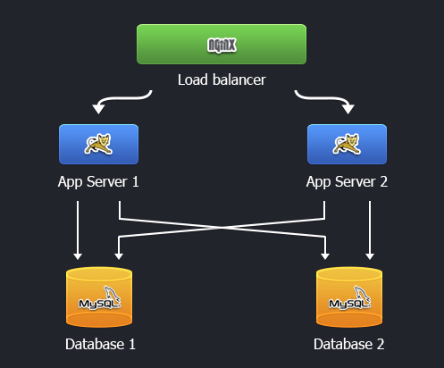
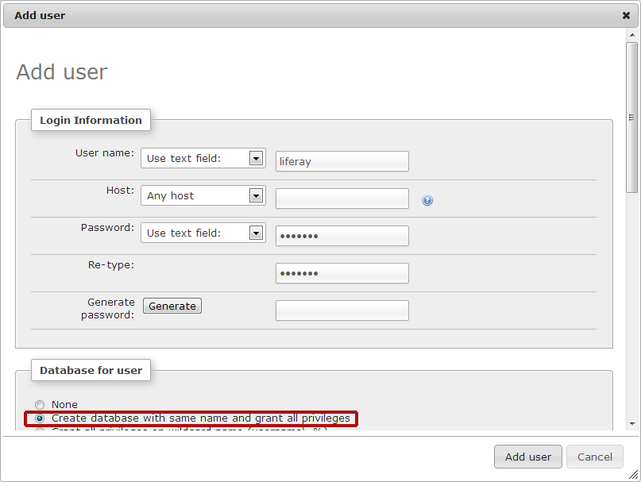
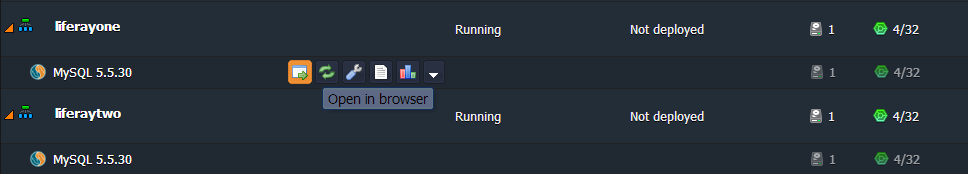
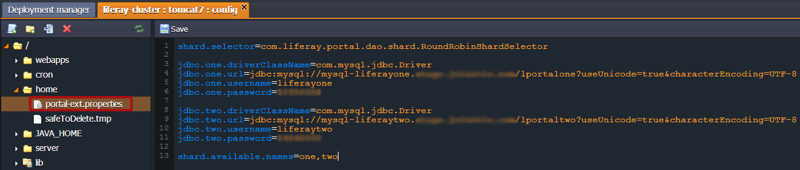
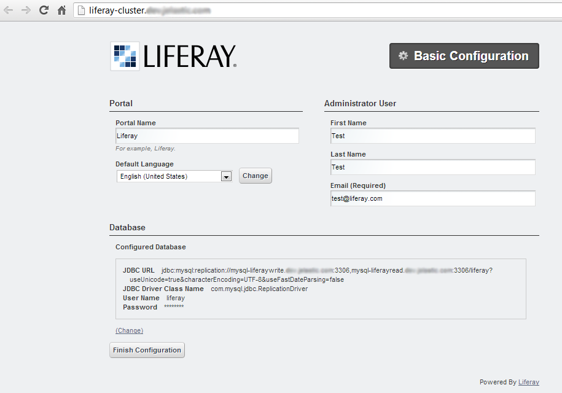
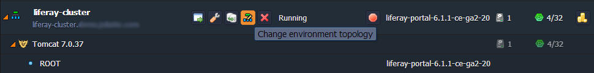
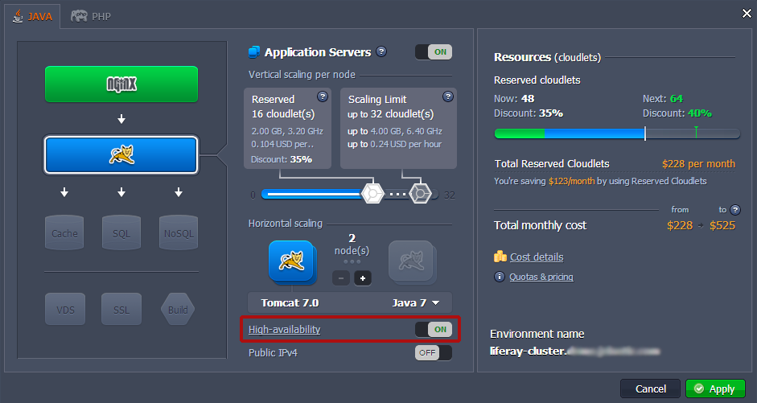
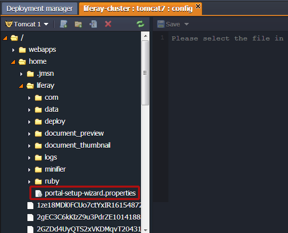

# Liferay Clustering

Liferay Portal is one of the most widely used Content Management Systems for Java. It is highly suitable for the platform scaling capabilities as it supports both vertical and horizontal scaling (i.e. working in vertical and horizontal clusters) and even their mix.

In the scheme below you can see the Liferay clustering architecture with the platform hosting:



As you can see in the picture, for creating a Liferay cluster we use two Tomcat application servers with two replicated databases (MySQL in our case). The NGINX-balancer node will be added automatically in front of our cluster in order to handle and distribute all incoming requests between the nodes.

So, let's examine how to set up our own Liferay clustered environment. Just come through the steps of the following instruction.


## Liferay Portal deployment

Follow [this instruction](/liferay-deploy/) in order to create a new environment and deploy the Liferay Portal to it.


## Database configuration

There are two database modes, which you can use for your clustered Liferay environment. The first is master-slave configuration. And the second one is database sharding. We'll inspect both of them.

### Master-Slave Configuration of the Database

Using this database mode means that you have two different database instances i.e. the database infrastructure is splitted into two blocks. For this example we will use the MySQL database replication, as it provides some additional benefits, such as quick response to the requests, fail-over capabilities and system administration. The only small disadvantage of this mode is that using two databases means increasing of the resources consumption.

To enable and configure **database master-slave replication** just follow the next steps:

1\. Set up two new similar environments (for example, *liferayread* and *liferaywrite*) with **MySQL** node in each of them. Perform a few simple configurations described in the [MySQL/MariaDB master-slave replication](/database-master-slave-replication/) document.

2\. When both of your databases are configured, log in to the admin panel of the master database (named *liferaywrite*) and create a new user and database with *liferay* name.



3\. Then navigate back to the platform dashboard and open the configuration manager for Tomcat application server by clicking the **Config** button next to it.

4\. Create the new portal-ext.properties file in the **home** folder. Enter the following line there:
```
resource.repositories.root=${user.home}/liferay
```

5\. Then configure two data sources for Liferay in the same file using the following strings. In such a way you'll enable the read-writer database.
```
jdbc.default.driverClassName=com.mysql.jdbc.ReplicationDriver  
jdbc.default.url=jdbc:mysql:replication://mysql-{your_write_database_environment_name}.{hoster's_domain}:3306,mysql-{your_read_database_environment_name}.{hoster's_domain}:3306/liferay?useUnicode=true&characterEncoding=UTF-8  
jdbc.default.username={your_database_user_name}  
jdbc.default.password={your_database_password}
```

6\. Finally, save the changes you've made and restart the Tomcat server.

### Database Sharding Configuration

With the database sharding you can divide DB by different types of data, which can be stored in it. Using this mode decreases the amount of data, which should be handled by the application. The only disadvantage you can meet that this method can't ensure adequate fail-over capabilities.

To configure **database sharding** for Liferay use the next instruction:

1\. Set up several (two or more) new similar environments with *MySQL* database in each of them.



2\. When the databases are configured, create the new users (e.g. *liferayone* and *liferaytwo*) and databases with the same name for each of shards, like we performed for master-slave mode.

3\. Navigate to the Tomcat **home** folder in the configuration manager (to open it press the **Config** button next to the Tomcat instance) and create there a new *portal-ext.properties* file. Add the following string to this new file:
```
shard.selector=com.liferay.portal.dao.shard.RoundRobinShardSelector
```

This will allow you to use the round robin shard selector, which is the default sharding algorithm in Liferay. 

4\. In the same file set your different database shards:
```
jdbc.one.driverClassName=com.mysql.jdbc.Driver
jdbc.one.url=jdbc:mysql://mysql-{your_first_database_environment_name}.{hoster's_domain}/lportalone?useUnicode=true&characterEncoding=UTF-8  
jdbc.one.username={your_database_user_name}  
jdbc.one.password={your_database_password}  

jdbc.two.driverClassName=com.mysql.jdbc.Driver  
jdbc.two.url=jdbc:mysql://mysql-{your_second_database_environment_name}.{hoster's_domain}/lportaltwo?useUnicode=true&characterEncoding=UTF-8  
jdbc.two.username={your_database_user_name}  
jdbc.two.password={your_database_password}  

shard.available.names=one,two
```



5\. To apply the performed configurations save the changes and click the **Restart node** button for Tomcat.


## Run Liferay

Press the **Open in Browser** button for your Liferay environment and go throughout the opened installation wizard.




## Cluster Configuration

Finally, let's configure the cluster, just a few steps remained.

1\. Press **Change Environment Topology** button next to your Liferay cluster environment.



2\. In the opened wizard enable the **High Availability**. Set up the amount of resources for automatically added *NGINX* load balancer node (as it was mentioned above, it is placed in front of your cluster to handle and distribute all the requests).



{}**Note:** HA was enabled after the Liferay installation have been completed in order to automatically copy the created **portal-setup-wizard.properties** file (home/liferay path) to the second instance and in such a way avoid the double installation.

{}

That's all! Now you have your own Liferay clustered environment with fail-over capabilities (if the first node fails, the second one perform the further processing) and great performance. Enjoy!


## What's next?

* [Cluster in the Cloud](/cluster-in-cloud/)
* [Liferay Deploy](/liferay-deploy/)
* [MySQL/MariaDB Master Slave Replication](/database-master-slave-replication/)