# How to Deploy Magento

**[Magento](https://magento.com/)** is an extremely popular open source e-commerce service powered by *PHP*. It provides a flexible modular architecture enhanced with agile ecosystem to continually adapt, customize and extend your platform. This allows Magento to be much more versatile than most e-commerce platforms at storing a large range of data.

With PaaS, you can not only integrate **Magento** instance to the platform but also get a clustered solution out-of-the-box. So, let's have a better insight into these options:

* [one-click automated installation](#magento-cluster-automatic-installation)
* [manual deployment](#instruction-on-manual-magento-installation)


## Magento Cluster Automatic Installation

You can have a reliable and auto-scalable **Magento Cluster** solution for e-commerce websites up and running within minutes using the one-click installation package. If you already registered at the platform, it can be installed directly from your dashboard using [platform Marketplace](/marketplace/). Note that this clustered solution is available only for *billing* customers.

If you don't have an account, you can automatically get it and, simultaneously, initiate *Auto-Scalable Magento Cluster* solution installation - just click the **Get it hosted now** button below and fill the form within the opened page.

[
](https://jelastic.com/install-application/?manifest=https://raw.githubusercontent.com/jelastic-jps/magento-cluster/v2.2.0/manifest.yml&keys=app.mycloud.by;app.jelastic.eapps.com;app.hidora.com;app.rag-control.hosteur.com;app.jpc.infomaniak.com;app.j.layershift.co.uk;app.jpe.infomaniak.com;app.trendhosting.cloud;app.cloudjiffy.com;app.paas.mamazala.com;app.mircloud.host;app.paas-infra.previder.com;app.my.reclaim.cloud;app.j.scaleforce.net;app.unicloud.pl;app.unispace.io;app.trendhosting.cloud;app.oxacloud.com;reg.ru;app.keliweb.cloud;app.infra.cloudlet.cloud;app.whelastic.net;app.ukhost4u.net;app.paas.massivegrid.com;app.jelastic.elastx.net;mawingu.io;app.infra.savecore.com;app.paas.vnet.sk;app.togglebox.cloud;app.rosehosting.cloud;app..paas.gva.cloudsigma.com;app.paas.datacenter.fi;app.libyanspider.cloud;app.appengine.flow.ch;app.cloudlets.com.au;app.controller.cloudlets.zone&filter=auto_cluster)

As a result, you'll get a new environment with the following topology:

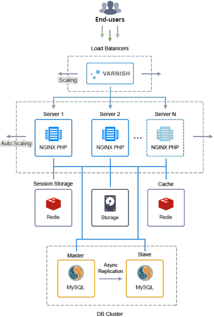

Read the [Auto-Scalable Magento Cluster](https://www.virtuozzo.com/company/blog/auto-scalable-magento-cluster-in-containers/) article for the detailed description or check the [project repository](https://github.com/jelastic-jps/magento-cluster) at GitHub.


## Instruction on Manual Magento Installation

In case you are intended to gain the full control over non-clustered **Magento** installation, we also prepared the detailed guide on its manual deployment. Follow the step-by-step instruction below to get your PHP Magento application inside the platform:

### Create Environment

1\. Log in to your PaaS account and click **New Environment** at the top left corner of the dashboard:


2\. Within the opened topology wizard, switch to the ***PHP*** tab, add the **Apache** application server and the **MySQL** database.

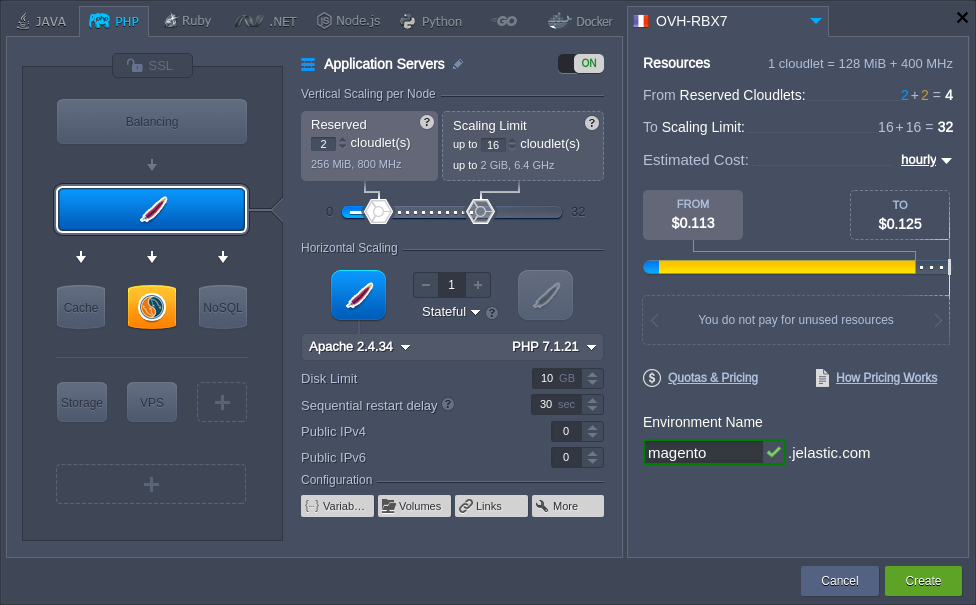

{}**Note:** MySQL 8 is not supported by Magento. Also, PHP 7.2.x is supported starting with the [2.3 release](https://devdocs.magento.com/guides/v2.3/install-gde/system-requirements-tech.html#php) (currently in development).{}

Configure other parameters up to your needs (e.g. cloudlets limit or region) and click **Create**.

3\. After creation, click the **Config** button next to your Apache server to check if the appropriate modules are activated.

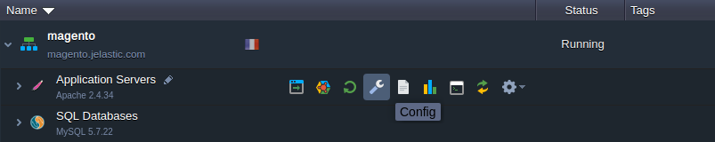

4\. Navigate to the ***/etc/php.ini*** file, locate and uncomment the following extensions as it is shown in the image below:

* *extension=gd.so*
* *extension=xsl.so*
* *extension=soap.so*

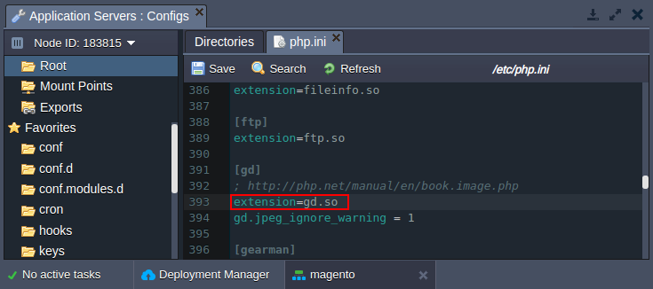

5\. **Save** file and **Restart nodes** to apply changes.

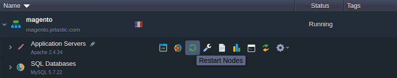

### Upload Application

1\. Add Magento repository from GitHub to the **[Deployment Manager](/deployment-manager/)**.

*[https://github.com/magento/magento2.git](https://github.com/magento/magento2.git)*

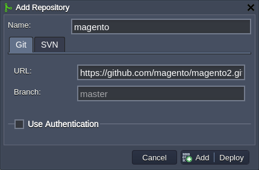

2\. [Deploy](/deployment-guide/#git--svn-deployment-configurations) Magento package into your environment. For the automatic dependencies installation, expand the ***[Hooks](/deployment-hooks/)*** section and add the **Post** script, which will run the *Composer* tool from your project directory:

```bash
cd $WEBROOT/ROOT
composer install
```

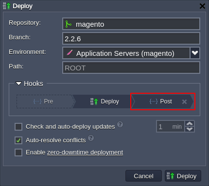

{}**Tip:** You can adjust the **Branch** field to provide the exact version of Magento (e.g. we set the *2.2.6* tag as the latest stable one at the moment).{}

In a minute your Magento project will be deployed.

### Configure Database

1\. While your project is deployed and dependencies installed, you can create a dedicated database with user. Click the **Open in Browser** button for your **MySQL** node.

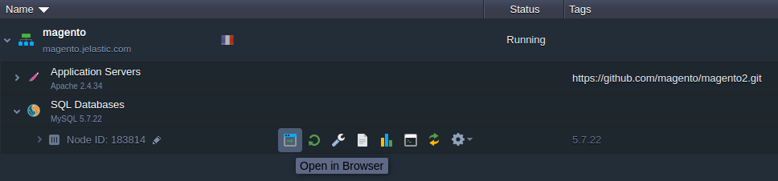


2\. Log in with credentials you've received via email after environment creation. Switch to the **User accounts** tab and click the *Add user account* link.

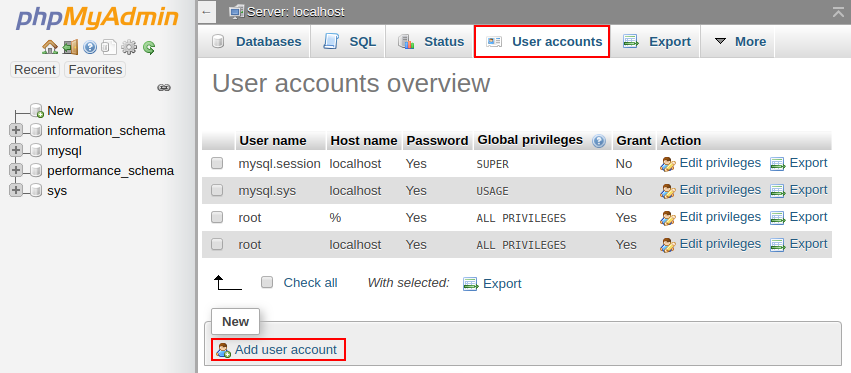

3\. Provide the desired *User name* and *Password* for your new account.

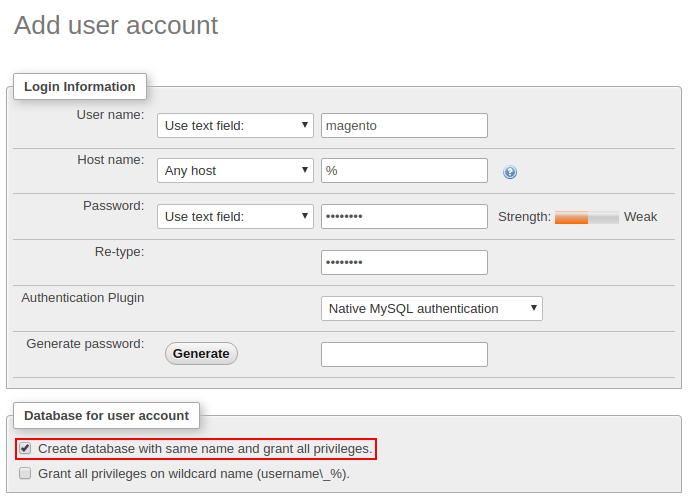

Tick the *Create database with same name and grant all privileges* option and click **Go** at the bottom of the page.

### Install Magento

1\. Click the **Open in Browser** button for your application server.

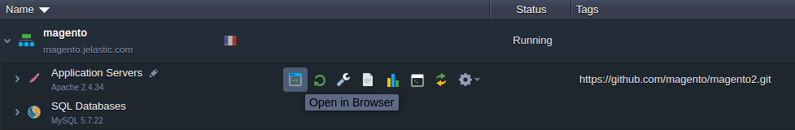

2\. The process of installation is rather simple, just follow the displayed steps.

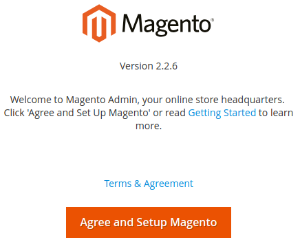

3\. Let's pay attention to the **Add a Database** step. Fill in the fields by specifying your database host (for example can be seen in the appropriate email) and credentials of a user created in the previous section:

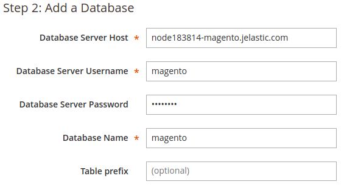

4\. Configure your Magento installation through the other steps and click **Install Now** on the last one to proceed.

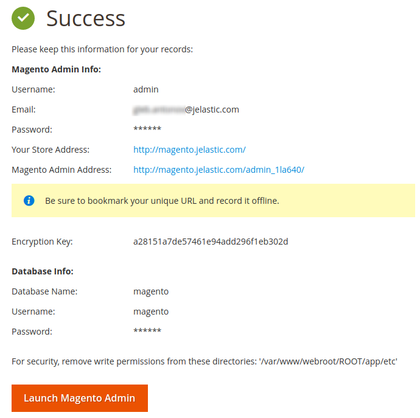

{}**Tip:** On the first connection to admin panel, you may see some warning notifications at the top of the admin panel:

* *invalid indexers* - run the next command ***php $WEBROOT/ROOT/bin/magento indexer:reindex*** command via [Web SSH](/web-ssh-client/) to reindex
* *invalidated cache* - select the appropriate cache (e.g. *Page Cache*) and refresh it via admin panel{}

That's all! Now you can start working with **Magento** in the platform.


## What's next?

* [Auto-Scalable Magento Cluster](https://www.virtuozzo.com/company/blog/auto-scalable-magento-cluster-in-containers/)
* [Transferring Data to Magento Cluster](https://www.virtuozzo.com/company/blog/transferring-data-to-scalable-magento-cluster/)
* [Cluster in the Cloud](/cluster-in-cloud/)
* [WordPress Cluster](/wordpress-cluster-devops/)