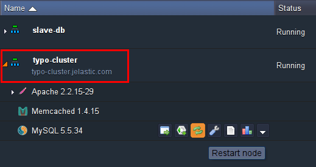

# TYPO3 Enterprise CMS Cluster

**TYPO3** is one of the most widely spread CMS for websites of any size. And with the platform, you can make your TYPO3 site not only very flexible and accessible, but also stable and high performing. This can be gained by setting up a high-available cluster with two **Apache** application servers, **NGINX** balancer, **Memcached** instance and two replicated **MySQL** databases.


The Memcached node is used for storing the sessions of the Apache servers. The sessions are backed up, and if any of the Apache servers fail, the second one will get the sessions from Memcached for further session serving. The NGINX balancer distributes the traffic inside the cluster. In addition, the MySQL database master-slave replication improves the performance, the security of the data and the fail-over capabilities of your environment.

And now, let's go step-by-step and configure your highly-available clustered TYPO3 application.


## Deploy TYPO3 Application

Firstly, let's create the required environment and deploy TYPO3 application.

1\. Log in to the platform dashboard and click **Create environment**.

2\. Pick **Apache** application server, **MySQL** database and **Memcached**. Specify your cloudlet limits and name your environment (for example, *typo-cluster*). Click **Create**.


3\. Wait just a moment for your environment to be created.


4\. Visit the official [TYPO3 web-site](https://get.typo3.org/download) to download the latest TYPO3 version as a **zip** package.


5\. Using the **Deployment manager**, upload the package you've just downloaded.


6\. Once the package is in the platform, deploy it to the environment you have just created.


{}**Note:** You need to disable ***zend_extension*** in order to get your TYPO3 application up and running. Navigate to **etc > php.ini** file and comment the following line:

```
#zend_extension=/usr/lib64/php/modules/opcache.so
```

{}


## Configure PHP Sessions Clustering

The high availability of your PHP application can be achieved by implementing PHP sessions clustering in the cloud. We are going to use Memcached to successfully handle application server failover.

1\. Click the **Config** button next to the **Apache** node. In the Config Manager, open the ***etc > php.ini*** file and enable Memcached module by adding the next string:  

```
extension=memcached.so
```


2\. To activate the support of the sessions, edit the **Session** block in ***php.ini*** config file by adding the following lines:

```
session.save_handler = memcached  
session.save_path = "< server >:11211"
```


{}**Note:** Paste the Memcached IP instead of *< server >*. To find it, click the **Info** button next to the Memcached node in your environment.


{}

3\. Apply the changes by clicking the **Save** button and **Restart** Apache server.


## Database Configuration

Let's configure MySQL master-slave replication in order to protect your application from downtime or data loss.

MySQL in your environment with TYPO3 deployed will be used as a master database. For the slave database, you need to create a separate environment.

Navigate to the platform dashboard and create your environment with **MySQL** node, which is going to be used as a slave database. Name your environment (e.g. *slave-db*) and click **Create**.


And now, let's configure each database separately:

### Master Database

As we've mentioned above, we use MySQL in the environment with app deployed (i.e. *typo-cluster*) as our master database.

1\. Click **Config** button for your master database.


2\. Navigate to **etc > my.cnf** file and set the following properties as it is shown below (you just need to uncomment the lines):

```
server-id = 1
log-bin = mysql-bin
binlog-format=mixed
```


We use *binlog-format=mixed* to allow a replication of operations with foreign keys.

{}**Note:** Do not use *binlog_format=statement* otherwise you will get errors later on!{}

3\. **Save** the changes and **Restart** MySQL in order to apply new configuration parameters.



4\. Click the **Open in Browser** button for master MySQL. Log in using credentials you have received via email when creating the environment.


5\. Navigate to the **Replication** tab and click on **Add slave replication user**.


6\. Specify the name and password for your slave replication user and click **Go**.


Your slave user is successfully created.


### Slave Database

And now, let's connect the master database with slave MySQL.

1\. Click the **Config** button for your slave database.


2\. Navigate to ***my.cnf*** file and add the following strings:  

```
server-id = 2
slave-skip-errors = all
```


We allow our slave base to skip all errors from master (*slave-skip-errors = all*) in order not to stop normal slave operation, in case of errors on the master base.

Skipping this step is not recommended at the development stage, in order to locate bugs, etc. However here, we focus on production, when your code has already been tested. Any error on the master's side can stop slave or lead to its unsynchronization. In this case, the error may be even innocuous. Some minor errors will probably occur on production, so the replication can be stopped because of small errors.

3\. **Save** the changes and **Restart** your slave database server in order to apply the new configuration parameters.


4\. Navigate to **phpMyAdmin** using the credentials which the platform sent you when you created the environment for your slave database.

5\. Go to the **Replication** tab click ***configure*** for **Slave replication**.


6\. Configure your master server (enter the name, password and host of your slave replication user).


Now your master server is configured.


7\. Click on **Control slave > Full start** for the slave server, in order to run *Slave SQL* and *Slave IO* threads.


8\. Check the slave status table to ensure that everything is ok.


The replication is configured and all the data is synchronized between the master and slave database.


## TYPO3 Installation

Now we can complete TYPO3 installation.

1\. Navigate to the platform dashboard and click the **Open in browser** button next to your TYPO3 environment. The installation will be started. Click **Continue**.


2\. In the **Connect to your database** host window:

* choose the **MySQL/MySQLi** driver
* fill in the **Username** and **Password** fields with the credentials to your master database (you've received them via email when creating the environment)
* ut the database server address in the **Host** field

Click **Continue**.


3\. At the ***Select database*** step, create a new database by entering a name for your TYPO3 database (e.g. *typo_db*). Click **Continue**.

{}**Note:** With the help of database replication configured previously, the created DB will be automatically located at both master and slave MySQL.{}


4\. In the next window choose the **Introduction package**. Click **Continue**.


5\. The installation will be started. Wait a few minutes for its completion.


6\. Finally, enter the password for access to the TYPO3 Admin Panel and choose the color of your TYPO3 main page.


Congratulations! TYPO3 is installed.


## Cluster Configuration

After TYPO3 installation has been successfully completed, you can proceed to configuration of a highly-available cluster.

1\. Navigate to the platform dashboard and click **Change environment topology** button next to the environment with your TYPO3 app.


2\. Add one more Apache application server by clicking **+** button (circled in the image below). **NGINX**-balancer will be added automatically. Click **Apply**.


{}
* The reason we added the second application server instance only after installation, is that in such a way, we synchronized all of the data between two Apache nodes and avoided double installation and configuration.
* You can also configure file synchronization between the servers in your cluster using the instruction in the [File Sync document](/file-synchronization/).
{}

3\. Click **Open in Browser** and start using your TYPO3 application.


Now, you have your own highly reliable and scalable clustered environment, hosted with TYPO3.


Enjoy!


## What's next?

* [Software Clustering](/cluster-in-cloud/)
* [Automatic Horizontal Scaling](/automatic-horizontal-scaling/)
* [Application Configuration](/configuration-file-manager/)